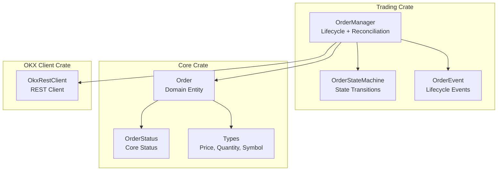
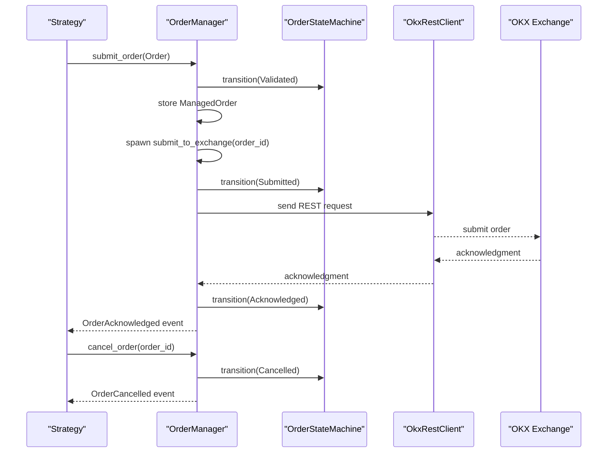
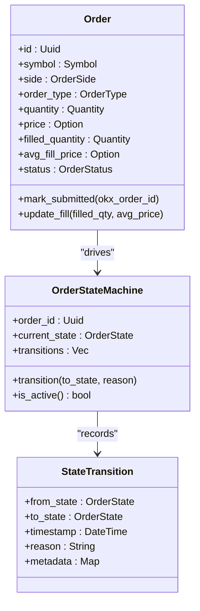
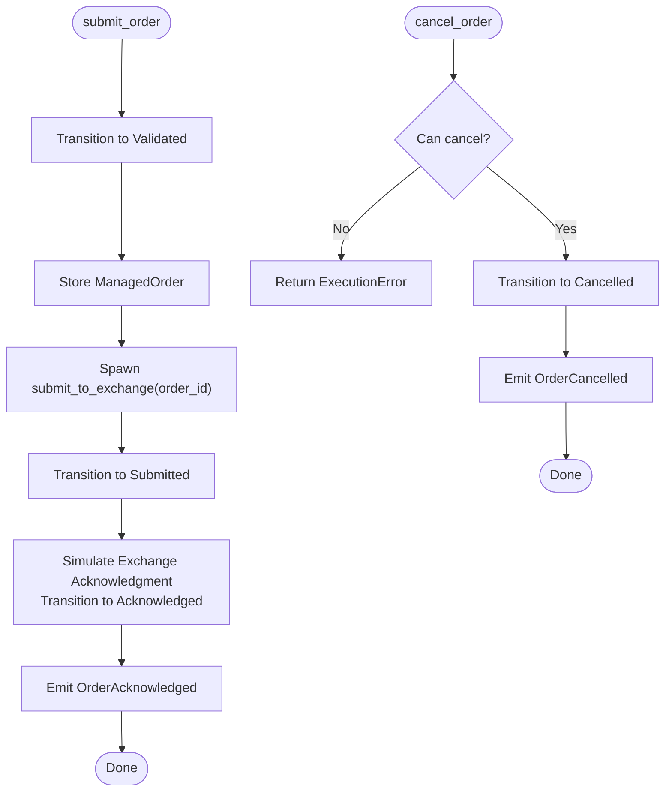
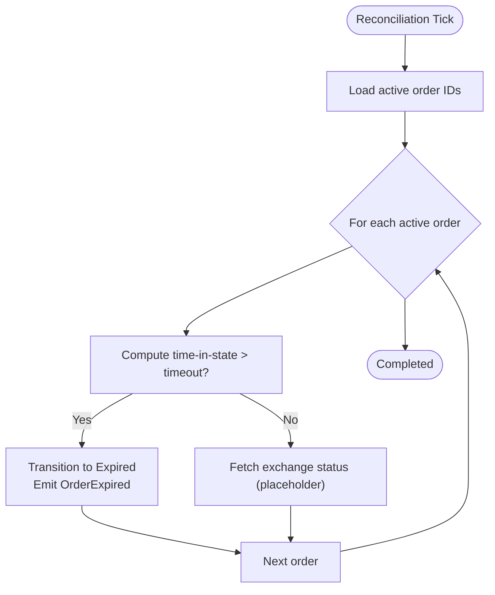
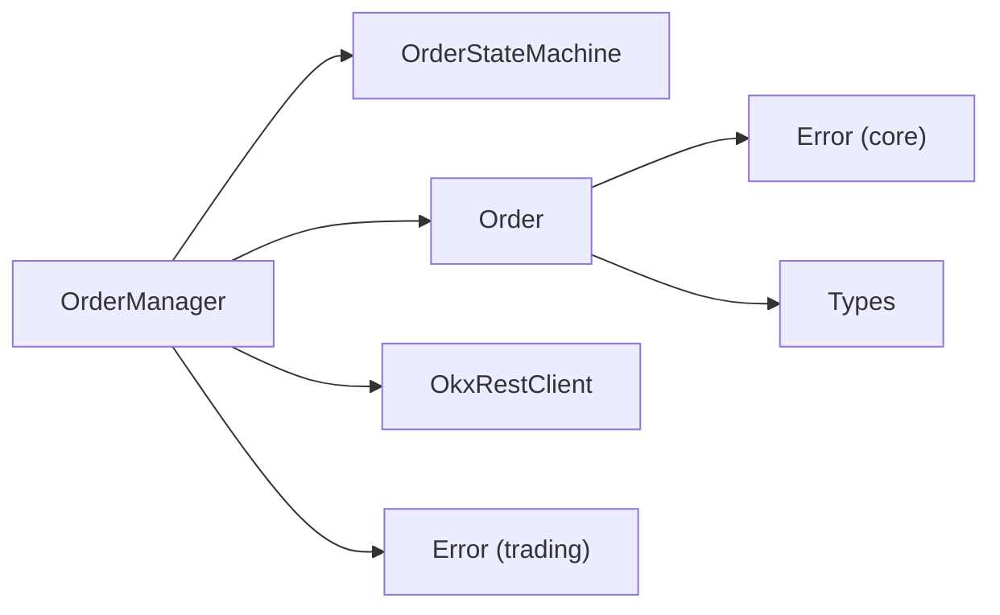

# Order Management

<cite>
**Referenced Files in This Document**
- [order_manager.rs](file://crates/trading/src/order_manager.rs)
- [state_machine.rs](file://crates/trading/src/state_machine.rs)
- [order.rs](file://crates/core/src/models/order.rs)
- [types.rs](file://crates/core/src/types.rs)
- [error.rs (trading)](file://crates/trading/src/error.rs)
- [error.rs (core)](file://crates/core/src/error.rs)
- [lib.rs (okx-client)](file://crates/okx-client/src/lib.rs)
- [rest.rs (okx-client)](file://crates/okx-client/src/rest.rs)
- [grid_trading.rs](file://examples/grid_trading.rs)
- [trading.rs (frontend commands)](file://src-tauri/src/commands/trading.rs)
</cite>

## Table of Contents
1. [Introduction](#introduction)
2. [Project Structure](#project-structure)
3. [Core Components](#core-components)
4. [Architecture Overview](#architecture-overview)
5. [Detailed Component Analysis](#detailed-component-analysis)
6. [Dependency Analysis](#dependency-analysis)
7. [Performance Considerations](#performance-considerations)
8. [Troubleshooting Guide](#troubleshooting-guide)
9. [Conclusion](#conclusion)
10. [Appendices](#appendices)

## Introduction
This document explains the order management system that tracks active orders, enforces state consistency, and reconciles internal state with the OKX exchange. It covers the domain model (Order, OrderState, OrderEvent), lifecycle management (creation, submission, cancellation, status updates), and the reconciliation loop that detects and resolves discrepancies. Practical examples demonstrate order lifecycle management and common issues such as status mismatches and network timeouts.

## Project Structure
The order management system spans several crates:
- Trading crate: OrderManager orchestrates order lifecycle and reconciliation, and defines OrderEvent and OrderManagerStats.
- Core crate: Defines the Order entity, OrderStatus, and shared types (Price, Quantity, Symbol).
- OKX client crate: Provides the OkxRestClient abstraction used by OrderManager to communicate with OKX.
- Frontend Tauri commands: Expose commands to place/cancel orders and fetch open/history data (placeholder integration).

**Diagram sources**
- [order_manager.rs](file://crates/trading/src/order_manager.rs#L50-L110)
- [state_machine.rs](file://crates/trading/src/state_machine.rs#L1-L57)
- [order.rs](file://crates/core/src/models/order.rs#L94-L151)
- [types.rs](file://crates/core/src/types.rs#L86-L179)
- [lib.rs (okx-client)](file://crates/okx-client/src/lib.rs#L1-L39)

**Section sources**
- [order_manager.rs](file://crates/trading/src/order_manager.rs#L50-L110)
- [order.rs](file://crates/core/src/models/order.rs#L94-L151)
- [types.rs](file://crates/core/src/types.rs#L86-L179)
- [lib.rs (okx-client)](file://crates/okx-client/src/lib.rs#L1-L39)

## Core Components
- OrderManager: Central coordinator for order lifecycle, state transitions, event emission, and reconciliation.
- OrderStateMachine: Enforces valid state transitions and tracks state history.
- Order: Domain entity representing a trade request with lifecycle metadata.
- Types: Shared numeric types (Price, Quantity) and Symbol with validation.
- OrderEvent: Typed events emitted during lifecycle changes.
- OkxRestClient: REST client abstraction for OKX integration.

Key responsibilities:
- Creation: Validates and transitions to Submitted/Acknowledged, emits events.
- Cancellation: Validates cancellable states and transitions to Cancelled.
- Status updates: Emits partial/filled/rejected/failed/expired events.
- Reconciliation: Periodically checks timeouts and compares internal state with exchange reports.

**Section sources**
- [order_manager.rs](file://crates/trading/src/order_manager.rs#L110-L221)
- [order_manager.rs](file://crates/trading/src/order_manager.rs#L223-L258)
- [order_manager.rs](file://crates/trading/src/order_manager.rs#L278-L336)
- [state_machine.rs](file://crates/trading/src/state_machine.rs#L92-L167)
- [order.rs](file://crates/core/src/models/order.rs#L226-L270)
- [types.rs](file://crates/core/src/types.rs#L86-L179)

## Architecture Overview
The system uses a state-machine-driven lifecycle with explicit event emissions. OrderManager holds active orders in-memory, maps exchange IDs to internal IDs, and periodically reconciles with the exchange.

**Diagram sources**
- [order_manager.rs](file://crates/trading/src/order_manager.rs#L110-L221)
- [order_manager.rs](file://crates/trading/src/order_manager.rs#L223-L258)
- [state_machine.rs](file://crates/trading/src/state_machine.rs#L92-L167)
- [lib.rs (okx-client)](file://crates/okx-client/src/lib.rs#L1-L39)

## Detailed Component Analysis

### Domain Model: Order, OrderStatus, and OrderState
- Order: Immutable identifier, symbol, side, type, quantity, optional price, filled metrics, status, timestamps, and latency tracking. Provides helpers to mark submitted and update fills.
- OrderStatus: Core lifecycle statuses (Created, Submitted, Partial, Filled, Cancelled, Rejected, Failed).
- OrderState: Execution lifecycle states (Created, Validated, Submitted, Acknowledged, PartiallyFilled, Filled, Cancelled, Rejected, Failed, Expired). Used by OrderStateMachine.

**Diagram sources**
- [order.rs](file://crates/core/src/models/order.rs#L94-L151)
- [order.rs](file://crates/core/src/models/order.rs#L226-L270)
- [state_machine.rs](file://crates/trading/src/state_machine.rs#L59-L99)
- [state_machine.rs](file://crates/trading/src/state_machine.rs#L92-L167)

**Section sources**
- [order.rs](file://crates/core/src/models/order.rs#L94-L151)
- [order.rs](file://crates/core/src/models/order.rs#L226-L270)
- [state_machine.rs](file://crates/trading/src/state_machine.rs#L1-L57)
- [state_machine.rs](file://crates/trading/src/state_machine.rs#L92-L167)

### Order Lifecycle Management
- Creation: Strategy constructs an Order and calls OrderManager.submit_order. The manager validates pre-trade checks, transitions to Validated, stores the order, and spawns asynchronous submission.
- Submission: The manager transitions to Submitted, emits OrderSubmitted, and simulates exchange acknowledgment by transitioning to Acknowledged and emitting OrderAcknowledged. In a real integration, the OkxRestClient would be invoked here.
- Cancellation: The manager checks if the current state allows cancellation and transitions to Cancelled, emitting OrderCancelled.
- Status updates: The manager emits OrderPartiallyFilled and OrderFilled events as fills occur. The Order entity updates filled quantities and average price, and sets terminal/completion timestamps.

**Diagram sources**
- [order_manager.rs](file://crates/trading/src/order_manager.rs#L110-L221)
- [order_manager.rs](file://crates/trading/src/order_manager.rs#L223-L258)
- [order.rs](file://crates/core/src/models/order.rs#L226-L270)

**Section sources**
- [order_manager.rs](file://crates/trading/src/order_manager.rs#L110-L221)
- [order_manager.rs](file://crates/trading/src/order_manager.rs#L223-L258)
- [order.rs](file://crates/core/src/models/order.rs#L226-L270)

### Reconciliation Process
- Periodic loop: OrderManager.start_reconciliation ticks at configured interval and calls reconcile.
- Timeout detection: For each active order, compute time-in-state. If exceeded, transition to Expired and emit OrderExpired.
- Exchange sync: The reconcile loop is designed to fetch exchange status for active orders and compare with internal state. In the current implementation, exchange queries are marked as placeholders and would integrate OkxRestClient.

**Diagram sources**
- [order_manager.rs](file://crates/trading/src/order_manager.rs#L278-L336)

**Section sources**
- [order_manager.rs](file://crates/trading/src/order_manager.rs#L278-L336)

### Interfaces: Creation, Cancellation, and Status Updates
- Creation: submit_order(Order) returns an internal order ID and asynchronously submits to the exchange.
- Cancellation: cancel_order(order_id) validates state and transitions to Cancelled.
- Status updates: OrderManager emits OrderPartiallyFilled, OrderFilled, OrderRejected, OrderFailed, OrderExpired. The Order entity updates filled metrics and completion timestamps.

Integration points:
- OkxRestClient is used by OrderManager.submit_to_exchange to submit orders and by the reconciliation loop to query exchange status (placeholder).

**Section sources**
- [order_manager.rs](file://crates/trading/src/order_manager.rs#L110-L221)
- [order_manager.rs](file://crates/trading/src/order_manager.rs#L223-L258)
- [order_manager.rs](file://crates/trading/src/order_manager.rs#L294-L336)
- [lib.rs (okx-client)](file://crates/okx-client/src/lib.rs#L1-L39)

### Concrete Examples from the Codebase
- Grid trading strategy creates multiple limit orders and tracks active orders in a map keyed by internal order IDs. This demonstrates how strategies create and manage orders that would be handled by OrderManager.
- Frontend Tauri commands expose place_order, cancel_order, get_open_orders, and get_order_history. These are placeholders and would integrate with OrderManager in a production system.

**Section sources**
- [grid_trading.rs](file://examples/grid_trading.rs#L80-L115)
- [trading.rs (frontend commands)](file://src-tauri/src/commands/trading.rs#L36-L80)

## Dependency Analysis
- OrderManager depends on:
  - OrderStateMachine for state transitions and validity checks.
  - OkxRestClient for exchange communication (placeholder in current implementation).
  - Order for domain representation and helpers.
  - Types for validated numeric and symbol types.
  - Error types for cross-crate error propagation.

**Diagram sources**
- [order_manager.rs](file://crates/trading/src/order_manager.rs#L1-L40)
- [state_machine.rs](file://crates/trading/src/state_machine.rs#L1-L33)
- [order.rs](file://crates/core/src/models/order.rs#L1-L20)
- [types.rs](file://crates/core/src/types.rs#L1-L20)
- [error.rs (trading)](file://crates/trading/src/error.rs#L1-L31)
- [error.rs (core)](file://crates/core/src/error.rs#L1-L47)
- [lib.rs (okx-client)](file://crates/okx-client/src/lib.rs#L1-L39)

**Section sources**
- [order_manager.rs](file://crates/trading/src/order_manager.rs#L1-L40)
- [state_machine.rs](file://crates/trading/src/state_machine.rs#L1-L33)
- [order.rs](file://crates/core/src/models/order.rs#L1-L20)
- [types.rs](file://crates/core/src/types.rs#L1-L20)
- [error.rs (trading)](file://crates/trading/src/error.rs#L1-L31)
- [error.rs (core)](file://crates/core/src/error.rs#L1-L47)
- [lib.rs (okx-client)](file://crates/okx-client/src/lib.rs#L1-L39)

## Performance Considerations
- Concurrency: OrderManager uses async submission and a periodic reconciliation loop. Ensure the reconciliation interval balances accuracy and overhead.
- Locking: RwLock protects in-memory order maps; keep critical sections small to minimize contention.
- Eventing: Unbounded channels are used for events; monitor backpressure if consumers fall behind.
- Network retries: Configure OkxRestClient retry/backoff to handle transient failures gracefully.

[No sources needed since this section provides general guidance]

## Troubleshooting Guide
Common issues and resolutions:
- Order status mismatches:
  - Symptom: Internal state differs from exchange report.
  - Action: Use reconciliation loop to detect timeouts and compare exchange status against internal state. Ensure OrderManager transitions are valid and events are emitted consistently.
- Network timeouts during submission:
  - Symptom: Order remains in Submitted or Acknowledged without exchange confirmation.
  - Action: Increase timeout thresholds and implement retry with exponential backoff. Emit OrderFailed with a reason when submission fails.
- Invalid state transitions:
  - Symptom: Attempting to cancel a terminal state or skipping required transitions.
  - Action: Validate state using OrderStateMachine.can_cancel and enforce valid transitions. Return InvalidStateTransition errors for invalid moves.
- Order not found:
  - Symptom: Cancelling or querying a non-existent order.
  - Action: Return OrderNotFound errors and ensure order IDs are tracked via exchange_id_map.

**Section sources**
- [state_machine.rs](file://crates/trading/src/state_machine.rs#L92-L167)
- [order_manager.rs](file://crates/trading/src/order_manager.rs#L223-L258)
- [order_manager.rs](file://crates/trading/src/order_manager.rs#L294-L336)
- [error.rs (trading)](file://crates/trading/src/error.rs#L1-L31)
- [error.rs (core)](file://crates/core/src/error.rs#L1-L47)

## Conclusion
The order management system provides a robust, state-machine-driven lifecycle for orders, with clear interfaces for creation, cancellation, and status updates. It enforces state consistency, emits typed events, and includes a reconciliation loop to detect timeouts and reconcile with exchange reports. Integrating OkxRestClient completes the end-to-end flow, enabling accurate order tracking and timely resolution of discrepancies.

[No sources needed since this section summarizes without analyzing specific files]

## Appendices

### OrderEvent Types
- OrderCreated, OrderSubmitted, OrderAcknowledged, OrderPartiallyFilled, OrderFilled, OrderCancelled, OrderRejected, OrderFailed, OrderExpired.

**Section sources**
- [order_manager.rs](file://crates/trading/src/order_manager.rs#L50-L98)

### Example: Grid Trading Orders
- Demonstrates creating multiple limit orders and tracking active orders by internal ID, aligning with OrderManager’s indexing strategy.

**Section sources**
- [grid_trading.rs](file://examples/grid_trading.rs#L80-L115)