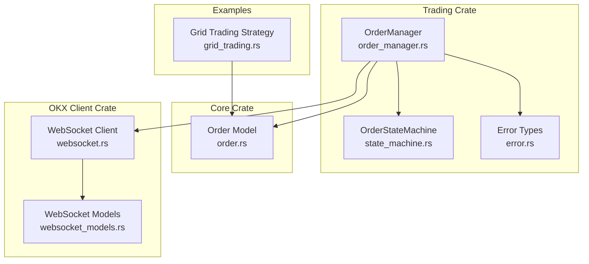
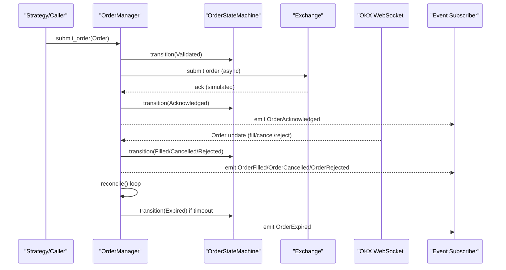
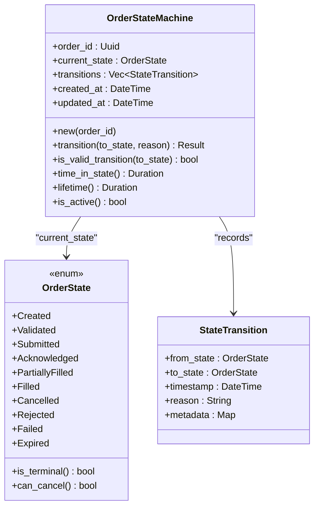
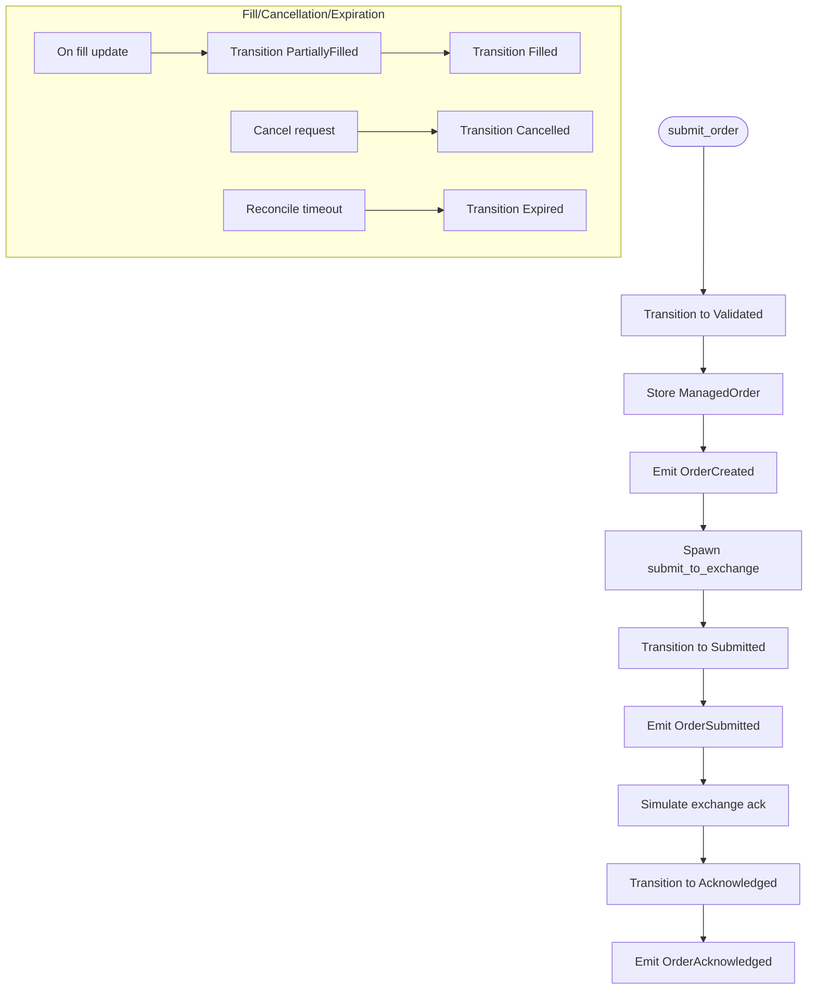
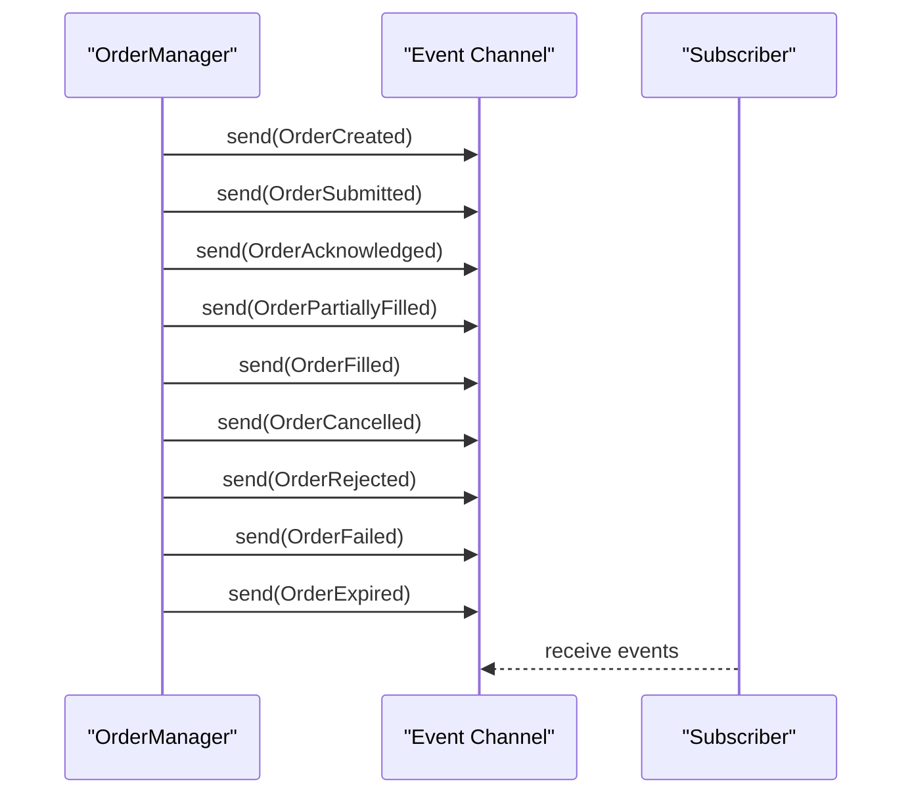
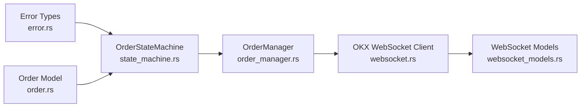

# Order State Machine

<cite>
**Referenced Files in This Document**
- [state_machine.rs](file://crates/trading/src/state_machine.rs)
- [order_manager.rs](file://crates/trading/src/order_manager.rs)
- [order.rs](file://crates/core/src/models/order.rs)
- [error.rs](file://crates/trading/src/error.rs)
- [websocket.rs](file://crates/okx-client/src/websocket.rs)
- [websocket_models.rs](file://crates/okx-client/src/models/websocket.rs)
- [grid_trading.rs](file://examples/grid_trading.rs)
</cite>

## Table of Contents
1. [Introduction](#introduction)
2. [Project Structure](#project-structure)
3. [Core Components](#core-components)
4. [Architecture Overview](#architecture-overview)
5. [Detailed Component Analysis](#detailed-component-analysis)
6. [Dependency Analysis](#dependency-analysis)
7. [Performance Considerations](#performance-considerations)
8. [Troubleshooting Guide](#troubleshooting-guide)
9. [Conclusion](#conclusion)
10. [Appendices](#appendices)

## Introduction
This document explains the 9-state order execution state machine that governs the lifecycle of trading orders. It covers the state definitions, valid transitions, validation logic, event-driven triggers, error handling, and recovery mechanisms. The system prevents invalid state changes, emits domain events for observability, and reconciles state against exchange responses and timeouts. The goal is to make the state machine understandable for beginners while providing deep technical insights for experienced developers.

## Project Structure
The order state machine spans several crates:
- Trading crate: state machine, order manager, and event emission
- Core crate: order model and lifecycle fields
- OKX client crate: WebSocket connectivity and order data parsing
- Examples: grid trading strategy that creates orders

**Diagram sources**
- [state_machine.rs](file://crates/trading/src/state_machine.rs#L1-L120)
- [order_manager.rs](file://crates/trading/src/order_manager.rs#L1-L120)
- [order.rs](file://crates/core/src/models/order.rs#L90-L160)
- [websocket.rs](file://crates/okx-client/src/websocket.rs#L1-L120)
- [websocket_models.rs](file://crates/okx-client/src/models/websocket.rs#L1-L80)
- [grid_trading.rs](file://examples/grid_trading.rs#L1-L40)

**Section sources**
- [state_machine.rs](file://crates/trading/src/state_machine.rs#L1-L120)
- [order_manager.rs](file://crates/trading/src/order_manager.rs#L1-L120)
- [order.rs](file://crates/core/src/models/order.rs#L90-L160)
- [websocket.rs](file://crates/okx-client/src/websocket.rs#L1-L120)
- [websocket_models.rs](file://crates/okx-client/src/models/websocket.rs#L1-L80)
- [grid_trading.rs](file://examples/grid_trading.rs#L1-L40)

## Core Components
- OrderStateMachine: encapsulates the current state, validates transitions, records history, and exposes helpers like time-in-state and activity checks.
- OrderManager: orchestrates order submission, cancellation, reconciliation, and event emission; integrates with the state machine and OKX client.
- Order model: holds order metadata, lifecycle timestamps, and status; provides helpers to update status and compute terminal states.
- OKX WebSocket client: streams market and order data; parses order updates suitable for reconciliation.
- Error types: centralized error variants for invalid transitions, timeouts, and execution errors.

Key responsibilities:
- State machine enforces deterministic transitions and prevents invalid state changes.
- Order manager drives transitions via pre-trade validation, submission, acknowledgments, fills, cancellations, and expirations.
- Events notify subscribers about lifecycle changes.
- Reconciliation detects timeouts and aligns internal state with exchange reality.

**Section sources**
- [state_machine.rs](file://crates/trading/src/state_machine.rs#L1-L120)
- [order_manager.rs](file://crates/trading/src/order_manager.rs#L1-L120)
- [order.rs](file://crates/core/src/models/order.rs#L150-L265)
- [error.rs](file://crates/trading/src/error.rs#L1-L31)

## Architecture Overview
The order lifecycle is event-driven:
- Strategy or trading logic creates an Order and delegates submission to OrderManager.
- OrderManager validates pre-trade checks, transitions to Validated, and asynchronously submits to the exchange.
- Exchange responses trigger OrderAcknowledged and subsequent fills.
- Reconciliation detects timeouts and transitions to Expired.
- Cancellations are initiated by the user or system logic and lead to Cancelled.
- Terminal states (Filled, Cancelled, Rejected, Failed, Expired) halt further transitions.

**Diagram sources**
- [order_manager.rs](file://crates/trading/src/order_manager.rs#L110-L220)
- [state_machine.rs](file://crates/trading/src/state_machine.rs#L92-L151)
- [websocket_models.rs](file://crates/okx-client/src/models/websocket.rs#L224-L265)

**Section sources**
- [order_manager.rs](file://crates/trading/src/order_manager.rs#L110-L220)
- [state_machine.rs](file://crates/trading/src/state_machine.rs#L92-L151)
- [websocket_models.rs](file://crates/okx-client/src/models/websocket.rs#L224-L265)

## Detailed Component Analysis

### State Machine Implementation
The state machine defines nine states and strict transition rules. It also exposes helpers to detect terminal states and whether an order is still active.

States:
- Created: initial state before pre-trade validation
- Validated: pre-trade checks passed
- Submitted: sent to exchange
- Acknowledged: exchange acknowledged receipt
- PartiallyFilled: partial fills occurred
- Filled: fully executed
- Cancelled: user/system cancellation
- Rejected: exchange rejection
- Failed: submission failure
- Expired: timeout reached

Validation logic:
- Transitions are validated against a deterministic set of allowed pairs.
- Transitions from terminal states are blocked.
- Same-state transitions are permitted (for updates).

Helpers:
- is_terminal(): determines if an order has completed.
- can_cancel(): determines if cancellation is allowed.
- time_in_state(): measures time since last state change.
- lifetime(): measures total order lifetime.

**Diagram sources**
- [state_machine.rs](file://crates/trading/src/state_machine.rs#L1-L120)
- [state_machine.rs](file://crates/trading/src/state_machine.rs#L116-L151)

**Section sources**
- [state_machine.rs](file://crates/trading/src/state_machine.rs#L1-L120)
- [state_machine.rs](file://crates/trading/src/state_machine.rs#L116-L151)
- [state_machine.rs](file://crates/trading/src/state_machine.rs#L153-L167)

### Order Manager and Event Emission
OrderManager coordinates lifecycle actions:
- Pre-trade validation: transitions to Validated immediately upon submission.
- Submission: marks order as Submitted and emits OrderSubmitted.
- Acknowledgment: transitions to Acknowledged and emits OrderAcknowledged.
- Fills: updates order model and state machine; emits OrderPartiallyFilled and OrderFilled.
- Cancellations: validates state and transitions to Cancelled; emits OrderCancelled.
- Expirations: reconciler checks time-in-state and transitions to Expired; emits OrderExpired.
- Failed submissions: emits OrderFailed when submission fails.

Concurrency and consistency:
- Uses RwLock to guard the in-memory order registry.
- Emits events via an unbounded channel for subscribers.
- Asynchronous submission avoids blocking the caller.

**Diagram sources**
- [order_manager.rs](file://crates/trading/src/order_manager.rs#L110-L220)
- [order_manager.rs](file://crates/trading/src/order_manager.rs#L278-L336)

**Section sources**
- [order_manager.rs](file://crates/trading/src/order_manager.rs#L110-L220)
- [order_manager.rs](file://crates/trading/src/order_manager.rs#L278-L336)

### Order Model and Status Mapping
The Order model tracks lifecycle fields and status. It provides helpers to:
- Determine terminal states.
- Update status based on fills.
- Compute latency from submission to first fill.
- Mark submission and completion timestamps.

OrderStatus (core) and OrderState (trading) are mapped:
- Created -> Created
- Submitted -> Submitted
- Partial -> PartiallyFilled
- Filled -> Filled
- Cancelled -> Cancelled
- Rejected -> Rejected
- Failed -> Failed

This mapping enables interoperability between core models and the trading state machine.

**Section sources**
- [order.rs](file://crates/core/src/models/order.rs#L150-L265)
- [state_machine.rs](file://crates/trading/src/state_machine.rs#L169-L182)

### Event-Driven Architecture
Order events are emitted for each lifecycle change:
- OrderCreated, OrderSubmitted, OrderAcknowledged
- OrderPartiallyFilled, OrderFilled
- OrderCancelled, OrderRejected, OrderFailed
- OrderExpired

These events are consumed by subscribers (e.g., UI, logging, analytics). The OKX WebSocket client parses order data suitable for reconciliation and state alignment.

**Diagram sources**
- [order_manager.rs](file://crates/trading/src/order_manager.rs#L49-L76)
- [websocket_models.rs](file://crates/okx-client/src/models/websocket.rs#L224-L265)

**Section sources**
- [order_manager.rs](file://crates/trading/src/order_manager.rs#L49-L76)
- [websocket_models.rs](file://crates/okx-client/src/models/websocket.rs#L224-L265)

### Transition Rules and Validation Logic
Allowed transitions:
- Created -> Validated, Rejected, Failed
- Validated -> Submitted, Rejected, Cancelled
- Submitted -> Acknowledged, Rejected, Failed, Cancelled, Expired
- Acknowledged -> PartiallyFilled, Filled, Cancelled, Rejected
- PartiallyFilled -> Filled, Cancelled

Invalid transitions:
- Cannot transition from terminal states.
- Cannot skip intermediate states (e.g., Created -> Filled is invalid).
- Same-state transitions are allowed for updates.

Validation enforcement:
- The state machine rejects invalid transitions and returns a dedicated error variant.
- OrderManager checks cancellation eligibility before attempting Cancelled transitions.

**Section sources**
- [state_machine.rs](file://crates/trading/src/state_machine.rs#L116-L151)
- [order_manager.rs](file://crates/trading/src/order_manager.rs#L223-L258)
- [error.rs](file://crates/trading/src/error.rs#L11-L16)

### Error Handling and Recovery
Errors and recovery mechanisms:
- InvalidStateTransition: raised when attempting illegal transitions.
- OrderNotFound: raised when operating on unknown order IDs.
- ReconciliationError and TimeoutError: used for reconciliation failures and timeouts.
- ExecutionError: raised for invalid cancellation attempts (e.g., in terminal states).
- SerializationError: for JSON serialization/deserialization issues.

Recovery strategies:
- Reconciliation loop periodically checks time-in-state and transitions to Expired when exceeded.
- Submission failures emit OrderFailed and surface the underlying error.
- Event-driven subscribers can react to failures and trigger remediation.

**Section sources**
- [error.rs](file://crates/trading/src/error.rs#L1-L31)
- [order_manager.rs](file://crates/trading/src/order_manager.rs#L278-L336)
- [order_manager.rs](file://crates/trading/src/order_manager.rs#L143-L163)

### Race Conditions and State Consistency
Race conditions and mitigations:
- Concurrent access: OrderManager uses RwLock to protect the in-memory order registry.
- Atomic state updates: Each transition is guarded by the state machine’s validation and timestamp updates.
- Event ordering: Events are emitted after state transitions, ensuring subscribers observe consistent state.
- Reconciliation: Periodic reconciliation aligns internal state with exchange data and timeouts.

Best practices:
- Avoid external writes to state machine fields; always use transition().
- Use the provided helpers (time_in_state, is_active) to reason about state.
- Treat terminal states as immutable; do not attempt further transitions.

**Section sources**
- [order_manager.rs](file://crates/trading/src/order_manager.rs#L1-L40)
- [state_machine.rs](file://crates/trading/src/state_machine.rs#L92-L120)

### Concrete Examples from the Codebase
- Grid trading strategy creates orders and relies on OrderManager for submission and lifecycle management.
- OrderManager simulates exchange acknowledgments and emits OrderAcknowledged.
- Reconciliation loop demonstrates timeout detection and OrderExpired emission.

**Section sources**
- [grid_trading.rs](file://examples/grid_trading.rs#L78-L115)
- [order_manager.rs](file://crates/trading/src/order_manager.rs#L166-L221)
- [order_manager.rs](file://crates/trading/src/order_manager.rs#L278-L336)

## Dependency Analysis
The state machine depends on core models and error types. OrderManager composes the state machine, order model, and OKX client. The WebSocket client parses order data suitable for reconciliation.

**Diagram sources**
- [error.rs](file://crates/trading/src/error.rs#L1-L31)
- [state_machine.rs](file://crates/trading/src/state_machine.rs#L1-L40)
- [order.rs](file://crates/core/src/models/order.rs#L90-L160)
- [order_manager.rs](file://crates/trading/src/order_manager.rs#L1-L40)
- [websocket.rs](file://crates/okx-client/src/websocket.rs#L1-L120)
- [websocket_models.rs](file://crates/okx-client/src/models/websocket.rs#L1-L80)

**Section sources**
- [error.rs](file://crates/trading/src/error.rs#L1-L31)
- [state_machine.rs](file://crates/trading/src/state_machine.rs#L1-L40)
- [order.rs](file://crates/core/src/models/order.rs#L90-L160)
- [order_manager.rs](file://crates/trading/src/order_manager.rs#L1-L40)
- [websocket.rs](file://crates/okx-client/src/websocket.rs#L1-L120)
- [websocket_models.rs](file://crates/okx-client/src/models/websocket.rs#L1-L80)

## Performance Considerations
- Event throughput: Unbounded channels can buffer events; monitor subscriber lag to avoid backlog.
- Lock contention: RwLock protects order registry; keep critical sections small and avoid long-running operations inside locks.
- Reconciliation cadence: Tune reconciliation interval and timeout thresholds to balance responsiveness and load.
- Serialization overhead: Minimize unnecessary serialization of order state; cache frequently accessed fields.

[No sources needed since this section provides general guidance]

## Troubleshooting Guide
Common issues and resolutions:
- Invalid state transition errors: Verify pre-trade validation and submission steps; ensure transitions follow the allowed set.
- Order not found: Confirm order ID exists in the registry; check for race conditions around creation and deletion.
- Timeout without fills: Inspect reconciliation interval and timeout configuration; ensure the reconciler is running.
- Duplicate events: Ensure subscribers handle deduplication; rely on event ordering guarantees.
- Cancellation failures: Check state eligibility using can_cancel(); avoid cancelling terminal states.

**Section sources**
- [error.rs](file://crates/trading/src/error.rs#L11-L27)
- [order_manager.rs](file://crates/trading/src/order_manager.rs#L223-L258)
- [state_machine.rs](file://crates/trading/src/state_machine.rs#L169-L182)

## Conclusion
The order state machine provides a robust, deterministic lifecycle for trading orders. Its strict validation prevents invalid state changes, while event emission and reconciliation ensure consistency with exchange responses and timeouts. By following the documented patterns and best practices, teams can build reliable trading systems that remain resilient under load and recover gracefully from failures.

[No sources needed since this section summarizes without analyzing specific files]

## Appendices

### Appendix A: State Transition Matrix
Allowed transitions:
- Created -> Validated, Rejected, Failed
- Validated -> Submitted, Rejected, Cancelled
- Submitted -> Acknowledged, Rejected, Failed, Cancelled, Expired
- Acknowledged -> PartiallyFilled, Filled, Cancelled, Rejected
- PartiallyFilled -> Filled, Cancelled

Invalid transitions:
- From terminal states (Filled, Cancelled, Rejected, Failed, Expired)
- Skipping intermediate states

**Section sources**
- [state_machine.rs](file://crates/trading/src/state_machine.rs#L116-L151)