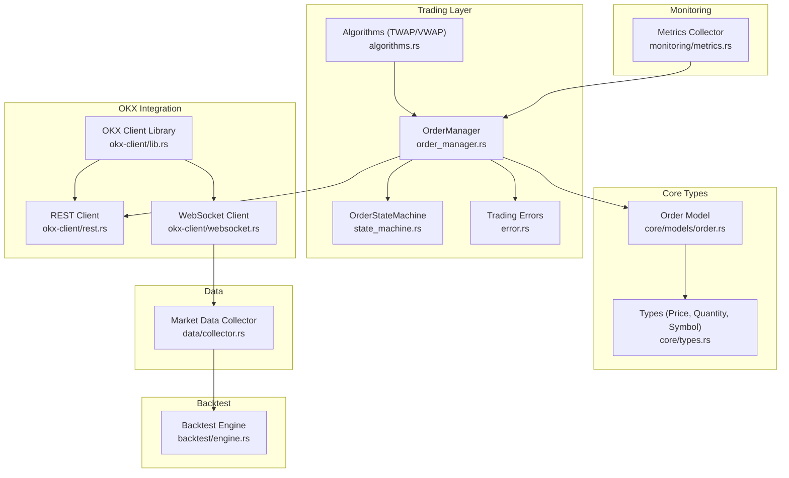
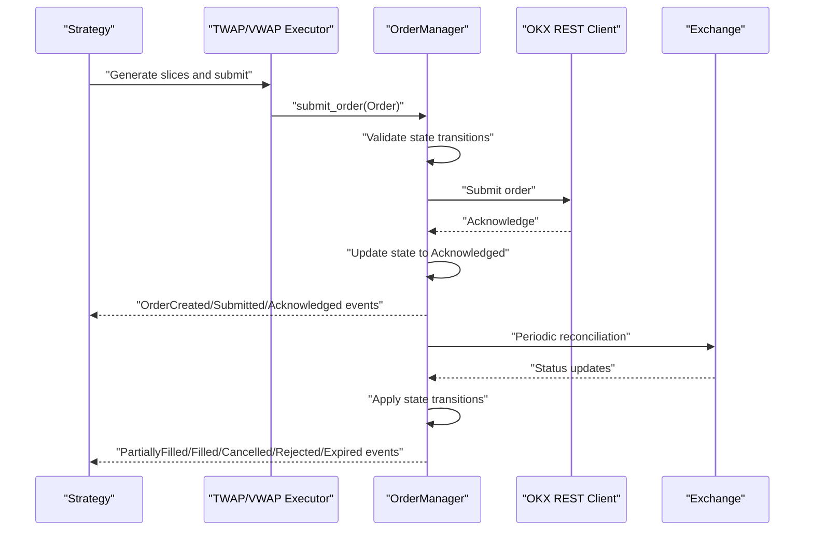
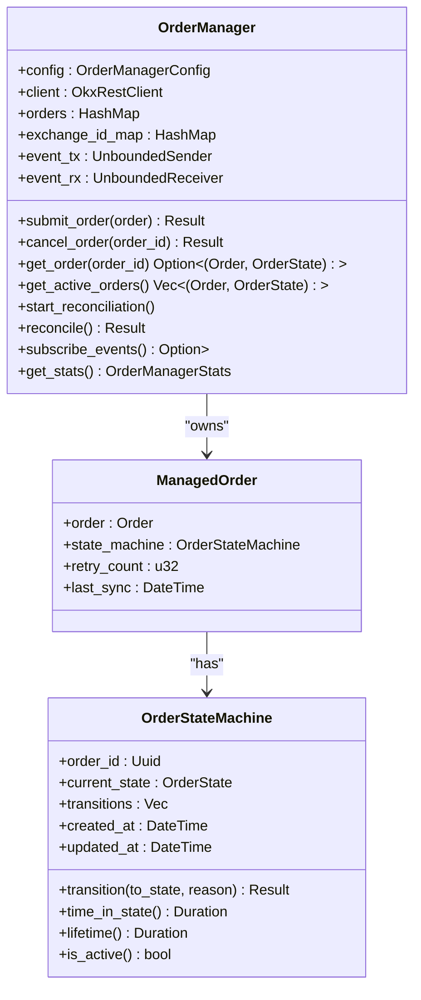
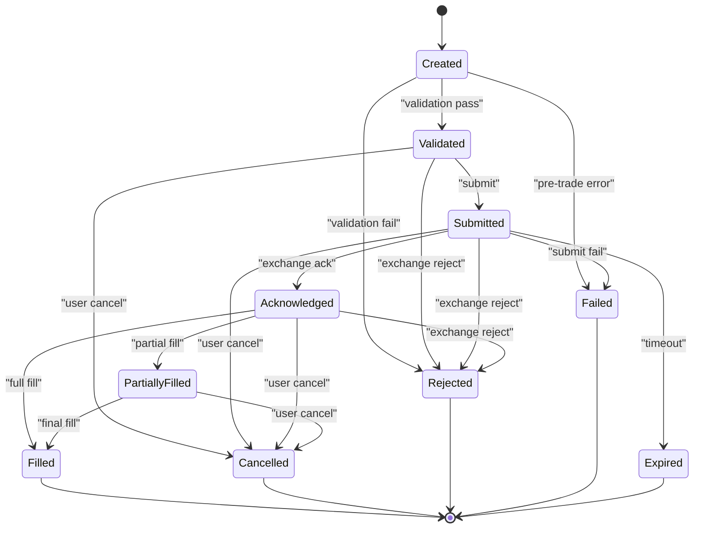
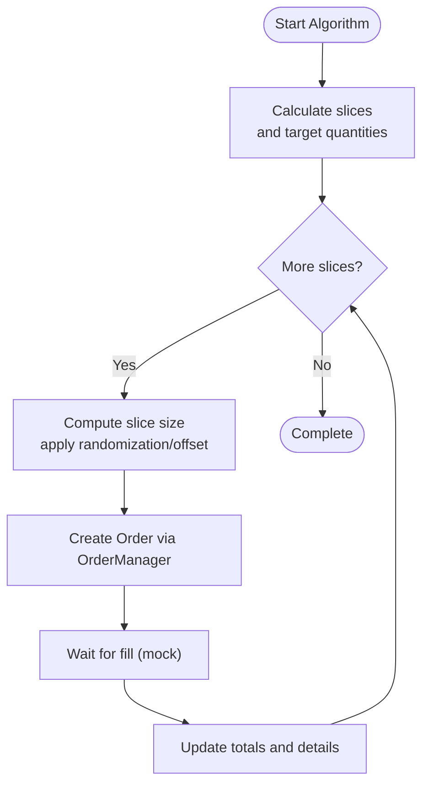
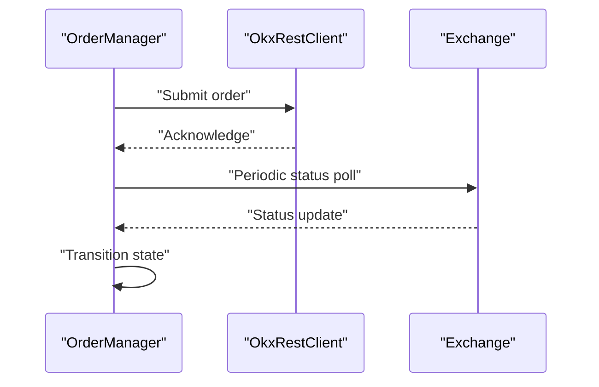
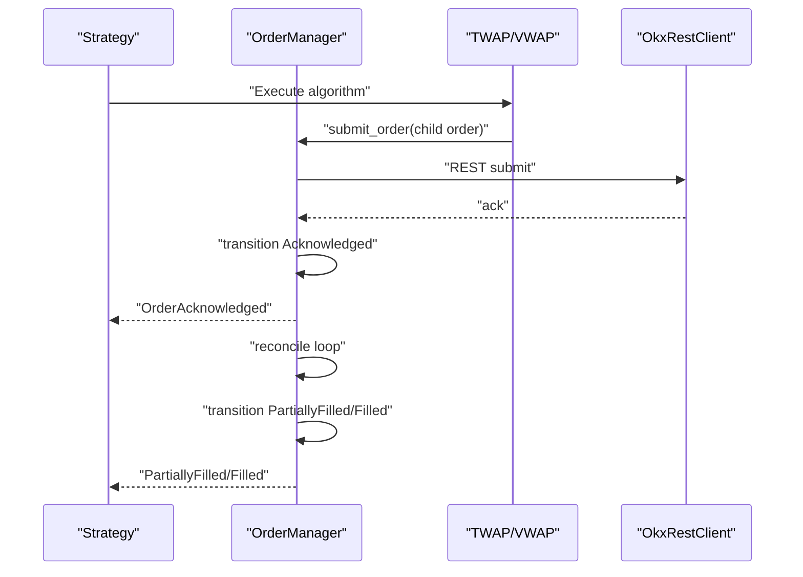
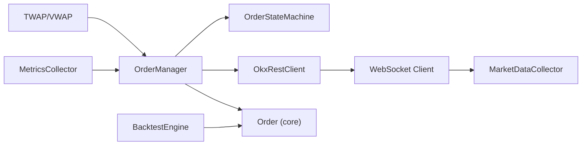

# Trading Execution

<cite>
**Referenced Files in This Document**
- [order_manager.rs](file://crates/trading/src/order_manager.rs)
- [state_machine.rs](file://crates/trading/src/state_machine.rs)
- [algorithms.rs](file://crates/trading/src/algorithms.rs)
- [error.rs](file://crates/trading/src/error.rs)
- [lib.rs](file://crates/okx-client/src/lib.rs)
- [rest.rs](file://crates/okx-client/src/rest.rs)
- [websocket.rs](file://crates/okx-client/src/websocket.rs)
- [order.rs](file://crates/core/src/models/order.rs)
- [types.rs](file://crates/core/src/types.rs)
- [metrics.rs](file://crates/monitoring/src/metrics.rs)
- [collector.rs](file://crates/data/src/collector.rs)
- [engine.rs](file://crates/backtest/src/engine.rs)
- [simple_ma_crossover.rs](file://examples/simple_ma_crossover.rs)
- [websocket_ticker.rs](file://examples/websocket_ticker.rs)
</cite>

## Table of Contents
1. [Introduction](#introduction)
2. [Project Structure](#project-structure)
3. [Core Components](#core-components)
4. [Architecture Overview](#architecture-overview)
5. [Detailed Component Analysis](#detailed-component-analysis)
6. [Dependency Analysis](#dependency-analysis)
7. [Performance Considerations](#performance-considerations)
8. [Troubleshooting Guide](#troubleshooting-guide)
9. [Conclusion](#conclusion)
10. [Appendices](#appendices)

## Introduction
This document describes the trading execution system architecture with a focus on the order manager, the 9-state order execution state machine, execution algorithms (TWAP and VWAP), latency tracking and performance monitoring, integration with the OKX client, and order book management considerations. It also provides concrete execution workflows and diagrams to illustrate how components interact during order lifecycle management and algorithmic slicing.

## Project Structure
The trading execution system is organized into modular crates:
- trading: order lifecycle, state machine, and execution algorithms
- okx-client: REST and WebSocket clients for OKX
- core: shared models and types (Order, Price, Quantity, Symbol)
- monitoring: metrics and health reporting
- data: market data collector and storage integration
- backtest: backtesting engine and cost modeling
- examples: usage examples for strategies and WebSocket connectivity

**Diagram sources**
- [order_manager.rs](file://crates/trading/src/order_manager.rs#L1-L374)
- [state_machine.rs](file://crates/trading/src/state_machine.rs#L1-L271)
- [algorithms.rs](file://crates/trading/src/algorithms.rs#L1-L526)
- [error.rs](file://crates/trading/src/error.rs#L1-L31)
- [lib.rs](file://crates/okx-client/src/lib.rs#L1-L39)
- [rest.rs](file://crates/okx-client/src/rest.rs#L1-L10)
- [websocket.rs](file://crates/okx-client/src/websocket.rs#L1-L612)
- [order.rs](file://crates/core/src/models/order.rs#L1-L383)
- [types.rs](file://crates/core/src/types.rs#L1-L292)
- [metrics.rs](file://crates/monitoring/src/metrics.rs#L1-L299)
- [collector.rs](file://crates/data/src/collector.rs#L1-L361)
- [engine.rs](file://crates/backtest/src/engine.rs#L1-L585)

**Section sources**
- [order_manager.rs](file://crates/trading/src/order_manager.rs#L1-L374)
- [state_machine.rs](file://crates/trading/src/state_machine.rs#L1-L271)
- [algorithms.rs](file://crates/trading/src/algorithms.rs#L1-L526)
- [lib.rs](file://crates/okx-client/src/lib.rs#L1-L39)
- [rest.rs](file://crates/okx-client/src/rest.rs#L1-L10)
- [websocket.rs](file://crates/okx-client/src/websocket.rs#L1-L612)
- [order.rs](file://crates/core/src/models/order.rs#L1-L383)
- [types.rs](file://crates/core/src/types.rs#L1-L292)
- [metrics.rs](file://crates/monitoring/src/metrics.rs#L1-L299)
- [collector.rs](file://crates/data/src/collector.rs#L1-L361)
- [engine.rs](file://crates/backtest/src/engine.rs#L1-L585)

## Core Components
- OrderManager: central orchestrator for order lifecycle, state transitions, reconciliation, and event emission. It integrates with the OKX REST client and maintains in-memory order state and exchange ID mapping.
- OrderStateMachine: enforces a strict 9-state order lifecycle with explicit valid transitions and cancellation rules.
- Algorithms (TWAP/VWAP): slice large orders into smaller pieces over time, with configurable offsets and randomization, and submit via OrderManager.
- OKX Client: provides REST and WebSocket interfaces for order submission and real-time market data.
- Core Models and Types: strongly typed Order, Price, Quantity, Symbol with validation and serialization support.
- Monitoring: metrics collector for counters, gauges, and histograms; health checks for system components.
- Data Collector: subscribes to OKX WebSocket feeds, validates quality, and stores data to configured backends.
- Backtest Engine: simulates order execution with realistic costs and generates performance results.

**Section sources**
- [order_manager.rs](file://crates/trading/src/order_manager.rs#L1-L374)
- [state_machine.rs](file://crates/trading/src/state_machine.rs#L1-L271)
- [algorithms.rs](file://crates/trading/src/algorithms.rs#L1-L526)
- [lib.rs](file://crates/okx-client/src/lib.rs#L1-L39)
- [order.rs](file://crates/core/src/models/order.rs#L1-L383)
- [types.rs](file://crates/core/src/types.rs#L1-L292)
- [metrics.rs](file://crates/monitoring/src/metrics.rs#L1-L299)
- [collector.rs](file://crates/data/src/collector.rs#L1-L361)
- [engine.rs](file://crates/backtest/src/engine.rs#L1-L585)

## Architecture Overview
The system separates concerns across layers:
- Strategy layer produces signals and orders
- Trading layer executes orders via OrderManager and Algorithms
- OKX client layer handles REST and WebSocket communications
- Monitoring and Data layers provide observability and market data

**Diagram sources**
- [algorithms.rs](file://crates/trading/src/algorithms.rs#L1-L526)
- [order_manager.rs](file://crates/trading/src/order_manager.rs#L110-L221)
- [state_machine.rs](file://crates/trading/src/state_machine.rs#L92-L167)
- [rest.rs](file://crates/okx-client/src/rest.rs#L1-L10)

## Detailed Component Analysis

### Order Manager
Responsibilities:
- Manage order lifecycle, enforce state transitions, emit events, reconcile with exchange, and expose statistics.
- Maintain internal order registry and exchange ID mapping.
- Provide async submission and cancellation APIs.

Key behaviors:
- Pre-trade validation sets state to Validated before submission.
- Asynchronous submission spawns a task to call the OKX client and then transitions to Acknowledged.
- Reconciliation loop periodically checks timeouts and emits Expired when exceeded.
- Event-driven architecture uses an unbounded channel for order lifecycle notifications.

**Diagram sources**
- [order_manager.rs](file://crates/trading/src/order_manager.rs#L80-L374)
- [state_machine.rs](file://crates/trading/src/state_machine.rs#L69-L167)
- [order.rs](file://crates/core/src/models/order.rs#L94-L151)

**Section sources**
- [order_manager.rs](file://crates/trading/src/order_manager.rs#L110-L221)
- [order_manager.rs](file://crates/trading/src/order_manager.rs#L278-L336)
- [order_manager.rs](file://crates/trading/src/order_manager.rs#L338-L374)

### Order Execution State Machine
States:
- Created, Validated, Submitted, Acknowledged, PartiallyFilled, Filled, Cancelled, Rejected, Failed, Expired

Rules:
- Terminal states: Filled, Cancelled, Rejected, Failed, Expired
- Cancellation allowed from Created, Validated, Submitted, Acknowledged, PartiallyFilled
- Valid transitions enforced by a deterministic match set

**Diagram sources**
- [state_machine.rs](file://crates/trading/src/state_machine.rs#L8-L31)
- [state_machine.rs](file://crates/trading/src/state_machine.rs#L116-L151)

**Section sources**
- [state_machine.rs](file://crates/trading/src/state_machine.rs#L33-L57)
- [state_machine.rs](file://crates/trading/src/state_machine.rs#L116-L151)

### Execution Algorithms: TWAP and VWAP
TWAP:
- Slices total quantity evenly across a duration with configurable slice intervals.
- Applies randomization percentage to reduce market impact.
- Uses limit orders except possibly the final slice (configurable aggressive final).
- Calculates price offset based on side and basis points.

VWAP:
- Slices based on a historical hourly volume profile to align with liquidity.
- Ensures minimum slice size and calculates price offset similarly.
- Computes deviation from current price to assess execution quality.

**Diagram sources**
- [algorithms.rs](file://crates/trading/src/algorithms.rs#L170-L304)
- [algorithms.rs](file://crates/trading/src/algorithms.rs#L369-L474)

**Section sources**
- [algorithms.rs](file://crates/trading/src/algorithms.rs#L136-L168)
- [algorithms.rs](file://crates/trading/src/algorithms.rs#L170-L304)
- [algorithms.rs](file://crates/trading/src/algorithms.rs#L346-L474)

### OKX Client Integration
REST:
- Provides a placeholder OkxRestClient constructor for initialization; actual implementation would handle order submission and status queries.

WebSocket:
- Implements connection management, authentication, subscription handling, heartbeat, and message processing.
- Emits parsed events to subscribers for market data consumption.

**Diagram sources**
- [rest.rs](file://crates/okx-client/src/rest.rs#L1-L10)
- [order_manager.rs](file://crates/trading/src/order_manager.rs#L166-L221)

**Section sources**
- [lib.rs](file://crates/okx-client/src/lib.rs#L1-L39)
- [rest.rs](file://crates/okx-client/src/rest.rs#L1-L10)
- [websocket.rs](file://crates/okx-client/src/websocket.rs#L1-L612)

### Order Book Management and Market Impact
- Market data collection subscribes to tickers, candles, and trades via WebSocket, applying quality control and storing to configured backends.
- The backtest engine uses order book snapshots to compute mid-price for realistic fills and slippage modeling.
- Algorithms incorporate price offsets and randomization to mitigate market impact during slicing.

**Section sources**
- [collector.rs](file://crates/data/src/collector.rs#L1-L361)
- [engine.rs](file://crates/backtest/src/engine.rs#L285-L351)
- [algorithms.rs](file://crates/trading/src/algorithms.rs#L202-L210)

### Examples of Order Execution Workflows
- Strategy-to-Order: A strategy generates a signal and creates an Order; the OrderManager submits it and transitions through states, emitting events.
- TWAP Workflow: The TWAP executor slices a large order across time, submitting child orders and aggregating execution details.
- VWAP Workflow: The VWAP executor slices according to volume profile, submitting child orders and computing deviation.

**Diagram sources**
- [simple_ma_crossover.rs](file://examples/simple_ma_crossover.rs#L1-L279)
- [algorithms.rs](file://crates/trading/src/algorithms.rs#L170-L304)
- [order_manager.rs](file://crates/trading/src/order_manager.rs#L166-L221)

**Section sources**
- [simple_ma_crossover.rs](file://examples/simple_ma_crossover.rs#L1-L279)
- [websocket_ticker.rs](file://examples/websocket_ticker.rs#L1-L149)

## Dependency Analysis
- OrderManager depends on OrderStateMachine, OKX REST client, and core Order model.
- Algorithms depend on OrderManager and core types.
- OKX client exposes REST and WebSocket modules; WebSocket is used by the data collector.
- Monitoring metrics are integrated via tracing-based collectors.
- Backtest engine depends on core models and cost modeling to simulate realistic execution.

**Diagram sources**
- [order_manager.rs](file://crates/trading/src/order_manager.rs#L80-L167)
- [state_machine.rs](file://crates/trading/src/state_machine.rs#L69-L167)
- [algorithms.rs](file://crates/trading/src/algorithms.rs#L147-L168)
- [rest.rs](file://crates/okx-client/src/rest.rs#L1-L10)
- [websocket.rs](file://crates/okx-client/src/websocket.rs#L1-L612)
- [collector.rs](file://crates/data/src/collector.rs#L1-L361)
- [metrics.rs](file://crates/monitoring/src/metrics.rs#L1-L299)
- [engine.rs](file://crates/backtest/src/engine.rs#L1-L585)

**Section sources**
- [order_manager.rs](file://crates/trading/src/order_manager.rs#L1-L374)
- [algorithms.rs](file://crates/trading/src/algorithms.rs#L1-L526)
- [websocket.rs](file://crates/okx-client/src/websocket.rs#L1-L612)
- [collector.rs](file://crates/data/src/collector.rs#L1-L361)
- [metrics.rs](file://crates/monitoring/src/metrics.rs#L1-L299)
- [engine.rs](file://crates/backtest/src/engine.rs#L1-L585)

## Performance Considerations
- Latency tracking: OrderManager computes latency from submission to first fill and exposes metrics via the metrics collector. The metrics collector records order latency, API latency, and strategy execution time.
- Throughput: OrderManager uses asynchronous submission and reconciliation loops to minimize blocking and maximize concurrent order processing.
- Market impact: Algorithms apply randomization and price offsets to distribute orders over time and reduce adverse selection.
- Data quality: Market data collector applies quality control and filters invalid or unconfirmed candles/trades to prevent noisy inputs.

**Section sources**
- [order.rs](file://crates/core/src/models/order.rs#L242-L265)
- [metrics.rs](file://crates/monitoring/src/metrics.rs#L165-L188)
- [metrics.rs](file://crates/monitoring/src/metrics.rs#L190-L208)
- [collector.rs](file://crates/data/src/collector.rs#L198-L220)
- [collector.rs](file://crates/data/src/collector.rs#L222-L269)
- [collector.rs](file://crates/data/src/collector.rs#L272-L319)

## Troubleshooting Guide
Common issues and diagnostics:
- Invalid state transitions: The state machine enforces valid transitions and returns errors for illegal moves.
- Order not found: Submission/cancel operations return order-not-found errors when internal state is missing.
- Reconciliation errors: Periodic reconciliation logs reconciliation errors and marks expired states when timeouts occur.
- WebSocket connectivity: The WebSocket client manages connection states, heartbeats, and reconnection policies; errors are logged and surfaced.

**Section sources**
- [state_machine.rs](file://crates/trading/src/state_machine.rs#L116-L151)
- [error.rs](file://crates/trading/src/error.rs#L1-L31)
- [order_manager.rs](file://crates/trading/src/order_manager.rs#L294-L336)
- [websocket.rs](file://crates/okx-client/src/websocket.rs#L376-L418)
- [websocket.rs](file://crates/okx-client/src/websocket.rs#L493-L536)

## Conclusion
The trading execution system provides a robust framework for managing order lifecycle, enforcing strict state transitions, and executing large orders via TWAP and VWAP algorithms. It integrates with OKX via REST and WebSocket, offers comprehensive latency and performance monitoring, and includes mechanisms for order book management and market impact mitigation. The architecture supports event-driven workflows and is suitable for both live trading and backtesting environments.

## Appendices
- Example usage: See the MA crossover strategy example for order creation and lifecycle handling, and the WebSocket ticker example for real-time market data consumption.
- Backtesting: The backtest engine simulates realistic fills with cost modeling and generates performance results for evaluation.

**Section sources**
- [simple_ma_crossover.rs](file://examples/simple_ma_crossover.rs#L1-L279)
- [websocket_ticker.rs](file://examples/websocket_ticker.rs#L1-L149)
- [engine.rs](file://crates/backtest/src/engine.rs#L1-L585)