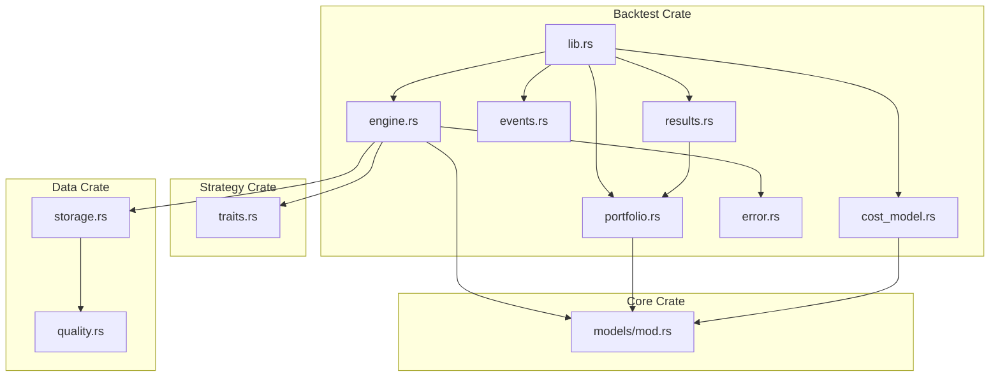
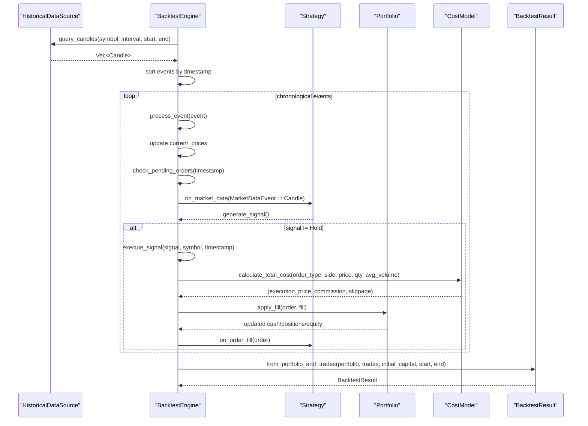
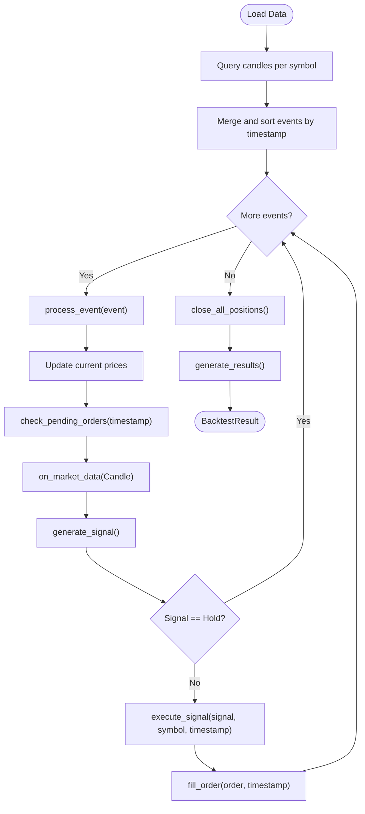
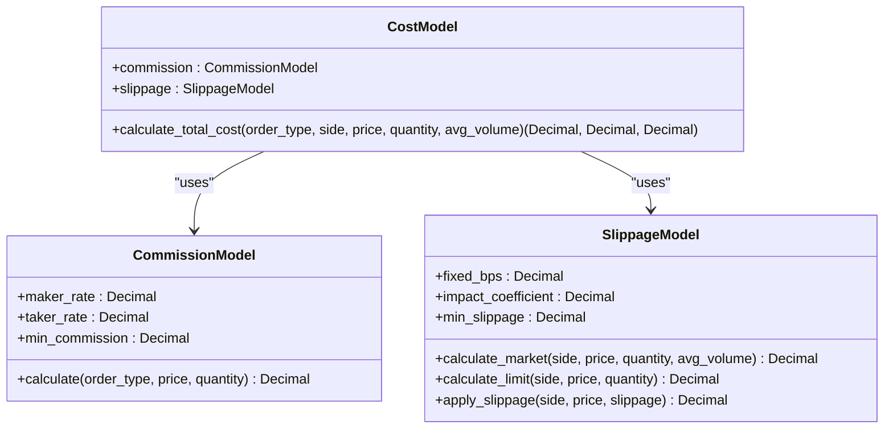
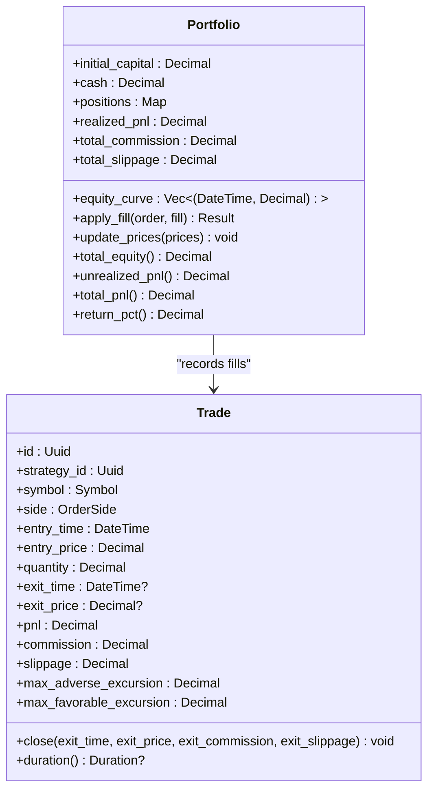
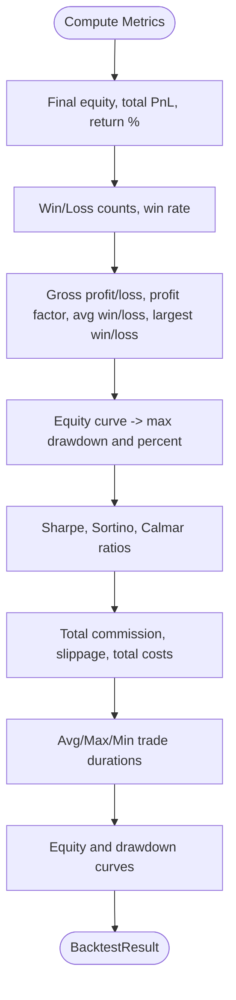
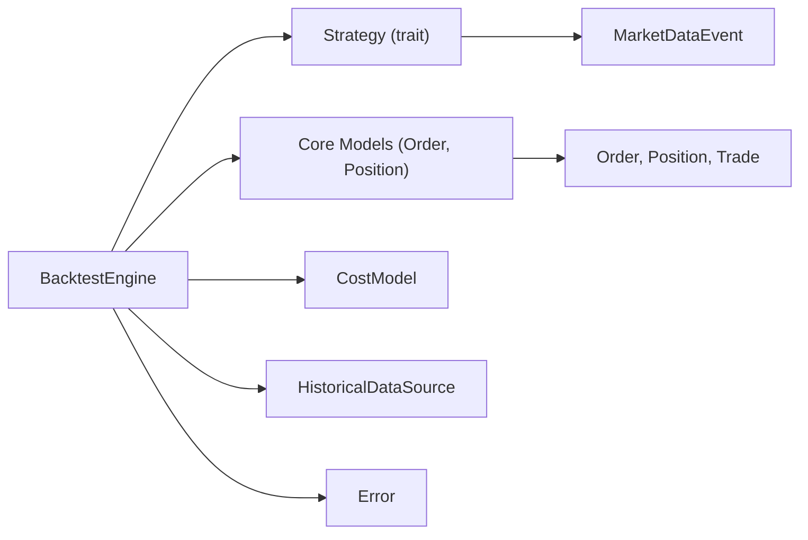
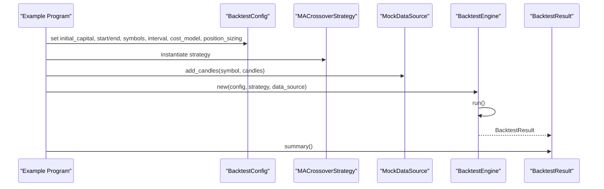

# Backtesting Methodology

<cite>
**Referenced Files in This Document**
- [lib.rs](file://crates/backtest/src/lib.rs)
- [engine.rs](file://crates/backtest/src/engine.rs)
- [events.rs](file://crates/backtest/src/events.rs)
- [portfolio.rs](file://crates/backtest/src/portfolio.rs)
- [results.rs](file://crates/backtest/src/results.rs)
- [cost_model.rs](file://crates/backtest/src/cost_model.rs)
- [error.rs](file://crates/backtest/src/error.rs)
- [traits.rs](file://crates/strategy/src/traits.rs)
- [mod.rs](file://crates/core/src/models/mod.rs)
- [storage.rs](file://crates/data/src/storage.rs)
- [quality.rs](file://crates/data/src/quality.rs)
- [backtest_simple.rs](file://examples/backtest_simple.rs)
</cite>

## Table of Contents
1. [Introduction](#introduction)
2. [Project Structure](#project-structure)
3. [Core Components](#core-components)
4. [Architecture Overview](#architecture-overview)
5. [Detailed Component Analysis](#detailed-component-analysis)
6. [Dependency Analysis](#dependency-analysis)
7. [Performance Considerations](#performance-considerations)
8. [Troubleshooting Guide](#troubleshooting-guide)
9. [Conclusion](#conclusion)
10. [Appendices](#appendices)

## Introduction
This document explains the event-driven backtesting engine and how it replays historical market data to evaluate trading strategies. It covers realistic execution simulation (commissions, slippage, latency), performance metrics (Sharpe ratio, drawdown, win rate, etc.), trade-by-trade audit trail, and result analysis. It also provides guidance on configuring backtests across timeframes, instruments, and market conditions, along with data requirements and quality considerations. Finally, it addresses common pitfalls (look-ahead bias, overfitting) and shows how to interpret results to improve strategies.

## Project Structure
The backtesting system is implemented in the backtest crate and integrates with the strategy, core, and data crates. The example demonstrates a simple moving average crossover strategy.

**Diagram sources**
- [lib.rs](file://crates/backtest/src/lib.rs#L1-L16)
- [engine.rs](file://crates/backtest/src/engine.rs#L1-L120)
- [events.rs](file://crates/backtest/src/events.rs#L1-L60)
- [portfolio.rs](file://crates/backtest/src/portfolio.rs#L1-L60)
- [results.rs](file://crates/backtest/src/results.rs#L1-L60)
- [cost_model.rs](file://crates/backtest/src/cost_model.rs#L1-L60)
- [error.rs](file://crates/backtest/src/error.rs#L1-L33)
- [traits.rs](file://crates/strategy/src/traits.rs#L1-L40)
- [mod.rs](file://crates/core/src/models/mod.rs#L1-L12)
- [storage.rs](file://crates/data/src/storage.rs#L1-L40)
- [quality.rs](file://crates/data/src/quality.rs#L1-L40)

**Section sources**
- [lib.rs](file://crates/backtest/src/lib.rs#L1-L16)
- [engine.rs](file://crates/backtest/src/engine.rs#L1-L120)
- [traits.rs](file://crates/strategy/src/traits.rs#L1-L40)
- [mod.rs](file://crates/core/src/models/mod.rs#L1-L12)
- [storage.rs](file://crates/data/src/storage.rs#L1-L40)
- [quality.rs](file://crates/data/src/quality.rs#L1-L40)

## Core Components
- BacktestEngine: orchestrates replay of historical candles, feeds market data to the strategy, executes signals as orders, applies fills with cost modeling, updates portfolio, and generates results.
- HistoricalDataSource and MockDataSource: provide candle data for the backtest period.
- CostModel: encapsulates commission and slippage models for realistic execution.
- Portfolio: tracks cash, positions, realized/unrealized PnL, and equity curve.
- BacktestResult: aggregates performance metrics and equity/drawdown curves.
- Events: MarketEvent, ExecutionEvent, Fill, and Trade define the audit trail and execution semantics.
- Strategy trait: defines how strategies receive market data, generate signals, and react to fills.

**Section sources**
- [engine.rs](file://crates/backtest/src/engine.rs#L123-L206)
- [cost_model.rs](file://crates/backtest/src/cost_model.rs#L152-L208)
- [portfolio.rs](file://crates/backtest/src/portfolio.rs#L1-L60)
- [results.rs](file://crates/backtest/src/results.rs#L1-L60)
- [events.rs](file://crates/backtest/src/events.rs#L1-L60)
- [traits.rs](file://crates/strategy/src/traits.rs#L60-L90)

## Architecture Overview
The backtesting engine is event-driven. It loads candles from a data source, sorts them by timestamp, and processes them sequentially. For each candle, it updates current prices, checks pending orders for fills, feeds market data to the strategy, and executes signals as orders. Fills are applied to the portfolio with cost modeling, and the engine records executions and trades for audit and analysis.

**Diagram sources**
- [engine.rs](file://crates/backtest/src/engine.rs#L187-L283)
- [engine.rs](file://crates/backtest/src/engine.rs#L285-L351)
- [engine.rs](file://crates/backtest/src/engine.rs#L391-L445)
- [engine.rs](file://crates/backtest/src/engine.rs#L447-L503)
- [engine.rs](file://crates/backtest/src/engine.rs#L574-L585)
- [cost_model.rs](file://crates/backtest/src/cost_model.rs#L183-L208)
- [portfolio.rs](file://crates/backtest/src/portfolio.rs#L50-L136)
- [results.rs](file://crates/backtest/src/results.rs#L61-L187)
- [traits.rs](file://crates/strategy/src/traits.rs#L60-L90)

## Detailed Component Analysis

### Event-Driven Replay and Strategy Integration
- HistoricalDataSource abstraction allows loading candles for each symbol and interval. The engine sorts all events by timestamp before processing.
- MarketEvent supports Candle, Trade, and OrderBook snapshots. The engine currently processes Candle events for strategy input and uses best bid/ask mid for mid-price updates.
- Strategy receives MarketDataEvent::Candle and returns a Signal. The engine translates signals into orders and executes them immediately for market orders.

**Diagram sources**
- [engine.rs](file://crates/backtest/src/engine.rs#L187-L283)
- [engine.rs](file://crates/backtest/src/engine.rs#L285-L351)
- [engine.rs](file://crates/backtest/src/engine.rs#L353-L445)
- [engine.rs](file://crates/backtest/src/engine.rs#L447-L503)
- [engine.rs](file://crates/backtest/src/engine.rs#L562-L585)

**Section sources**
- [engine.rs](file://crates/backtest/src/engine.rs#L187-L283)
- [engine.rs](file://crates/backtest/src/engine.rs#L285-L351)
- [events.rs](file://crates/backtest/src/events.rs#L1-L52)
- [traits.rs](file://crates/strategy/src/traits.rs#L13-L38)

### Realistic Execution Simulation (Commissions, Slippage, Latency)
- Commissions: CommissionModel computes maker/taker fees based on order type and notional value, with configurable minimums.
- Slippage: SlippageModel computes fixed and impact-based slippage for market orders, applied unfavorably to execution price. Limit orders incur no slippage by default.
- CostModel: Combines commission and slippage to compute execution price, commission, and slippage for each fill.
- Latency modeling: The engine processes events in chronological order and executes orders immediately upon signal. There is no explicit latency injection in the engine; latency would require adding simulated delays to order placement and fill detection.

**Diagram sources**
- [cost_model.rs](file://crates/backtest/src/cost_model.rs#L1-L151)
- [cost_model.rs](file://crates/backtest/src/cost_model.rs#L152-L208)

**Section sources**
- [cost_model.rs](file://crates/backtest/src/cost_model.rs#L1-L151)
- [cost_model.rs](file://crates/backtest/src/cost_model.rs#L152-L208)
- [engine.rs](file://crates/backtest/src/engine.rs#L447-L503)

### Portfolio Management and Trade Audit Trail
- Portfolio tracks cash, positions, realized PnL, total commission, total slippage, and equity curve. It validates sufficient funds for buys and sufficient position size for sells.
- Trade records capture entry/exit details, PnL computation, and MAE/MFE fields. The engine maintains a trade list and execution events for audit and result computation.

**Diagram sources**
- [portfolio.rs](file://crates/backtest/src/portfolio.rs#L1-L195)
- [events.rs](file://crates/backtest/src/events.rs#L110-L189)

**Section sources**
- [portfolio.rs](file://crates/backtest/src/portfolio.rs#L1-L195)
- [events.rs](file://crates/backtest/src/events.rs#L110-L189)

### Performance Metrics and Result Analysis
BacktestResult computes:
- Capital: initial/final equity, total PnL, total return percentage
- Trade statistics: total/winning/losing trades, win rate
- PnL metrics: gross profit/loss, profit factor, average win/loss, largest win/loss
- Risk metrics: max drawdown and percent, Sharpe ratio, Sortino ratio, Calmar ratio
- Cost analysis: total commission, slippage, total costs
- Time metrics: average/max/min trade duration in hours
- Curves: equity curve and drawdown curve

**Diagram sources**
- [results.rs](file://crates/backtest/src/results.rs#L61-L187)
- [results.rs](file://crates/backtest/src/results.rs#L189-L331)

**Section sources**
- [results.rs](file://crates/backtest/src/results.rs#L1-L187)
- [results.rs](file://crates/backtest/src/results.rs#L189-L331)

### Setting Up Backtests Across Timeframes, Instruments, and Conditions
- Timeframe and interval: configure BacktestConfig.interval and start/end times. The engine loads candles for each symbol and processes them chronologically.
- Instruments: set BacktestConfig.symbols to backtest multiple assets simultaneously. The engine maintains per-symbol prices and positions.
- Market conditions: adjust cost model (CommissionModel and SlippageModel) to reflect spot vs futures, maker vs taker, and conservative vs aggressive assumptions.

Practical guidance:
- Choose intervals that match strategy frequency (e.g., 1H for swing trading, 1m for intraday).
- Use multiple symbols to assess diversification and correlation effects.
- Vary cost model parameters to stress-test profitability under different fee and liquidity regimes.

**Section sources**
- [engine.rs](file://crates/backtest/src/engine.rs#L77-L122)
- [engine.rs](file://crates/backtest/src/engine.rs#L187-L219)
- [cost_model.rs](file://crates/backtest/src/cost_model.rs#L1-L151)
- [backtest_simple.rs](file://examples/backtest_simple.rs#L150-L176)

### Data Requirements and Quality Considerations
- Data source: HistoricalDataSource must return candles ordered by timestamp for each symbol and interval. The engine expects non-empty datasets for the selected period.
- Data quality: While the backtest engine does not enforce data quality, the data crate provides a QualityControl module that can be used to validate candles/ticks for:
  - Timestamp validation (reject future/stale data)
  - Price range validation (deviation thresholds)
  - Anomaly detection (Z-score)
  - Duplicate detection (message IDs)
- Recommendations:
  - Ensure continuous and gapless candles for the chosen interval.
  - Validate timestamps and prices before backtesting.
  - Monitor duplicate and anomaly rejections to maintain data integrity.

**Section sources**
- [engine.rs](file://crates/backtest/src/engine.rs#L187-L219)
- [storage.rs](file://crates/data/src/storage.rs#L186-L228)
- [quality.rs](file://crates/data/src/quality.rs#L105-L133)
- [quality.rs](file://crates/data/src/quality.rs#L135-L157)
- [quality.rs](file://crates/data/src/quality.rs#L159-L215)
- [quality.rs](file://crates/data/src/quality.rs#L217-L239)
- [quality.rs](file://crates/data/src/quality.rs#L241-L274)

### Pitfalls and Best Practices
Common pitfalls:
- Look-ahead bias: Ensure signals are generated only from available past data and that the engine processes events in chronological order.
- Overfitting: Use walk-forward analysis, out-of-sample testing, and robustness checks across market regimes. Avoid tuning parameters solely on in-sample data.
- Survivorship bias: Use adjusted historical data where applicable.
- Data snooping: Validate strategies on disjoint periods and instruments.

Mitigations:
- Use realistic cost models (commissions and slippage) to reflect real trading costs.
- Employ multiple backtest runs with different random seeds and market conditions.
- Validate metrics robustness across rolling windows.

**Section sources**
- [engine.rs](file://crates/backtest/src/engine.rs#L261-L279)
- [cost_model.rs](file://crates/backtest/src/cost_model.rs#L152-L208)
- [results.rs](file://crates/backtest/src/results.rs#L189-L331)

### Interpreting Results and Strategy Improvement
- Sharpe ratio: measures risk-adjusted returns; higher is generally better, but consider stability across market regimes.
- Max drawdown: indicates worst peak-to-trough decline; lower is preferable.
- Win rate and profit factor: help assess consistency and reward/risk profile.
- Cost analysis: total costs as a percentage of capital reveal the impact of fees and slippage.
- Equity and drawdown curves: visualize performance and stress periods.

Guidance:
- If Sharpe is low but profit factor is high, consider reducing position sizes or tightening stops.
- If drawdown is large, review risk limits and reduce leverage or position concentration.
- If costs erode profits, optimize order types (maker vs taker) and improve timing.

**Section sources**
- [results.rs](file://crates/backtest/src/results.rs#L1-L187)
- [results.rs](file://crates/backtest/src/results.rs#L189-L331)
- [backtest_simple.rs](file://examples/backtest_simple.rs#L220-L247)

## Dependency Analysis
The backtesting engine depends on strategy traits for market data and signals, core models for order/position types, and cost models for execution realism. The example demonstrates a minimal strategy implementation.

**Diagram sources**
- [engine.rs](file://crates/backtest/src/engine.rs#L1-L120)
- [traits.rs](file://crates/strategy/src/traits.rs#L13-L38)
- [mod.rs](file://crates/core/src/models/mod.rs#L1-L12)
- [cost_model.rs](file://crates/backtest/src/cost_model.rs#L152-L208)
- [error.rs](file://crates/backtest/src/error.rs#L1-L33)

**Section sources**
- [engine.rs](file://crates/backtest/src/engine.rs#L1-L120)
- [traits.rs](file://crates/strategy/src/traits.rs#L60-L90)
- [mod.rs](file://crates/core/src/models/mod.rs#L1-L12)
- [error.rs](file://crates/backtest/src/error.rs#L1-L33)

## Performance Considerations
- Event processing scale: The engine processes events sequentially; performance depends on data volume and strategy complexity. Use verbose logging judiciously.
- Cost model overhead: Slippage and commission calculations are lightweight but can add up across many trades.
- Memory footprint: Equity curve and trade lists grow with the number of trades; consider trimming or sampling for very long runs.

[No sources needed since this section provides general guidance]

## Troubleshooting Guide
Common issues and remedies:
- Insufficient data: The engine returns an error if no candles are found for a symbol/time range. Verify symbol, interval, and date range.
- Execution errors: Cash or position constraints can cause execution failures. Review cost model parameters and position sizing.
- Strategy errors: Ensure the strategy handles MarketDataEvent and returns valid signals. Check risk limits and order types.

**Section sources**
- [engine.rs](file://crates/backtest/src/engine.rs#L207-L213)
- [portfolio.rs](file://crates/backtest/src/portfolio.rs#L50-L136)
- [error.rs](file://crates/backtest/src/error.rs#L1-L33)

## Conclusion
The backtesting engine provides a robust, event-driven framework for evaluating trading strategies using historical candles. It incorporates realistic execution costs, maintains a detailed audit trail, and computes comprehensive performance metrics. By carefully selecting data, validating quality, and avoiding common pitfalls, users can derive actionable insights to refine and improve strategies across diverse market conditions.

[No sources needed since this section summarizes without analyzing specific files]

## Appendices

### Example: Running a Simple Backtest
The example demonstrates configuring a backtest, creating a mock data source, and running the engine to produce results.

**Diagram sources**
- [backtest_simple.rs](file://examples/backtest_simple.rs#L150-L247)
- [engine.rs](file://crates/backtest/src/engine.rs#L166-L185)
- [results.rs](file://crates/backtest/src/results.rs#L333-L412)

**Section sources**
- [backtest_simple.rs](file://examples/backtest_simple.rs#L150-L247)