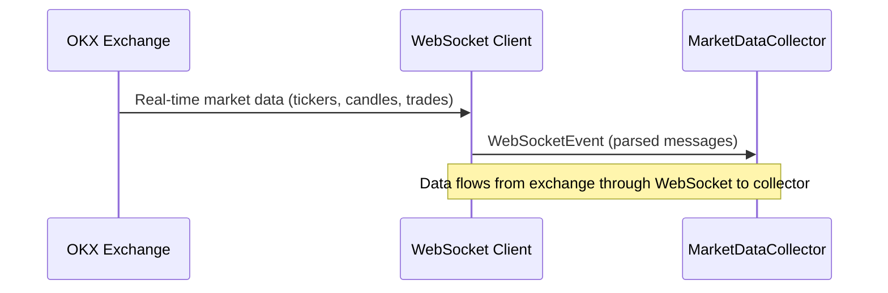
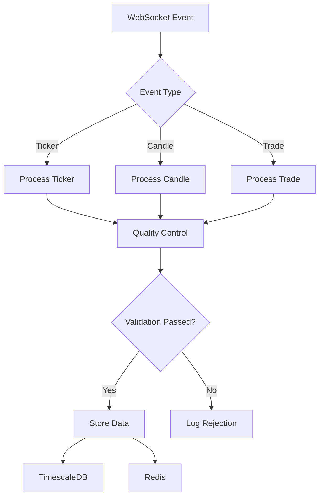
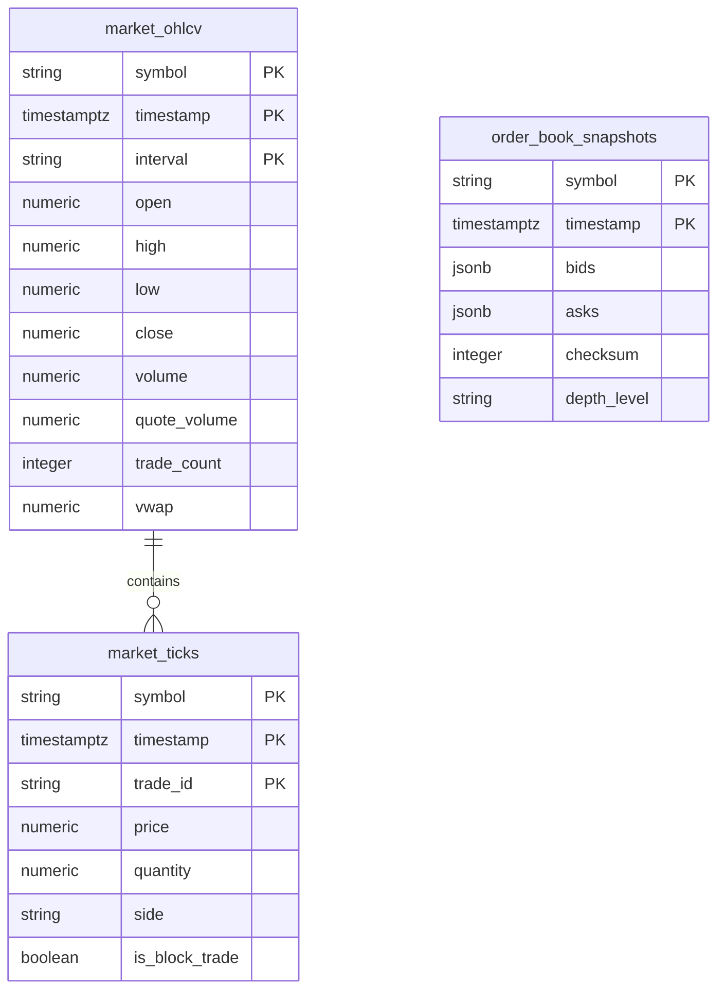
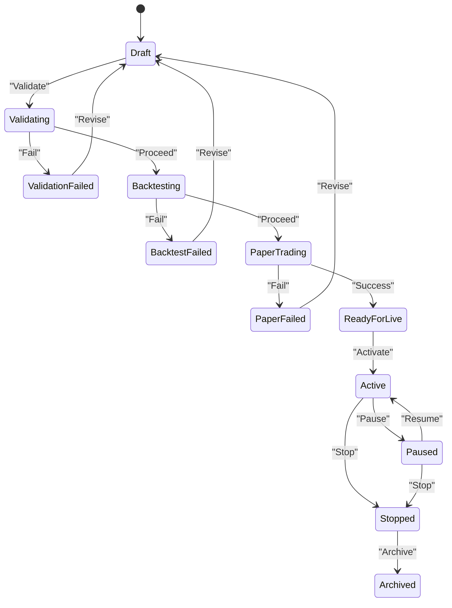
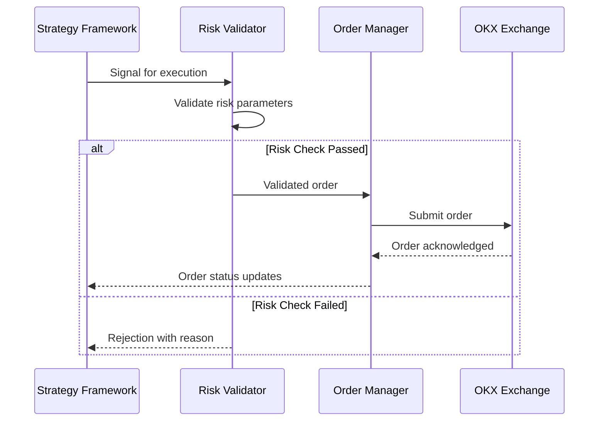
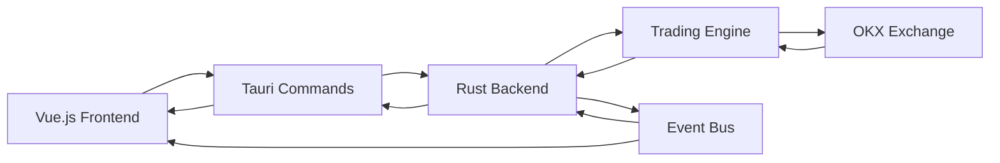
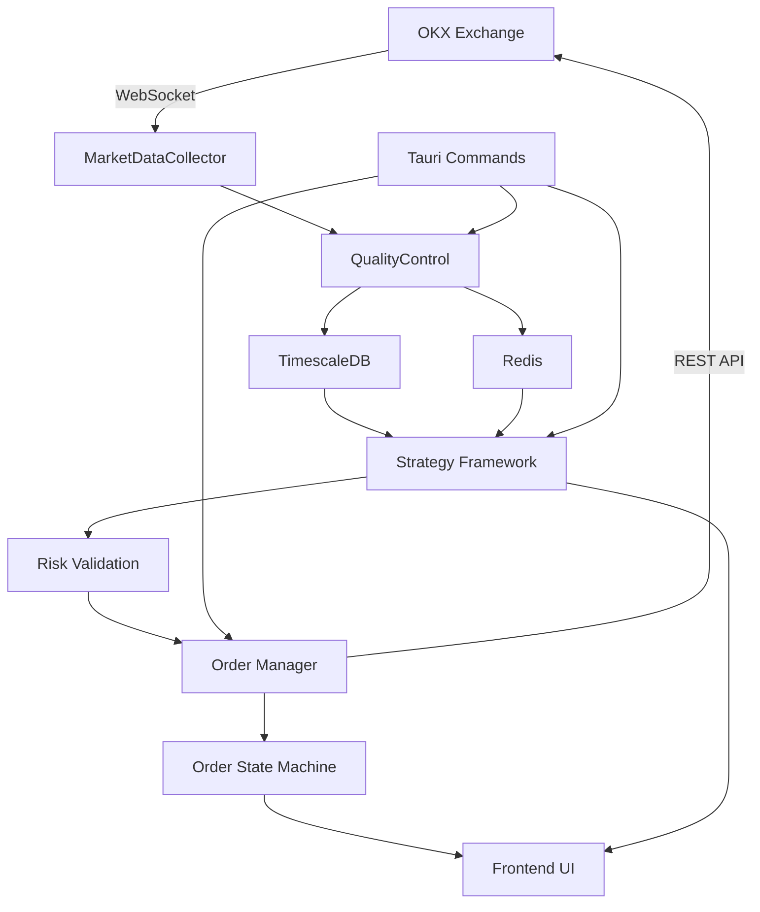

# Data Flow Between Layers

<cite>
**Referenced Files in This Document**   
- [collector.rs](file://crates/data/src/collector.rs)
- [storage.rs](file://crates/data/src/storage.rs)
- [quality.rs](file://crates/data/src/quality.rs)
- [websocket.rs](file://crates/okx-client/src/websocket.rs)
- [lib.rs](file://crates/strategy/src/lib.rs)
- [lifecycle.rs](file://crates/strategy/src/lifecycle.rs)
- [signal.rs](file://crates/strategy/src/signal.rs)
- [order_manager.rs](file://crates/trading/src/order_manager.rs)
- [validators.rs](file://crates/risk/src/validators.rs)
- [data.rs](file://frontend/src-tauri/src/commands/data.rs)
- [useTauriEvents.ts](file://frontend/src/composables/useTauriEvents.ts)
</cite>

## Table of Contents
1. [Data Ingestion from OKX Exchange](#data-ingestion-from-okx-exchange)
2. [Market Data Collector and Quality Control](#market-data-collector-and-quality-control)
3. [Data Storage in TimescaleDB and Redis](#data-storage-in-timescaledb-and-redis)
4. [Strategy Framework and Signal Generation](#strategy-framework-and-signal-generation)
5. [Trading Execution and Risk Validation](#trading-execution-and-risk-validation)
6. [Frontend-Backend Communication via Tauri](#frontend-backend-communication-via-tauri)
7. [Event-Driven Architecture and Data Propagation](#event-driven-architecture-and-data-propagation)
8. [Data Transformation and Synchronization](#data-transformation-and-synchronization)
9. [Data Consistency, Latency, and Error Handling](#data-consistency-latency-and-error-handling)

## Data Ingestion from OKX Exchange

The data flow begins with real-time market data ingestion from the OKX exchange through WebSocket connections. The system establishes persistent connections to both public and private WebSocket endpoints to receive various types of market data including tickers, OHLCV candles, trades, order book updates, account updates, position updates, and order updates.

The WebSocket client implements robust connection management with auto-reconnection capabilities, exponential backoff strategies, and heartbeat/ping-pong mechanisms to maintain reliable connectivity. It supports authentication for private channels using API key, secret, and passphrase credentials with proper signature generation. The client handles subscription management, allowing dynamic subscription and unsubscription from various data channels based on system requirements.

**Diagram sources**
- [websocket.rs](file://crates/okx-client/src/websocket.rs#L1-L590)
- [collector.rs](file://crates/data/src/collector.rs#L1-L311)

**Section sources**
- [websocket.rs](file://crates/okx-client/src/websocket.rs#L1-L590)
- [collector.rs](file://crates/data/src/collector.rs#L1-L311)

## Market Data Collector and Quality Control

The MarketDataCollector serves as the central component for receiving, validating, and processing market data from the WebSocket client. It implements a comprehensive quality control pipeline that ensures data integrity before storage. The collector processes different types of market data events including tickers, candles, and trades, applying various validation checks.

The quality control system performs multiple validation steps on incoming data:
- Timestamp validation to reject future or stale data beyond configured thresholds
- Price deviation checks to detect abnormal price movements
- Duplicate detection using message ID tracking
- Anomaly detection using statistical methods (Z-score analysis)
- Range validation to ensure prices fall within reasonable bounds

The quality control system maintains statistics on data processing, including counts of rejected data due to various validation failures, which can be monitored for system health assessment.

**Diagram sources**
- [collector.rs](file://crates/data/src/collector.rs#L1-L311)
- [quality.rs](file://crates/data/src/quality.rs#L1-L367)

**Section sources**
- [collector.rs](file://crates/data/src/collector.rs#L1-L311)
- [quality.rs](file://crates/data/src/quality.rs#L1-L367)

## Data Storage in TimescaleDB and Redis

The system employs a dual-storage strategy using TimescaleDB for persistent time-series data storage and Redis for caching frequently accessed data. This architecture optimizes both data durability and access performance.

TimescaleDB stores detailed market data including:
- OHLCV candle data with open, high, low, close prices, volume, and other metrics
- Individual trade ticks with precise timestamp, price, quantity, and side information
- Order book snapshots for market depth analysis

The storage implementation uses PostgreSQL's UPSERT functionality to handle duplicate data gracefully, ensuring data consistency even with potential message duplication. TimescaleDB's hypertable features enable efficient time-based queries and automatic partitioning.

Redis serves as a high-performance cache for frequently accessed data such as:
- Latest candle data for quick access
- Current market prices for low-latency retrieval
- Strategy state and configuration data

The caching strategy includes appropriate expiration policies to ensure data freshness while maintaining performance benefits.

**Diagram sources**
- [storage.rs](file://crates/data/src/storage.rs#L1-L385)

**Section sources**
- [storage.rs](file://crates/data/src/storage.rs#L1-L385)

## Strategy Framework and Signal Generation

The strategy framework processes stored market data to generate trading signals based on predefined algorithms. Strategies subscribe to market data events and analyze historical and real-time data to identify trading opportunities. The signal generation process transforms raw market data into actionable trading signals with associated metadata.

Trading signals include various types such as Buy, Sell, Hold, CloseLong, and CloseShort, each with confidence levels, target prices, stop-loss and take-profit levels, and suggested quantities. The framework supports different strategy types and provides a plugin architecture for implementing custom trading logic.

The strategy lifecycle management system tracks the state of each strategy through various phases including Draft, Validating, Backtesting, PaperTrading, ReadyForLive, Active, Paused, Stopped, and Archived. This state machine ensures proper strategy deployment and risk management.

**Diagram sources**
- [lifecycle.rs](file://crates/strategy/src/lifecycle.rs#L1-L125)
- [signal.rs](file://crates/strategy/src/signal.rs#L1-L65)

**Section sources**
- [lib.rs](file://crates/strategy/src/lib.rs#L1-L25)
- [lifecycle.rs](file://crates/strategy/src/lifecycle.rs#L1-L125)
- [signal.rs](file://crates/strategy/src/signal.rs#L1-L65)

## Trading Execution and Risk Validation

When trading signals are generated, they trigger the execution process through the order management system. Before any order is submitted to the exchange, it undergoes comprehensive risk validation to ensure compliance with predefined risk limits.

The risk validation system checks multiple parameters:
- Position size limits per symbol
- Maximum leverage exposure
- Daily loss limits
- Portfolio concentration limits
- Margin requirements
- Maximum number of open positions

The order manager implements a state machine to track the lifecycle of each order through states such as Created, Submitted, Acknowledged, PartiallyFilled, Filled, Cancelled, Rejected, Failed, and Expired. It handles order submission, cancellation, status updates, and reconciliation with the exchange.

The system includes timeout mechanisms and retry logic with exponential backoff to handle transient failures, ensuring reliable order execution even under adverse network conditions.

**Diagram sources**
- [validators.rs](file://crates/risk/src/validators.rs#L1-L397)
- [order_manager.rs](file://crates/trading/src/order_manager.rs#L1-L336)

**Section sources**
- [validators.rs](file://crates/risk/src/validators.rs#L1-L397)
- [order_manager.rs](file://crates/trading/src/order_manager.rs#L1-L336)

## Frontend-Backend Communication via Tauri

The frontend communicates with the backend through Tauri commands, enabling a secure and efficient interface between the user interface and the trading engine. The Tauri framework provides a bridge between the frontend (Vue.js) and backend (Rust) components, allowing UI actions to trigger backend operations and receive data for display.

The command system exposes specific endpoints for different functionality areas:
- Data commands for retrieving market data and system status
- Strategy commands for managing strategy lifecycle and configuration
- Trading commands for order submission and monitoring
- Risk commands for risk parameter management
- System commands for system-level operations

The composable useTauriEvents module in the frontend establishes event listeners to receive real-time updates from the backend, enabling reactive UI updates when market data arrives, orders are filled, or strategy states change.

**Diagram sources**
- [data.rs](file://frontend/src-tauri/src/commands/data.rs)
- [useTauriEvents.ts](file://frontend/src/composables/useTauriEvents.ts)

**Section sources**
- [data.rs](file://frontend/src-tauri/src/commands/data.rs)
- [useTauriEvents.ts](file://frontend/src/composables/useTauriEvents.ts)

## Event-Driven Architecture and Data Propagation

The system follows an event-driven architecture where data changes trigger cascading events throughout the system. Market data events propagate from the WebSocket client through the collector, storage, strategy framework, and trading execution components.

Key event types include:
- MarketDataEvent: Raw market data from the exchange
- SignalEvent: Trading signals generated by strategies
- OrderEvent: Order lifecycle events (created, submitted, filled, cancelled, etc.)
- RiskEvent: Risk validation results and violations
- SystemEvent: System-level events (startup, shutdown, configuration changes)

The event propagation system uses asynchronous message channels to decouple components, allowing for scalable and resilient data flow. Components subscribe to relevant events and react accordingly, enabling loose coupling and high cohesion.

The architecture supports both real-time processing for trading decisions and batch processing for analytics and reporting, providing flexibility for different use cases.

**Diagram sources**
- [collector.rs](file://crates/data/src/collector.rs#L1-L311)
- [order_manager.rs](file://crates/trading/src/order_manager.rs#L1-L336)
- [lifecycle.rs](file://crates/strategy/src/lifecycle.rs#L1-L125)

**Section sources**
- [collector.rs](file://crates/data/src/collector.rs#L1-L311)
- [order_manager.rs](file://crates/trading/src/order_manager.rs#L1-L336)
- [lifecycle.rs](file://crates/strategy/src/lifecycle.rs#L1-L125)

## Data Transformation and Synchronization

Throughout the data flow, multiple transformations occur to convert raw exchange data into actionable trading information. The system implements various synchronization mechanisms to ensure data consistency across components.

Data transformation stages include:
- Raw WebSocket message parsing into structured data types
- Normalization of market data across different instruments and timeframes
- Enrichment with calculated indicators and metrics
- Aggregation of tick data into candle data
- Serialization and deserialization for storage and transmission

Synchronization mechanisms ensure consistency between:
- In-memory state and persistent storage
- Frontend display and backend state
- Multiple instances in distributed deployments
- Cache and database

The system uses atomic operations, transactional updates, and versioning where appropriate to maintain data integrity during concurrent access.

**Section sources**
- [collector.rs](file://crates/data/src/collector.rs#L1-L311)
- [storage.rs](file://crates/data/src/storage.rs#L1-L385)
- [order_manager.rs](file://crates/trading/src/order_manager.rs#L1-L336)

## Data Consistency, Latency, and Error Handling

The system prioritizes data consistency through various mechanisms including database transactions, atomic updates, and reconciliation processes. For time-series data, the system ensures temporal consistency by validating timestamps and handling out-of-order messages appropriately.

Latency considerations are addressed through:
- Efficient data structures and algorithms
- Caching frequently accessed data in Redis
- Asynchronous processing to avoid blocking operations
- Connection pooling for database access
- Batch operations where appropriate

Error handling is implemented at multiple levels:
- Input validation to prevent invalid data from entering the system
- Graceful degradation when components fail
- Comprehensive logging and monitoring
- Retry mechanisms with exponential backoff
- Circuit breakers to prevent cascading failures
- Alerting for critical issues

The system includes health checks and monitoring capabilities to detect and respond to issues proactively, ensuring reliable operation in production environments.

**Section sources**
- [collector.rs](file://crates/data/src/collector.rs#L1-L311)
- [error.rs](file://crates/data/src/error.rs#L1-L62)
- [order_manager.rs](file://crates/trading/src/order_manager.rs#L1-L336)
- [validators.rs](file://crates/risk/src/validators.rs#L1-L397)