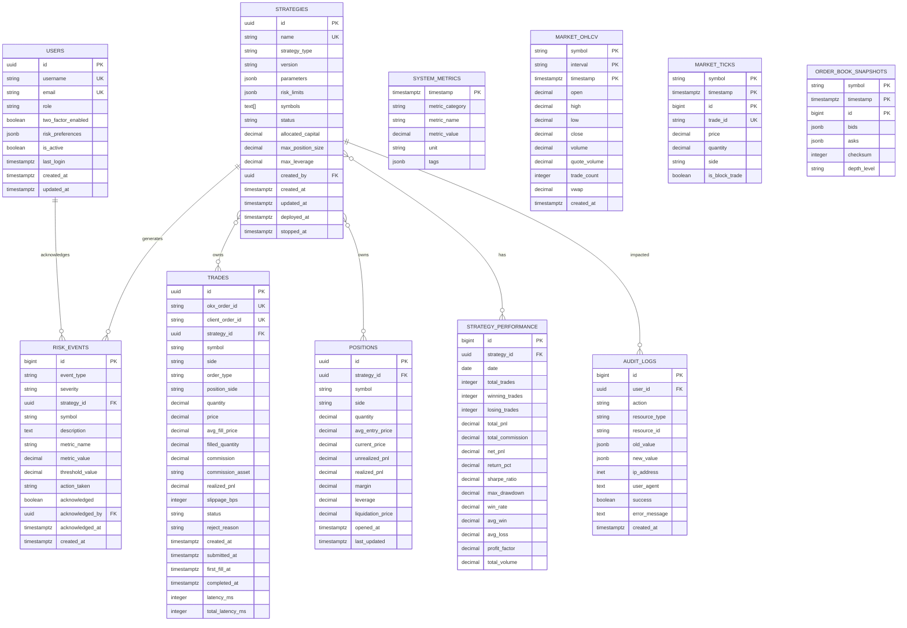

# Database Schema Design

<cite>
**Referenced Files in This Document**
- [001_initial_schema.sql](file://migrations/001_initial_schema.sql)
- [002_continuous_aggregates.sql](file://migrations/002_continuous_aggregates.sql)
- [storage.rs](file://crates/data/src/storage.rs)
- [collector.rs](file://crates/data/src/collector.rs)
- [quality.rs](file://crates/data/src/quality.rs)
- [types.rs](file://crates/core/src/types.rs)
- [README.md](file://config/README.md)
</cite>

## Table of Contents
1. [Introduction](#introduction)
2. [Project Structure](#project-structure)
3. [Core Components](#core-components)
4. [Architecture Overview](#architecture-overview)
5. [Detailed Component Analysis](#detailed-component-analysis)
6. [Dependency Analysis](#dependency-analysis)
7. [Performance Considerations](#performance-considerations)
8. [Troubleshooting Guide](#troubleshooting-guide)
9. [Conclusion](#conclusion)
10. [Appendices](#appendices)

## Introduction
This document describes the database schema and operational design for the EA OKX quantitative trading system. It focuses on the entity relationships, table structures, field definitions, TimescaleDB hypertables for time-series data, continuous aggregates for performance optimization, indexing strategy, data validation rules, schema evolution/migration management, retention and archival policies, and practical guidance for querying and performance tuning.

## Project Structure
The database schema is defined by SQL migration files and consumed by the data layer that writes and reads market data. The key elements are:
- Initial schema migration defines tables, constraints, indexes, and TimescaleDB policies.
- Continuous aggregates migration builds materialized views for OHLCV aggregation and adds additional indexes.
- The data layer implements storage and retrieval of candles, ticks, order book snapshots, and other entities.
- Quality control enforces data validation before persistence.
- Types define strong typing for symbols, prices, and quantities.

**Diagram sources**
- [001_initial_schema.sql](file://migrations/001_initial_schema.sql#L1-L273)
- [002_continuous_aggregates.sql](file://migrations/002_continuous_aggregates.sql#L1-L105)
- [storage.rs](file://crates/data/src/storage.rs#L1-L385)
- [collector.rs](file://crates/data/src/collector.rs#L1-L311)
- [quality.rs](file://crates/data/src/quality.rs#L1-L367)
- [types.rs](file://crates/core/src/types.rs#L1-L292)

**Section sources**
- [001_initial_schema.sql](file://migrations/001_initial_schema.sql#L1-L273)
- [002_continuous_aggregates.sql](file://migrations/002_continuous_aggregates.sql#L1-L105)
- [storage.rs](file://crates/data/src/storage.rs#L1-L385)
- [collector.rs](file://crates/data/src/collector.rs#L1-L311)
- [quality.rs](file://crates/data/src/quality.rs#L1-L367)
- [types.rs](file://crates/core/src/types.rs#L1-L292)

## Core Components
- Entities and tables:
  - Users, Strategies, Trades, Positions, Strategy Performance, Risk Events, System Metrics, Audit Logs.
- Time-series tables:
  - market_ohlcv (hypertable), market_ticks (hypertable), order_book_snapshots (hypertable), system_metrics (hypertable).
- Continuous aggregates:
  - market_ohlcv_5m, market_ohlcv_1h, market_ohlcv_1d, strategy_performance_daily.
- Indexes and constraints:
  - Primary keys, foreign keys, check constraints, partial indexes, GIN indexes for JSONB.
- Policies:
  - Compression and retention for hypertables; refresh policies for continuous aggregates.

**Section sources**
- [001_initial_schema.sql](file://migrations/001_initial_schema.sql#L8-L273)
- [002_continuous_aggregates.sql](file://migrations/002_continuous_aggregates.sql#L1-L105)

## Architecture Overview
The system ingests market data via WebSocket, validates it, and persists it to TimescaleDB. Hypertables partition time-series data for efficient storage and querying. Continuous aggregates precompute aggregated OHLCV and daily strategy performance metrics. The data layer exposes typed APIs for storing and retrieving candles, ticks, and order book snapshots.

**Diagram sources**
- [collector.rs](file://crates/data/src/collector.rs#L160-L272)
- [quality.rs](file://crates/data/src/quality.rs#L237-L268)
- [storage.rs](file://crates/data/src/storage.rs#L83-L177)

## Detailed Component Analysis

### Entity Relationship Model
The schema defines core business entities and their relationships. The primary relationships are:
- Strategies own Trades and Positions.
- Trades reference Strategies and record realized PnL.
- Positions reference Strategies and track unrealized and realized PnL.
- Risk Events optionally reference Strategies and Users for acknowledgments.
- System Metrics is a time-series table for operational telemetry.

**Diagram sources**
- [001_initial_schema.sql](file://migrations/001_initial_schema.sql#L8-L273)

**Section sources**
- [001_initial_schema.sql](file://migrations/001_initial_schema.sql#L8-L273)

### TimescaleDB Hypertables and Policies
- market_ohlcv: time-partitioned hypertable with compression and 5-year retention.
- market_ticks: time-partitioned hypertable with compression and 90-day retention.
- order_book_snapshots: time-partitioned hypertable with compression and 7-day retention.
- system_metrics: time-partitioned hypertable with compression and 180-day retention.

Retention and compression policies are configured per hypertable to balance storage costs and query performance.

**Section sources**
- [001_initial_schema.sql](file://migrations/001_initial_schema.sql#L52-L118)
- [001_initial_schema.sql](file://migrations/001_initial_schema.sql#L220-L235)

### Continuous Aggregates
Continuous aggregates precompute OHLCV at multiple granularities and daily strategy performance:
- market_ohlcv_5m: aggregates from market_ticks using time_bucket('5 minutes').
- market_ohlcv_1h: aggregates from market_ohlcv_5m using time_bucket('1 hour').
- market_ohlcv_1d: aggregates from market_ohlcv_1h using time_bucket('1 day').
- strategy_performance_daily: aggregates realized PnL and counts from filled trades.

Refresh policies are set to keep aggregates current with configurable offsets and intervals.

**Section sources**
- [002_continuous_aggregates.sql](file://migrations/002_continuous_aggregates.sql#L1-L91)

### Indexing Strategy
- Primary and composite indexes on time-series tables to accelerate time-range queries.
- Partial indexes for active filters (e.g., active strategies, submitted/partial trades).
- GIN indexes on JSONB columns for flexible tag-based filtering.
- Unique constraints on identifiers (e.g., trade_id) to prevent duplicates.

**Section sources**
- [001_initial_schema.sql](file://migrations/001_initial_schema.sql#L24-L26)
- [001_initial_schema.sql](file://migrations/001_initial_schema.sql#L48-L51)
- [001_initial_schema.sql](file://migrations/001_initial_schema.sql#L148-L152)
- [001_initial_schema.sql](file://migrations/001_initial_schema.sql#L172-L174)
- [001_initial_schema.sql](file://migrations/001_initial_schema.sql#L217-L219)
- [001_initial_schema.sql](file://migrations/001_initial_schema.sql#L252-L255)
- [002_continuous_aggregates.sql](file://migrations/002_continuous_aggregates.sql#L93-L105)

### Data Validation Rules and Constraints
- Database-level constraints enforce:
  - Enum-like values via CHECK constraints (e.g., roles, statuses, sides, intervals).
  - Positive numeric bounds (e.g., price > 0, volume >= 0).
  - Logical consistency (e.g., high >= open and high >= low; low <= close and low <= high).
  - Uniqueness (e.g., usernames, emails, strategy names, client order ids).
- Application-level quality control:
  - Timestamp validation (reject future or stale data).
  - Price deviation checks against last known price.
  - Duplicate detection using message IDs.
  - Anomaly detection via Z-score on price history.
  - Deduplication window management.

**Section sources**
- [001_initial_schema.sql](file://migrations/001_initial_schema.sql#L10-L22)
- [001_initial_schema.sql](file://migrations/001_initial_schema.sql#L52-L81)
- [001_initial_schema.sql](file://migrations/001_initial_schema.sql#L82-L118)
- [001_initial_schema.sql](file://migrations/001_initial_schema.sql#L120-L170)
- [001_initial_schema.sql](file://migrations/001_initial_schema.sql#L175-L219)
- [001_initial_schema.sql](file://migrations/001_initial_schema.sql#L220-L255)
- [quality.rs](file://crates/data/src/quality.rs#L105-L209)
- [quality.rs](file://crates/data/src/quality.rs#L213-L235)
- [collector.rs](file://crates/data/src/collector.rs#L201-L272)

### Schema Evolution and Migration Management
- Two migrations are provided:
  - Initial schema creation and TimescaleDB setup.
  - Continuous aggregates and additional indexes.
- The system uses TimescaleDB extension and hypertables; policies are attached during migration.
- The frontend includes database configuration UI and Docker compose guidance for local development.

**Section sources**
- [001_initial_schema.sql](file://migrations/001_initial_schema.sql#L1-L7)
- [002_continuous_aggregates.sql](file://migrations/002_continuous_aggregates.sql#L1-L105)
- [README.md](file://config/README.md#L134-L193)
- [README.md](file://config/README.md#L194-L224)

### Data Retention and Archival Strategies
- Retention periods:
  - market_ohlcv: 5 years.
  - market_ticks: 90 days.
  - order_book_snapshots: 7 days.
  - system_metrics: 180 days.
- Compression policies:
  - market_ohlcv: 30 days.
  - market_ticks: 7 days.
  - order_book_snapshots: 3 days.
  - system_metrics: 14 days.
- Archival:
  - Not explicitly defined in migrations; consider external archival for long-term storage beyond retention windows.

**Section sources**
- [001_initial_schema.sql](file://migrations/001_initial_schema.sql#L76-L81)
- [001_initial_schema.sql](file://migrations/001_initial_schema.sql#L98-L101)
- [001_initial_schema.sql](file://migrations/001_initial_schema.sql#L116-L119)
- [001_initial_schema.sql](file://migrations/001_initial_schema.sql#L232-L235)

### Data Security Considerations and Access Control
- Roles and permissions:
  - Users table includes a role field with predefined values; application-level logic can enforce role-based access.
  - No explicit database-level row-level security policies are defined in migrations.
- Audit logging:
  - Audit logs capture actions, resources, IP address, user agent, and outcomes.
- Secrets management:
  - Environment variables for database credentials and Redis URL are documented; credentials are not hardcoded in code.

**Section sources**
- [001_initial_schema.sql](file://migrations/001_initial_schema.sql#L10-L22)
- [001_initial_schema.sql](file://migrations/001_initial_schema.sql#L236-L255)
- [README.md](file://config/README.md#L134-L193)

### Querying Patterns and Performance Optimization
Common queries supported by the schema and indexes:
- Retrieve candles for a symbol and interval within a time range.
- Get the latest candle for a symbol and interval.
- Filter trades by status and time range.
- Aggregate daily strategy performance for reporting.
- Query risk events by severity and acknowledgment status.

Optimization tips:
- Use time-bound queries with ORDER BY timestamp to leverage time-partitioning.
- Prefer partial indexes for active filters (e.g., active strategies, submitted/partial trades).
- Use continuous aggregates for frequently accessed aggregated OHLCV and daily performance metrics.
- Leverage GIN indexes for tag-based filtering on JSONB columns.

**Section sources**
- [storage.rs](file://crates/data/src/storage.rs#L179-L256)
- [002_continuous_aggregates.sql](file://migrations/002_continuous_aggregates.sql#L1-L91)
- [001_initial_schema.sql](file://migrations/001_initial_schema.sql#L148-L152)
- [001_initial_schema.sql](file://migrations/001_initial_schema.sql#L172-L174)
- [001_initial_schema.sql](file://migrations/001_initial_schema.sql#L217-L219)
- [002_continuous_aggregates.sql](file://migrations/002_continuous_aggregates.sql#L93-L105)

## Dependency Analysis
- Data ingestion depends on WebSocket events and quality control.
- Storage layer depends on typed models for symbols, prices, and quantities.
- Continuous aggregates depend on time-series tables and TimescaleDB policies.
- Indexes and constraints support efficient querying and data integrity.

**Diagram sources**
- [collector.rs](file://crates/data/src/collector.rs#L1-L311)
- [quality.rs](file://crates/data/src/quality.rs#L1-L367)
- [storage.rs](file://crates/data/src/storage.rs#L1-L385)
- [types.rs](file://crates/core/src/types.rs#L1-L292)
- [001_initial_schema.sql](file://migrations/001_initial_schema.sql#L52-L273)
- [002_continuous_aggregates.sql](file://migrations/002_continuous_aggregates.sql#L1-L105)

**Section sources**
- [collector.rs](file://crates/data/src/collector.rs#L1-L311)
- [quality.rs](file://crates/data/src/quality.rs#L1-L367)
- [storage.rs](file://crates/data/src/storage.rs#L1-L385)
- [types.rs](file://crates/core/src/types.rs#L1-L292)
- [001_initial_schema.sql](file://migrations/001_initial_schema.sql#L52-L273)
- [002_continuous_aggregates.sql](file://migrations/002_continuous_aggregates.sql#L1-L105)

## Performance Considerations
- Use continuous aggregates to offload expensive aggregations for OHLCV and daily performance.
- Apply partial indexes for active filters to reduce scan sizes.
- Tune chunk_time_interval for hypertables based on workload patterns.
- Monitor compression effectiveness and adjust retention/compression windows.
- Use GIN indexes for JSONB tag filtering to improve analytics queries.

[No sources needed since this section provides general guidance]

## Troubleshooting Guide
- Data not appearing in continuous aggregates:
  - Verify refresh policies and time bucket alignment.
  - Confirm that underlying tables have data within the refresh offsets.
- Stale or rejected data:
  - Review quality control thresholds and logs.
  - Check for duplicate message IDs and anomaly detection warnings.
- Query performance issues:
  - Ensure time-bound queries leverage time-partitioning.
  - Add or refine indexes for new query patterns.
- Retention/compression behavior:
  - Confirm retention and compression policies are attached to the correct hypertables.

**Section sources**
- [002_continuous_aggregates.sql](file://migrations/002_continuous_aggregates.sql#L1-L91)
- [quality.rs](file://crates/data/src/quality.rs#L105-L209)
- [quality.rs](file://crates/data/src/quality.rs#L213-L235)
- [001_initial_schema.sql](file://migrations/001_initial_schema.sql#L76-L119)
- [001_initial_schema.sql](file://migrations/001_initial_schema.sql#L232-L235)

## Conclusion
The database schema leverages TimescaleDB to efficiently store and query time-series market data, with continuous aggregates enabling fast analytics and reporting. Robust constraints and application-level quality control ensure data integrity. Proper indexing and retention policies balance performance and storage costs. The modular design allows for incremental schema evolution and operational scalability.

[No sources needed since this section summarizes without analyzing specific files]

## Appendices

### Appendix A: Data Types and Strong Typing
- Symbol, Price, and Quantity types enforce domain constraints and precision.
- These types are used across the data layer to ensure consistent validation and storage.

**Section sources**
- [types.rs](file://crates/core/src/types.rs#L1-L292)

### Appendix B: Local Development Setup
- Environment variables for database and Redis are documented.
- Docker compose mounts migrations for initial schema setup.

**Section sources**
- [README.md](file://config/README.md#L134-L193)
- [README.md](file://config/README.md#L194-L224)