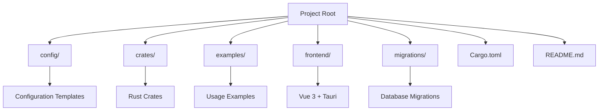
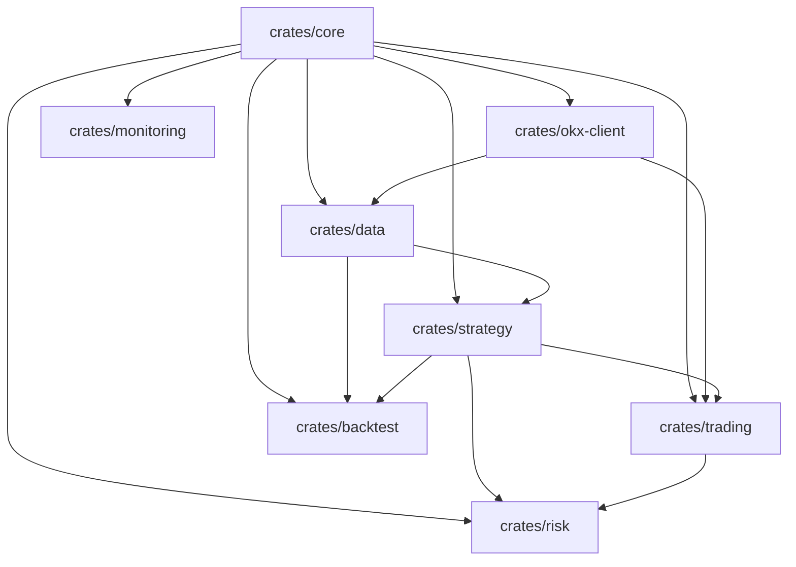
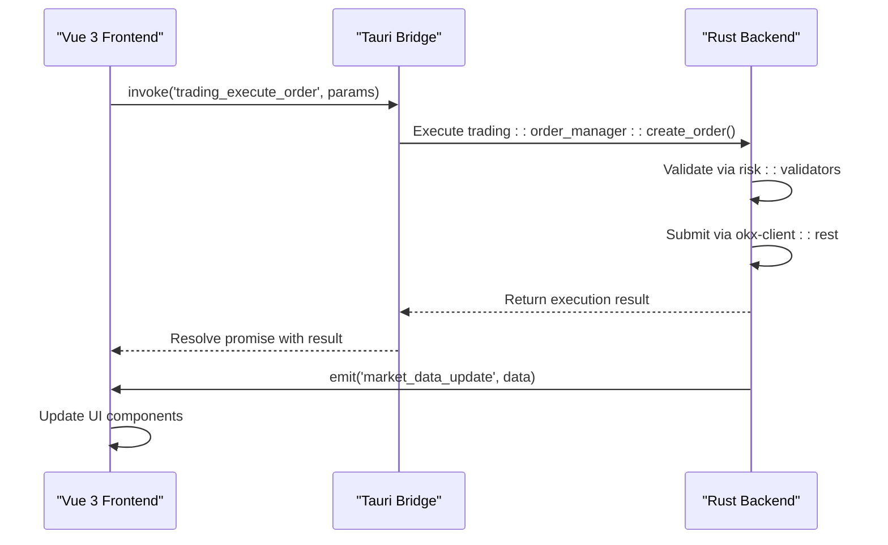

# Directory Structure Breakdown

<cite>
**Referenced Files in This Document**   
- [Cargo.toml](file://Cargo.toml)
- [README.md](file://README.md)
- [config/README.md](file://config/README.md)
- [crates/core/Cargo.toml](file://crates/core/Cargo.toml)
- [crates/strategy/Cargo.toml](file://crates/strategy/Cargo.toml)
- [crates/trading/Cargo.toml](file://crates/trading/Cargo.toml)
- [crates/data/Cargo.toml](file://crates/data/Cargo.toml)
- [crates/okx-client/Cargo.toml](file://crates/okx-client/Cargo.toml)
- [frontend/package.json](file://frontend/package.json)
- [frontend/src-tauri/Cargo.toml](file://frontend/src-tauri/Cargo.toml)
- [frontend/src-tauri/tauri.conf.json](file://frontend/src-tauri/tauri.conf.json)
- [frontend/src-tauri/src/main.rs](file://frontend/src-tauri/src/main.rs)
- [frontend/src-tauri/src/commands/mod.rs](file://frontend/src-tauri/src/commands/mod.rs)
- [examples/backtest_simple.rs](file://examples/backtest_simple.rs)
- [migrations/001_initial_schema.sql](file://migrations/001_initial_schema.sql)
</cite>

## Table of Contents
1. [Introduction](#introduction)
2. [Top-Level Directory Overview](#top-level-directory-overview)
3. [Monorepo Crate Structure](#monorepo-crate-structure)
4. [Tauri Integration Architecture](#tauri-integration-architecture)
5. [Root-Level Files and Configuration](#root-level-files-and-configuration)
6. [Build Artifacts and Target Directories](#build-artifacts-and-target-directories)
7. [Codebase Navigation Guide](#codebase-navigation-guide)

## Introduction
This document provides a comprehensive breakdown of the project's directory organization, focusing on the monorepo structure, component boundaries, and integration points between frontend and backend systems. The architecture combines a Rust-based backend with a Vue 3 frontend through Tauri, enabling a high-performance desktop application for quantitative trading on the OKX exchange.

**Section sources**
- [README.md](file://README.md#L1-L36)
- [Cargo.toml](file://Cargo.toml#L1-L95)

## Top-Level Directory Overview

The project follows a well-organized structure with clearly defined responsibilities for each top-level directory:

- **config/**: Contains configuration templates and examples for different environments (development, production), symbol-specific settings, Docker configurations, and loading mechanisms.
- **crates/**: Houses the monorepo's modular Rust components, each implementing specific trading system functionality.
- **examples/**: Provides usage demonstrations and standalone scripts showcasing how to use various components.
- **frontend/**: Contains the Vue 3 application with Tauri integration for desktop deployment.
- **migrations/**: Stores database schema changes as SQL scripts for version-controlled database evolution.

**Diagram sources**
- [config/README.md](file://config/README.md#L1-L224)
- [README.md](file://README.md#L1-L36)

**Section sources**
- [config/README.md](file://config/README.md#L1-L224)
- [README.md](file://README.md#L1-L36)

## Monorepo Crate Structure

The project implements a monorepo architecture with multiple interdependent Rust crates, each encapsulating specific domain functionality:

- **backtest**: Implements backtesting engine with cost modeling, portfolio simulation, and results analysis.
- **core**: Defines shared data models (orders, positions, trades) and fundamental types used across the system.
- **data**: Handles market data collection, quality assurance, and storage operations.
- **monitoring**: Provides alerting, metrics collection, and monitoring services.
- **okx-client**: Implements the API client for OKX exchange with REST and WebSocket support.
- **risk**: Manages risk validation, position limits, and Value-at-Risk calculations.
- **strategy**: Contains strategy lifecycle management, signal generation, and performance metrics.
- **trading**: Implements order execution algorithms, state machines, and order management.

The dependency graph shows a layered architecture where higher-level crates depend on lower-level ones:

**Diagram sources**
- [Cargo.toml](file://Cargo.toml#L2-L11)
- [crates/core/Cargo.toml](file://crates/core/Cargo.toml#L1-L20)
- [crates/strategy/Cargo.toml](file://crates/strategy/Cargo.toml#L1-L39)
- [crates/trading/Cargo.toml](file://crates/trading/Cargo.toml#L1-L27)
- [crates/data/Cargo.toml](file://crates/data/Cargo.toml#L1-L45)
- [crates/okx-client/Cargo.toml](file://crates/okx-client/Cargo.toml#L1-L49)

**Section sources**
- [Cargo.toml](file://Cargo.toml#L2-L11)
- [crates/core/Cargo.toml](file://crates/core/Cargo.toml#L1-L20)
- [crates/strategy/Cargo.toml](file://crates/strategy/Cargo.toml#L1-L39)
- [crates/trading/Cargo.toml](file://crates/trading/Cargo.toml#L1-L27)

## Tauri Integration Architecture

The frontend directory contains a Vue 3 application integrated with Tauri 2.0, creating a desktop application that bridges the web UI with Rust backend functionality. The integration works through Tauri's command system, allowing the frontend to invoke Rust functions securely.

Key integration points include:
- **src-tauri/src/commands/**: Contains Rust command modules exposed to the frontend (data, risk, strategy, trading, system).
- **src-tauri/tauri.conf.json**: Configures the Tauri application, security settings, and window behavior.
- **src-tauri/Cargo.toml**: Defines the Tauri backend dependencies and workspace integration.
- **frontend/src/composables/useTauriEvents.ts**: Handles bidirectional communication between frontend and backend via events.

The architecture enables the Vue 3 frontend to:
1. Display real-time market data from the Rust backend
2. Manage trading strategies through exposed commands
3. Execute orders via the trading crate
4. Monitor risk metrics and receive alerts
5. Perform backtesting with results visualization

**Diagram sources**
- [frontend/src-tauri/tauri.conf.json](file://frontend/src-tauri/tauri.conf.json)
- [frontend/src-tauri/src/main.rs](file://frontend/src-tauri/src/main.rs)
- [frontend/src-tauri/src/commands/mod.rs](file://frontend/src-tauri/src/commands/mod.rs)
- [frontend/src/composables/useTauriEvents.ts](file://frontend/src/composables/useTauriEvents.ts)

**Section sources**
- [README.md](file://README.md#L1-L36)
- [frontend/src-tauri/tauri.conf.json](file://frontend/src-tauri/tauri.conf.json)
- [frontend/src-tauri/src/main.rs](file://frontend/src-tauri/src/main.rs)

## Root-Level Files and Configuration

The root directory contains essential configuration and metadata files that govern the entire project:

- **Cargo.toml**: Defines the workspace configuration, listing all member crates and establishing shared dependencies with version policies. This enables consistent dependency management across the monorepo.
- **README.md**: Provides setup instructions, build commands, and an overview of planned features and technology stack (Vue 3, TypeScript, Tauri 2.0, Vite, Pinia).
- **IMPLEMENTATION_STATUS.md**, **FINAL_IMPLEMENTATION_REPORT.md**, **NEXT_STEPS.md**: Track project progress, completion status, and future development plans.
- **package-lock.json**: Locks frontend dependencies for reproducible builds.

The workspace configuration in Cargo.toml establishes a unified dependency ecosystem, with shared versions for critical crates like tokio, serde, sqlx, and tracing, ensuring compatibility across all components.

**Section sources**
- [Cargo.toml](file://Cargo.toml#L1-L95)
- [README.md](file://README.md#L1-L36)
- [IMPLEMENTATION_STATUS.md](file://IMPLEMENTATION_STATUS.md)
- [FINAL_IMPLEMENTATION_REPORT.md](file://FINAL_IMPLEMENTATION_REPORT.md)

## Build Artifacts and Target Directories

The project generates build artifacts in target/ directories at multiple levels:
- **target/**: Root-level directory for workspace-wide builds, containing compiled binaries and intermediate files.
- **frontend/src-tauri/target/**: Contains Tauri-specific build artifacts, including debug and release binaries for the desktop application.

These directories are typically excluded from version control (.gitignore) as they can be regenerated from source. The build process follows this flow:
1. Rust crates are compiled with shared dependencies from the workspace
2. Frontend assets are bundled via Vite
3. Tauri combines the frontend bundle with the Rust backend into a desktop application
4. Final binaries are produced in target/release/ or target/debug/

The separation of build artifacts from source code maintains a clean repository structure and enables reproducible builds across different environments.

**Section sources**
- [Cargo.toml](file://Cargo.toml#L87-L95)
- [frontend/src-tauri/build.rs](file://frontend/src-tauri/build.rs)

## Codebase Navigation Guide

To effectively navigate this codebase:
1. Start with the **crates/core** module to understand fundamental data models
2. Explore **crates/okx-client** to see exchange integration patterns
3. Examine **examples/** directory for practical usage demonstrations
4. Review **config/** templates to understand environment-specific settings
5. Study **frontend/src-tauri/src/commands/** to see how frontend-backend communication is structured

Key component boundaries:
- **Data Flow**: okx-client → data → strategy → trading → monitoring
- **Risk Integration**: All trading operations route through risk validation
- **Frontend Access**: Only specific commands are exposed via Tauri API
- **Configuration**: Environment-specific settings override defaults

This structure enables independent development of components while maintaining clear integration points through well-defined interfaces and shared data models.

**Section sources**
- [examples/backtest_simple.rs](file://examples/backtest_simple.rs)
- [migrations/001_initial_schema.sql](file://migrations/001_initial_schema.sql)
- [config/README.md](file://config/README.md#L1-L224)