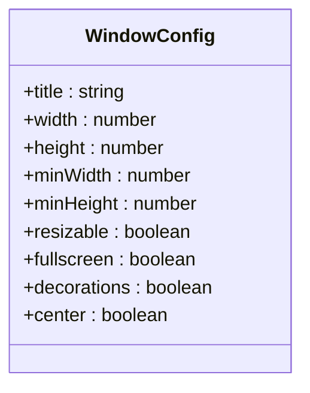
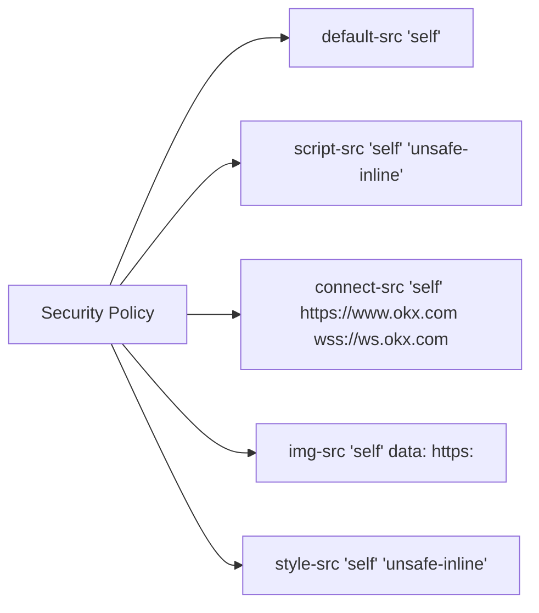
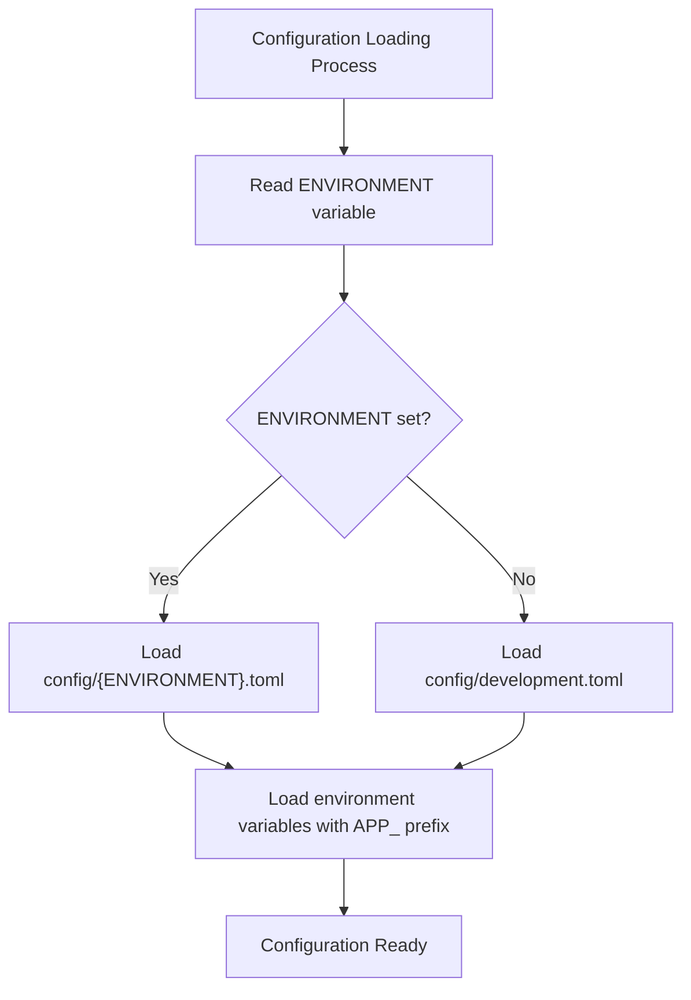

# Environment Configuration

<cite>
**Referenced Files in This Document**   
- [config/README.md](file://config/README.md)
- [src-tauri/tauri.conf.json](file://src-tauri/tauri.conf.json)
- [Cargo.toml](file://Cargo.toml)
- [config/development.toml](file://config/development.toml)
- [config/production.toml](file://config/production.toml)
- [config/symbols.toml](file://config/symbols.toml)
</cite>

## Table of Contents
1. [Introduction](#introduction)
2. [Configuration File Structure](#configuration-file-structure)
3. [Core Configuration Options](#core-configuration-options)
4. [Tauri Configuration](#tauri-configuration)
5. [Environment Setup](#environment-setup)
6. [Sensitive Data Management](#sensitive-data-management)
7. [Configuration Loading and Override Mechanisms](#configuration-loading-and-override-mechanisms)
8. [Troubleshooting Common Configuration Issues](#troubleshooting-common-configuration-issues)
9. [Conclusion](#conclusion)

## Introduction
The EA OKX quantitative trading platform provides a comprehensive configuration system that enables users to customize application behavior across different environments. This document details the configuration architecture, covering API credentials, database parameters, risk limits, logging settings, and Tauri-specific configurations. The system supports multiple configuration files, environment variables, and Docker-based deployment, ensuring flexibility and security in various deployment scenarios.

**Section sources**
- [config/README.md](file://config/README.md)

## Configuration File Structure
The application uses a TOML-based configuration system organized in the `config/` directory. The configuration is structured into logical sections that correspond to different aspects of the application:

```mermaid
flowchart TD
A["Configuration Structure"] --> B["environment"]
A --> C["okx"]
A --> D["database"]
A --> E["redis"]
A --> F["trading"]
A --> G["risk"]
A --> H["monitoring"]
B --> B1["name: environment name"]
B --> B2["log_level: logging verbosity"]
C --> C1["api_url: OKX API endpoint"]
C --> C2["ws_url: WebSocket endpoint"]
C --> C3["api_key: API key"]
C --> C4["secret_key: Secret key"]
C --> C5["passphrase: Account passphrase"]
D --> D1["host: Database host"]
D --> D2["port: Database port"]
D --> D3["database: Database name"]
D --> D4["username: Database user"]
D --> D5["password: Database password"]
D --> D6["max_connections: Connection pool size"]
D --> D7["ssl_mode: SSL configuration"]
E --> E1["url: Redis connection URL"]
E --> E2["pool_size: Redis connection pool"]
F --> F1["max_leverage: Maximum leverage"]
F --> F2["default_capital: Default trading capital"]
F --> F3["max_position_size_pct: Position size limit"]
F --> F4["max_daily_loss_pct: Daily loss threshold"]
G --> G1["enable_pre_trade_checks: Pre-trade validation"]
G --> G2["enable_position_limits: Position limits"]
G --> G3["max_positions: Maximum concurrent positions"]
G --> G4["var_confidence: Value at Risk confidence level"]
H --> H1["metrics_port: Prometheus metrics port"]
H --> H2["enable_prometheus: Metrics collection"]
H --> H3["alert_email: Alert notification email"]
H --> H4["pagerduty_key: PagerDuty integration key"]
```



**Diagram sources**
- [config/README.md](file://config/README.md)

**Section sources**
- [config/README.md](file://config/README.md)

## Core Configuration Options

### API Credentials
The `[okx]` section contains credentials and endpoint information for connecting to the OKX exchange API:

- **api_url**: The base URL for REST API requests (production: `https://www.okx.com`, testnet for development)
- **ws_url**: The WebSocket URL for real-time market data
- **api_key**: Your OKX API key (loaded from environment variable `OKX_API_KEY`)
- **secret_key**: Your OKX secret key (loaded from environment variable `OKX_SECRET_KEY`)
- **passphrase**: Your API passphrase (loaded from environment variable `OKX_PASSPHRASE`)

### Database Connection Parameters
The `[database]` section configures the PostgreSQL/TimescaleDB connection:

- **host**: Database server hostname or IP address
- **port**: Database port (default: 5432)
- **database**: Database name
- **username**: Database user
- **password**: Database password (loaded from environment variable `DB_PASSWORD`)
- **max_connections**: Maximum number of connections in the pool
- **ssl_mode**: SSL connection mode (`prefer`, `require`, `disable`)

### Risk Limits
The `[risk]` section defines risk management parameters:

- **enable_pre_trade_checks**: Whether to perform risk validation before executing trades
- **enable_position_limits**: Whether to enforce maximum position limits
- **max_positions**: Maximum number of concurrent positions allowed
- **max_daily_loss_pct**: Maximum percentage of capital that can be lost in a single day
- **var_confidence**: Confidence level for Value at Risk calculations

### Logging Settings
The `[environment]` section controls logging behavior:

- **log_level**: Logging verbosity level (`debug`, `info`, `warn`, `error`)
- **name**: Environment name (`development`, `production`, `testing`)

**Section sources**
- [config/README.md](file://config/README.md)

## Tauri Configuration

### Window Settings
The `tauri.conf.json` file configures the desktop application window properties:



**Diagram sources**
- [src-tauri/tauri.conf.json](file://src-tauri/tauri.conf.json)

Key window configuration options:
- **title**: Window title displayed in the title bar
- **width/height**: Initial window dimensions (800×600 pixels)
- **minWidth/minHeight**: Minimum resizable dimensions (400×300 pixels)
- **resizable**: Whether users can resize the window
- **fullscreen**: Whether to start in fullscreen mode
- **decorations**: Whether to show window borders and controls
- **center**: Whether to center the window on screen startup

### Security Policies
The application implements a Content Security Policy (CSP) to enhance security:



**Diagram sources**
- [src-tauri/tauri.conf.json](file://src-tauri/tauri.conf.json)

The CSP restricts:
- Loading resources only from the same origin (`'self'`)
- Script execution to local scripts and inline scripts
- Network connections to the local application and OKX API endpoints
- Image loading from local resources, data URLs, and HTTPS sources
- Stylesheet loading from local and inline sources

### Plugin Configurations
Currently, the application has no additional Tauri plugins configured, but the structure is ready for future extensions. The configuration supports adding plugins for features such as:

- **Notification systems**
- **File system access**
- **Hardware integration**
- **Additional security features**

**Section sources**
- [src-tauri/tauri.conf.json](file://src-tauri/tauri.conf.json)

## Environment Setup

### Development Environment
The development configuration (`config/development.toml`) is optimized for local testing:

```toml
[environment]
name = "development"
log_level = "debug"

[okx]
api_url = "https://www.okx.com"
ws_url = "wss://ws.okx.com:8443/ws/v5/public"
api_key = "${OKX_API_KEY}"
secret_key = "${OKX_SECRET_KEY}"
passphrase = "${OKX_PASSPHRASE}"

[database]
host = "localhost"
port = 5432
database = "ea_okx_dev"
username = "postgres"
password = "${DB_PASSWORD}"
max_connections = 10
ssl_mode = "prefer"
```

Development settings include:
- Debug logging for detailed troubleshooting
- Local database connection
- Conservative trading limits
- Testnet API endpoints (commented for easy switching)

### Production Environment
The production configuration (`config/production.toml`) is optimized for live trading:

```toml
[environment]
name = "production"
log_level = "info"

[okx]
api_url = "https://www.okx.com"
ws_url = "wss://ws.okx.com:8443/ws/v5/public"
api_key = "${OKX_API_KEY}"
secret_key = "${OKX_SECRET_KEY}"
passphrase = "${OKX_PASSPHRASE}"

[database]
host = "${DB_HOST}"
port = 5432
database = "ea_okx_prod"
username = "${DB_USER}"
password = "${DB_PASSWORD}"
max_connections = 50
ssl_mode = "require"
```

Production settings include:
- Info-level logging to reduce log volume
- External database with SSL enforcement
- Higher connection limits for performance
- Stricter risk controls including circuit breakers
- Production monitoring and alerting integration

### Docker Compose Configuration
The application includes a Docker Compose configuration for containerized deployment:

```yaml
version: '3.8'
services:
  postgres:
    image: timescale/timescaledb:latest-pg15
    environment:
      POSTGRES_DB: ea_okx
      POSTGRES_USER: postgres
      POSTGRES_PASSWORD: ${DB_PASSWORD}
    ports:
      - "5432:5432"
    volumes:
      - postgres_data:/var/lib/postgresql/data
      - ./migrations:/docker-entrypoint-initdb.d

  redis:
    image: redis:7-alpine
    ports:
      - "6379:6379"
    volumes:
      - redis_data:/data

volumes:
  postgres_data:
  redis_data:
```

This configuration provides:
- TimescaleDB for time-series data storage
- Redis for caching and message brokering
- Automatic database initialization with migrations
- Persistent data storage through Docker volumes

**Section sources**
- [config/README.md](file://config/README.md)

## Sensitive Data Management

### Environment Variables
Sensitive configuration data is managed through environment variables rather than hardcoding in configuration files:

```bash
# OKX API Credentials
OKX_API_KEY=your-api-key-here
OKX_SECRET_KEY=your-secret-key-here
OKX_PASSPHRASE=your-passphrase-here

# Database
DB_HOST=localhost
DB_USER=postgres
DB_PASSWORD=your-db-password

# Redis
REDIS_URL=redis://localhost:6379

# Monitoring
PAGERDUTY_KEY=your-pagerduty-key

# Application
RUST_LOG=info
ENVIRONMENT=development
```

Best practices for sensitive data management:
- Never commit `.env` files to version control
- Use `.env.example` as a template for required variables
- Implement strict access controls for production environment variables
- Rotate API keys regularly
- Use different API keys for different environments

### Security Best Practices
The application follows security best practices for configuration:

- **Principle of Least Privilege**: API keys have only the permissions necessary for operation
- **Environment Separation**: Different configurations for development, testing, and production
- **Secure Transmission**: SSL/TLS enforced for database and API connections
- **Input Validation**: All configuration values are validated before use
- **Error Handling**: Configuration errors fail securely without exposing sensitive information

**Section sources**
- [config/README.md](file://config/README.md)

## Configuration Loading and Override Mechanisms

### Configuration Loading Order
The application follows a specific hierarchy for loading configuration values:



**Diagram sources**
- [config/README.md](file://config/README.md)

The loading process:
1. Check for the `ENVIRONMENT` environment variable
2. If set, load the corresponding configuration file (e.g., `production.toml`)
3. If not set, default to `development.toml`
4. Overlay environment variables with the `APP_` prefix as overrides

### Override Mechanisms
Environment variables can override configuration file values using the `APP_` prefix:

- `APP_OKX_API_KEY` overrides the `okx.api_key` value
- `APP_DATABASE_HOST` overrides the `database.host` value
- `APP_TRADING_MAX_LEVERAGE` overrides the `trading.max_leverage` value

This allows for:
- Dynamic configuration in containerized environments
- Environment-specific overrides without modifying configuration files
- Secure handling of sensitive data through environment variables
- Easy integration with CI/CD pipelines and orchestration systems

**Section sources**
- [config/README.md](file://config/README.md)

## Troubleshooting Common Configuration Issues

### Missing Environment Variables
**Symptom**: Application fails to start with "Missing environment variable" errors
**Solution**: 
- Create a `.env` file with required variables
- Verify variable names match expected format
- Ensure the `.env` file is in the correct directory
- Check for typos in variable names

### Database Connection Failures
**Symptom**: "Failed to connect to database" errors
**Solution**:
- Verify database host, port, and credentials
- Check if the database server is running
- Ensure network connectivity between application and database
- Verify SSL mode settings match database configuration
- Check firewall rules for required ports

### API Authentication Errors
**Symptom**: "Invalid API key" or "Signature verification failed" errors
**Solution**:
- Verify API key, secret, and passphrase are correct
- Ensure the API key has required permissions enabled
- Check timestamp synchronization (clock drift)
- Verify the passphrase matches the one used when creating the API key
- Test credentials with a simple API call outside the application

### Configuration File Parsing Errors
**Symptom**: "Failed to parse configuration" errors
**Solution**:
- Validate TOML syntax using a linter
- Check for missing brackets or incorrect indentation
- Verify all required sections are present
- Ensure string values are properly quoted
- Check for unsupported data types

### Environment Not Loading Correctly
**Symptom**: Application loads wrong configuration file
**Solution**:
- Verify `ENVIRONMENT` variable is set correctly
- Check for typos in environment name
- Ensure configuration files exist with correct names
- Verify file permissions allow reading
- Check working directory when launching application

**Section sources**
- [config/README.md](file://config/README.md)

## Conclusion
The EA OKX platform's configuration system provides a robust, secure, and flexible foundation for managing application settings across different environments. By combining TOML configuration files with environment variable overrides, the system balances ease of use with security best practices. The Tauri configuration ensures a secure desktop application experience with appropriate window settings and security policies. Following the documented practices for sensitive data management and environment setup will help ensure reliable and secure operation of the quantitative trading system.