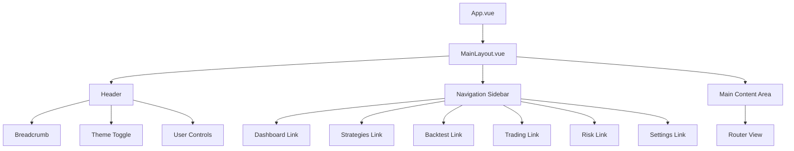

# Component Structure

<cite>
**Referenced Files in This Document**   
- [App.vue](file://frontend/src/App.vue)
- [MainLayout.vue](file://frontend/src/layouts/MainLayout.vue)
- [index.ts](file://frontend/src/router/index.ts)
- [Dashboard.vue](file://frontend/src/views/Dashboard.vue)
- [Backtest.vue](file://frontend/src/views/Backtest.vue)
- [Risk.vue](file://frontend/src/views/Risk.vue)
- [Settings.vue](file://frontend/src/views/Settings.vue)
- [Strategies.vue](file://frontend/src/views/Strategies.vue)
- [StrategyDetail.vue](file://frontend/src/views/StrategyDetail.vue)
- [Trading.vue](file://frontend/src/views/Trading.vue)
</cite>

## Table of Contents
1. [Introduction](#introduction)
2. [Root Component Structure](#root-component-structure)
3. [Layout System](#layout-system)
4. [View Components](#view-components)
5. [Component Composition Patterns](#component-composition-patterns)
6. [Navigation and Routing](#navigation-and-routing)
7. [Responsive Design and Accessibility](#responsive-design-and-accessibility)
8. [Conclusion](#conclusion)

## Introduction
This document provides a comprehensive analysis of the frontend component structure for the EA OKX trading system. The application follows a Vue 3 composition API pattern with a clear hierarchical organization centered around the MainLayout.vue component. The system implements a modular architecture with distinct view components for different functional areas including Dashboard, Backtest, Risk, Settings, Strategies, StrategyDetail, and Trading. The component structure leverages Vue Router for navigation, provides a consistent layout system with dynamic theming, and implements responsive design principles across all views.

## Root Component Structure

The application's component hierarchy begins with App.vue as the root component, which serves as the entry point for the entire application. App.vue contains minimal template structure, primarily consisting of a router-view element that renders the appropriate view component based on the current route. The component initializes essential services such as Tauri event listeners and theme management through composables. This design follows the single responsibility principle, with App.vue focusing solely on application initialization and routing, while delegating all visual presentation to child components.

**Section sources**
- [App.vue](file://frontend/src/App.vue#L1-L27)

## Layout System

### MainLayout.vue Structure
The MainLayout.vue component serves as the root layout container for all views in the application, providing a consistent user interface across different pages. The layout implements a two-column design with a fixed sidebar navigation and a flexible main content area. The sidebar contains a logo and a navigation menu with items for Dashboard, Strategies, Backtest, Trading, Risk, and Settings, each with appropriate icons. The main content area consists of a header with breadcrumb navigation, theme toggle, and user controls, followed by a router-view that renders the current page content.

The layout implements several key features:
- Dynamic theme support with dark/light mode toggle
- Responsive design with proper spacing and alignment
- Consistent color scheme using CSS variables
- Smooth page transition animations between views
- Persistent layout elements that remain constant across page changes

The component uses Vue's keep-alive feature to cache main views, improving performance when users navigate between pages. The layout also dynamically adjusts menu colors based on the current theme, providing visual feedback and maintaining accessibility standards.



**Diagram sources **
- [MainLayout.vue](file://frontend/src/layouts/MainLayout.vue#L1-L193)

**Section sources**
- [MainLayout.vue](file://frontend/src/layouts/MainLayout.vue#L1-L193)

## View Components

### Dashboard.vue
The Dashboard.vue component serves as the application's home screen, providing an overview of system metrics and performance. It displays key information through metric cards showing Total P&L, Active Strategies, Win Rate, and System Health. The component includes interactive charts for strategy performance and real-time market data using ECharts. It also features tables for active strategies and recent alerts, allowing users to quickly assess the system's status. The dashboard implements responsive design with a grid layout that adapts to different screen sizes.

### Backtest.vue
The Backtest.vue component provides a comprehensive interface for configuring and analyzing backtesting results. It features a configuration panel with form inputs for strategy selection, symbol, date range, initial capital, commission, and slippage settings. The results are displayed through performance metrics, equity curve charts, trade distribution analysis, and a detailed trade history table with filtering capabilities. The component allows users to run backtests and export results, with visualizations that update based on the selected chart type (equity, drawdown, or both).

### Risk.vue
The Risk.vue component offers a centralized interface for risk management and monitoring. It displays risk metrics through status cards and provides detailed analysis through VaR (Value at Risk) charts, drawdown analysis, and position risk assessment. The component includes a comprehensive risk limits configuration form with settings for position limits, loss limits, and stop loss/take profit parameters. Additional features include a risk heat map visualization and a timeline of risk alerts, enabling users to monitor and respond to potential issues.

### Settings.vue
The Settings.vue component implements a tabbed interface for managing application configuration. It organizes settings into logical categories including API Keys, System Settings, Database configuration, and About information. The API Keys section allows users to manage multiple OKX API configurations with secure storage and connection testing. System Settings include theme selection, language preferences, trading parameters, and notification options. The Database tab provides configuration for PostgreSQL and Redis services, while the About tab displays application information and version details.

### Strategies.vue
The Strategies.vue component serves as the central hub for strategy management. It displays a table of all strategies with filtering and search capabilities, showing key metrics such as P&L, win rate, and status. The component includes a multi-step wizard for creating and editing strategies, guiding users through basic information, strategy type selection, parameter configuration, and risk control settings. Each strategy can be started, paused, stopped, viewed, edited, or deleted directly from the table, with appropriate confirmation dialogs for destructive actions.

### StrategyDetail.vue
The StrategyDetail.vue component provides an in-depth view of a specific strategy's performance and configuration. It displays performance metrics and charts including equity curve and win/loss distribution. The component shows detailed strategy configuration including parameters, risk settings, and creation details. Additional sections include recent trades and strategy signals, providing comprehensive insight into the strategy's behavior. The interface includes control buttons for starting, pausing, resuming, stopping, and editing the strategy.

### Trading.vue
The Trading.vue component offers real-time monitoring and control of active trading activities. It displays current market data for multiple symbols and provides interfaces for managing active orders, current positions, and trade history. Users can place new orders through a dialog form with options for symbol, side, order type, quantity, and price. The component includes functionality for canceling orders and closing positions, with appropriate confirmation dialogs. Trade history can be filtered by date range and exported for further analysis.

**Section sources**
- [Dashboard.vue](file://frontend/src/views/Dashboard.vue#L1-L366)
- [Backtest.vue](file://frontend/src/views/Backtest.vue#L1-L518)
- [Risk.vue](file://frontend/src/views/Risk.vue#L1-L665)
- [Settings.vue](file://frontend/src/views/Settings.vue#L1-L523)
- [Strategies.vue](file://frontend/src/views/Strategies.vue#L1-L724)
- [StrategyDetail.vue](file://frontend/src/views/StrategyDetail.vue#L1-L549)
- [Trading.vue](file://frontend/src/views/Trading.vue#L1-L543)

## Component Composition Patterns

### Props Usage
The application follows consistent patterns for props usage across components. Most view components receive data through the composition API's reactive references rather than direct props, as they serve as top-level route components. However, when components are reused, they follow Vue's best practices for props definition with explicit typing using TypeScript interfaces. Props are used for configuration options, data display values, and callback functions, with appropriate validation where necessary.

### Event Handling
Event handling is implemented through a combination of direct event listeners in templates and composable functions. Click events, form submissions, and user interactions trigger methods defined in the component's setup function. The application uses Element Plus UI components extensively, leveraging their built-in event system. For communication between components, the application primarily relies on routing and shared state rather than custom events, following Vue's recommended patterns for larger applications.

### State Management
The application uses a combination of local component state and shared stores for state management. While the provided code does not show the store implementations, references to useConfigStore and useStrategyStore indicate the use of Pinia or Vuex for managing application-wide state. This approach allows components to access and modify shared data such as configuration settings and strategy information while maintaining reactivity.

### Code Organization
Components follow a consistent structure with the composition API, using defineOptions to specify component names for keep-alive caching. The script section is organized with reactive state at the top, followed by computed properties, methods, and lifecycle hooks. Utility functions are defined close to their usage points, improving code readability. The template structure follows a logical flow from configuration to results display, with appropriate use of Element Plus layout components.

**Section sources**
- [Dashboard.vue](file://frontend/src/views/Dashboard.vue#L105-L255)
- [Backtest.vue](file://frontend/src/views/Backtest.vue#L207-L444)
- [Risk.vue](file://frontend/src/views/Risk.vue#L247-L515)
- [Settings.vue](file://frontend/src/views/Settings.vue#L271-L454)
- [Strategies.vue](file://frontend/src/views/Strategies.vue#L339-L652)
- [StrategyDetail.vue](file://frontend/src/views/StrategyDetail.vue#L201-L420)
- [Trading.vue](file://frontend/src/views/Trading.vue#L247-L468)

## Navigation and Routing

### Route Configuration
The application's routing is configured in index.ts using Vue Router's createRouter function with a history mode. The routes are organized hierarchically with a Layout route that contains children for each main view. This structure enables the consistent MainLayout to be applied to all views while allowing individual components to be loaded on demand through dynamic imports. The route configuration includes metadata for each view such as titles and icons, which are used by the layout component for breadcrumb display and navigation menu items.

### Navigation Integration
Navigation is tightly integrated with the MainLayout.vue component, which uses the route's path to determine the active menu item. The layout displays the current route's title from the route meta information in the header breadcrumb. The application implements proper navigation guards implicitly through the router configuration, ensuring that users can only access views for which routes are defined. The routing system supports dynamic parameters, as evidenced by the StrategyDetail route which includes an ID parameter for viewing specific strategies.

```mermaid
graph TD
A[Router] --> B[Layout]
B --> C[/]
C --> D[Dashboard]
B --> E[/strategies]
E --> F[Strategies]
B --> G[/strategies/:id]
G --> H[StrategyDetail]
B --> I[/backtest]
I --> J[Backtest]
B --> K[/trading]
K --> L[Trading]
B --> M[/risk]
M --> N[Risk]
B --> O[/settings]
O --> P[Settings]
```

**Diagram sources **
- [index.ts](file://frontend/src/router/index.ts#L1-L63)

**Section sources**
- [index.ts](file://frontend/src/router/index.ts#L1-L63)
- [MainLayout.vue](file://frontend/src/layouts/MainLayout.vue#L75-L79)

## Responsive Design and Accessibility

### Responsive Design Considerations
The application implements responsive design principles through several mechanisms. The layout uses Element Plus's row and col components with percentage-based widths that adapt to different screen sizes. The grid system allows content to reflow appropriately on smaller screens, with key information remaining accessible. Charts and tables are given fixed heights with overflow handling to ensure content remains visible without excessive scrolling. Media queries are used sparingly, with most responsiveness achieved through flexible layout components.

### Accessibility Implementation
Accessibility is addressed through several features:
- Semantic HTML structure with appropriate heading levels
- Sufficient color contrast between text and background
- Keyboard navigation support through form controls and interactive elements
- ARIA attributes on interactive components like tabs and dialogs
- Descriptive labels for form inputs and controls
- Visual feedback for interactive elements on hover and focus
- Theme support that accommodates user preferences for dark/light mode

The application uses CSS variables for theming, allowing for consistent styling across light and dark modes while maintaining accessibility standards. Interactive elements include appropriate hover and focus states, and form controls have clear labels and validation feedback.

**Section sources**
- [MainLayout.vue](file://frontend/src/layouts/MainLayout.vue#L103-L193)
- [Dashboard.vue](file://frontend/src/views/Dashboard.vue#L257-L366)
- [Backtest.vue](file://frontend/src/views/Backtest.vue#L446-L518)
- [Risk.vue](file://frontend/src/views/Risk.vue#L517-L665)
- [Settings.vue](file://frontend/src/views/Settings.vue#L456-L523)
- [Strategies.vue](file://frontend/src/views/Strategies.vue#L654-L724)
- [StrategyDetail.vue](file://frontend/src/views/StrategyDetail.vue#L423-L549)
- [Trading.vue](file://frontend/src/views/Trading.vue#L471-L543)

## Conclusion
The frontend component structure of the EA OKX trading system demonstrates a well-organized, maintainable architecture following Vue 3 best practices. The application implements a clear hierarchy with MainLayout.vue serving as the consistent container for all views, providing navigation, theming, and layout services. Each view component has a focused responsibility, with cohesive organization of related functionality. The use of Vue Router enables clean navigation between views while maintaining a consistent user experience. The component composition patterns follow modern Vue practices with the composition API, reactive state management, and proper separation of concerns. Responsive design and accessibility considerations are integrated throughout the application, ensuring usability across different devices and for users with varying needs.