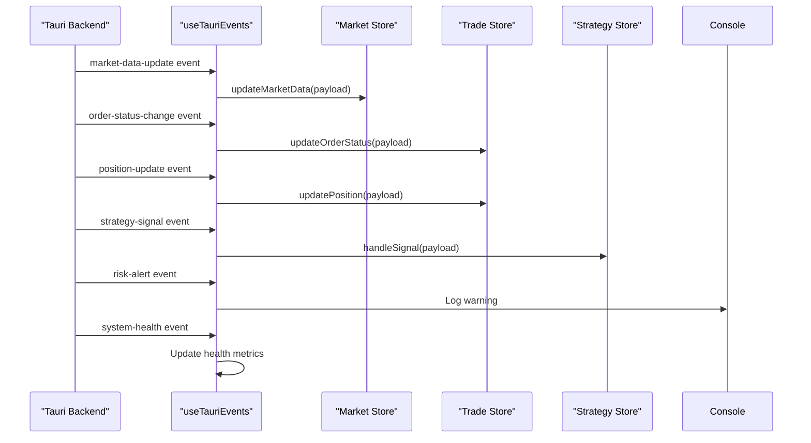
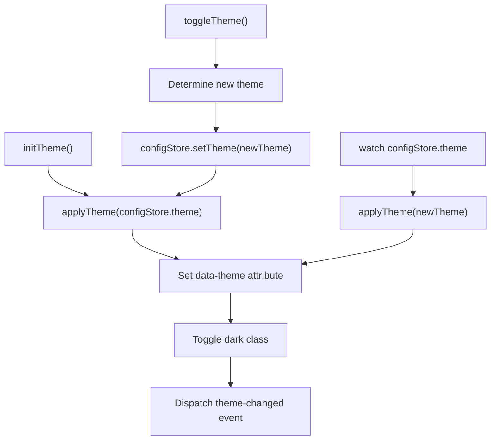
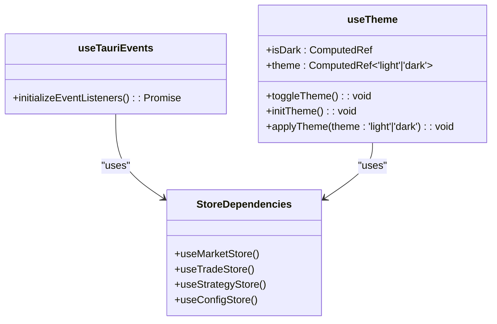
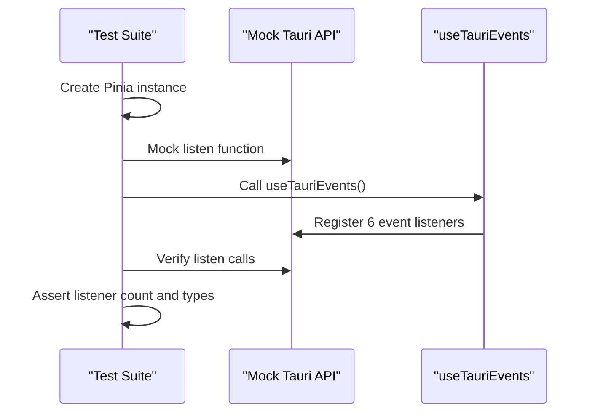

# Composables

<cite>
**Referenced Files in This Document**   
- [useTauriEvents.ts](file://src/composables/useTauriEvents.ts)
- [useTheme.ts](file://src/composables/useTheme.ts)
- [useTauriEvents.spec.ts](file://src/composables/__tests__/useTauriEvents.spec.ts)
- [market.ts](file://src/stores/market.ts)
- [trade.ts](file://src/stores/trade.ts)
- [strategy.ts](file://src/stores/strategy.ts)
- [config.ts](file://src/stores/config.ts)
</cite>

## Table of Contents
1. [Introduction](#introduction)
2. [useTauriEvents Composable](#usetaurievents-composable)
3. [useTheme Composable](#usetheme-composable)
4. [Composition Patterns and Interfaces](#composition-patterns-and-interfaces)
5. [Usage in Components](#usage-in-components)
6. [Testing Approach](#testing-approach)
7. [Conclusion](#conclusion)

## Introduction
This document provides comprehensive documentation for the composable functions in the EA OKX application, focusing on `useTauriEvents` and `useTheme`. These composables enable critical functionality for Tauri backend event handling, IPC communication, and dynamic theme management. The documentation details implementation patterns, usage examples, and testing strategies to ensure robust and maintainable code.

## useTauriEvents Composable

The `useTauriEvents` composable manages event subscription patterns between the Tauri backend and frontend, enabling real-time updates across various application domains including market data, trading, strategy signals, and system health.

**Diagram sources**
- [useTauriEvents.ts](file://src/composables/useTauriEvents.ts#L6-L47)
- [market.ts](file://src/stores/market.ts#L8-L15)
- [trade.ts](file://src/stores/trade.ts#L8-L22)
- [strategy.ts](file://src/stores/strategy.ts#L17-L23)

The composable establishes six primary event listeners through Tauri's `listen` API, each mapping to specific store update functions. This pattern ensures reactivity by automatically updating the application state when backend events occur. Error handling is implicit through the Tauri event system, with risk alerts being logged to the console for monitoring.

**Section sources**
- [useTauriEvents.ts](file://src/composables/useTauriEvents.ts#L6-L47)

## useTheme Composable

The `useTheme` composable provides dynamic theme management capabilities, allowing users to switch between light and dark themes with immediate visual feedback across the application.

**Diagram sources**
- [useTheme.ts](file://src/composables/useTheme.ts#L4-L46)
- [config.ts](file://src/stores/config.ts#L5-L12)

The composable integrates with the configuration store to maintain theme state and applies changes directly to the DOM for instant visual updates. It also dispatches a custom `theme-changed` event to notify components like charts that may need to update their visual appearance. The implementation includes reactive computed properties (`isDark`, `theme`) and watches for external theme changes.

**Section sources**
- [useTheme.ts](file://src/composables/useTheme.ts#L4-L46)

## Composition Patterns and Interfaces

Both composables follow the Vue 3 composition API pattern, returning reactive functions and properties that can be easily consumed by components. The parameter interfaces are minimal, requiring no input parameters, which simplifies usage.

**Diagram sources**
- [useTauriEvents.ts](file://src/composables/useTauriEvents.ts#L6-L47)
- [useTheme.ts](file://src/composables/useTheme.ts#L4-L46)
- [market.ts](file://src/stores/market.ts)
- [trade.ts](file://src/stores/trade.ts)
- [strategy.ts](file://src/stores/strategy.ts)
- [config.ts](file://src/stores/config.ts)

The composables have no parameters and return structured objects containing functions and reactive properties. This pattern promotes reusability and testability while maintaining clear separation of concerns.

**Section sources**
- [useTauriEvents.ts](file://src/composables/useTauriEvents.ts#L6-L47)
- [useTheme.ts](file://src/composables/useTheme.ts#L4-L46)

## Usage in Components

Components utilize these composables to establish real-time event handling and dynamic theming. The `useTauriEvents` composable is typically initialized during application startup to ensure all event listeners are registered, while `useTheme` is used in both layout components and settings interfaces.

For example, a dashboard component would call `initializeEventListeners()` to begin receiving market data updates, order status changes, and strategy signals. Similarly, a settings component would use `toggleTheme()` to provide users with theme switching capability, while the `isDark` computed property could be used for conditional styling.

The composables' integration with Pinia stores ensures that state changes are properly managed and persisted, with the theme configuration being persisted across sessions.

**Section sources**
- [useTauriEvents.ts](file://src/composables/useTauriEvents.ts#L6-L47)
- [useTheme.ts](file://src/composables/useTheme.ts#L4-L46)

## Testing Approach

The composables are tested using Vitest with a comprehensive unit test suite that verifies event listener registration and function availability.

**Diagram sources**
- [useTauriEvents.spec.ts](file://src/composables/__tests__/useTauriEvents.spec.ts#L1-L38)

The testing approach includes mocking the Tauri event API to verify that the correct number and types of event listeners are registered. Tests validate that `initializeEventListeners` registers exactly six listeners for the expected event types and that the composable returns the expected function interface. The test suite uses Vitest's mocking capabilities and Pinia for state management testing.

**Section sources**
- [useTauriEvents.spec.ts](file://src/composables/__tests__/useTauriEvents.spec.ts#L1-L38)

## Conclusion

The `useTauriEvents` and `useTheme` composables provide essential functionality for the EA OKX application, enabling real-time event handling and dynamic theme management. Their implementation follows Vue 3 composition API best practices, with clean interfaces, proper error handling, and reactive integration with Pinia stores. The comprehensive testing strategy ensures reliability and maintainability, while the modular design promotes reusability across components.