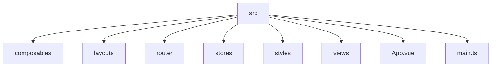
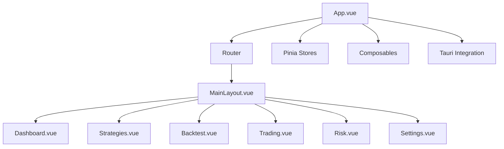
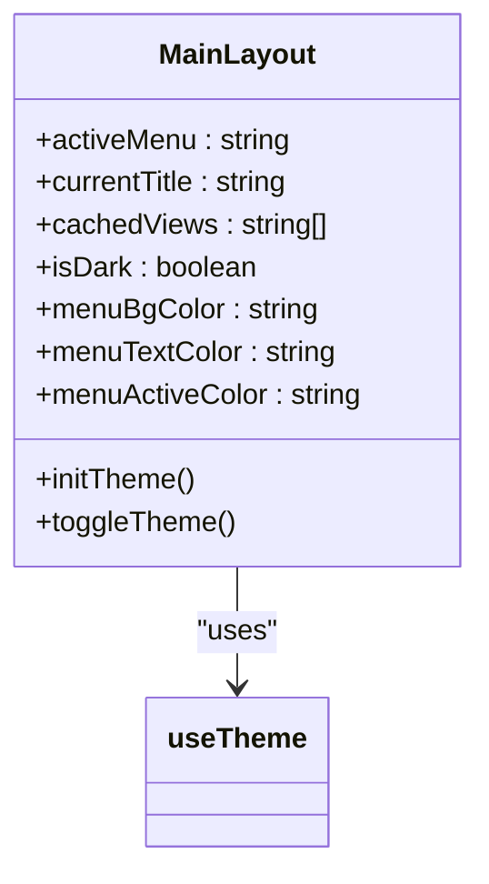
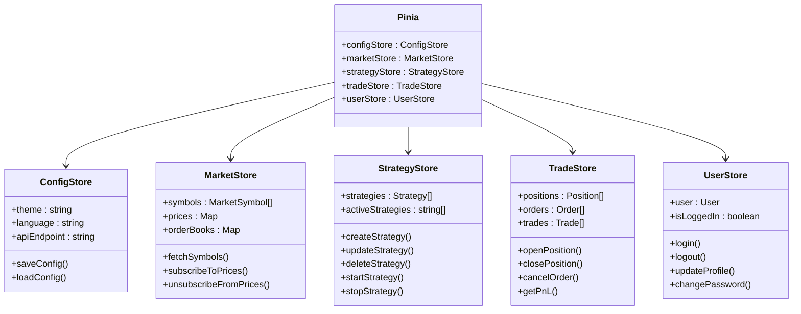
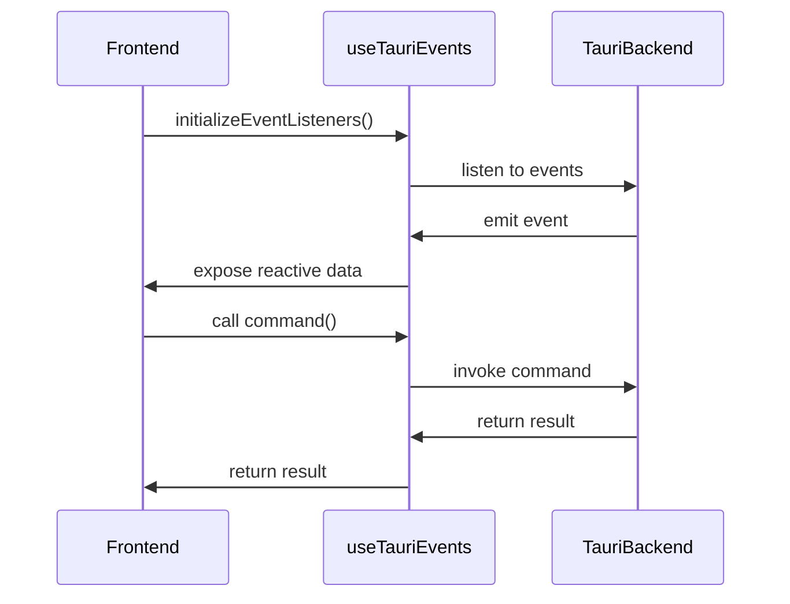
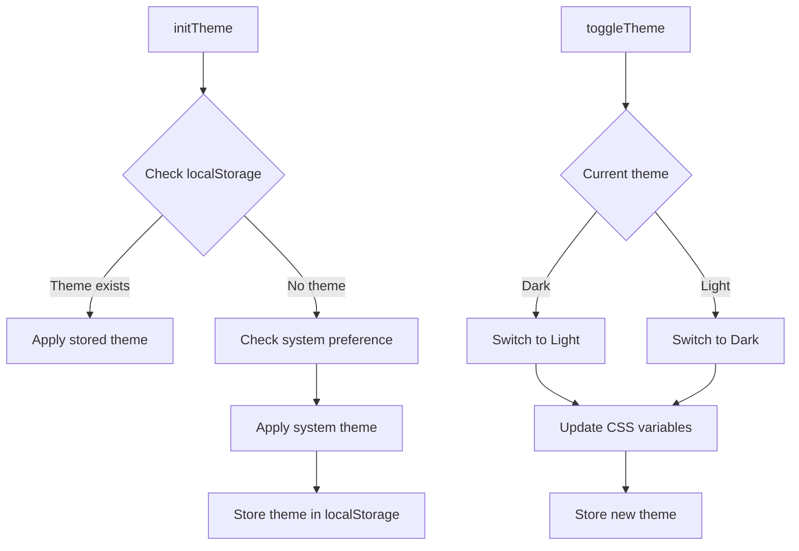
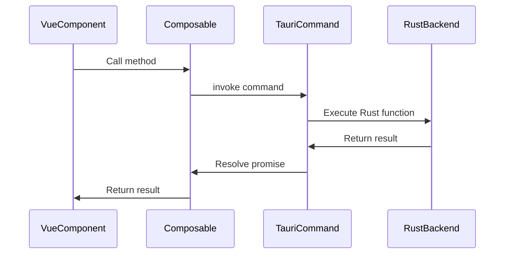
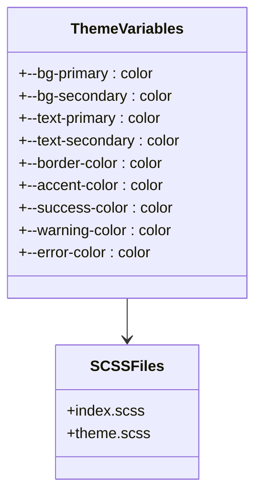
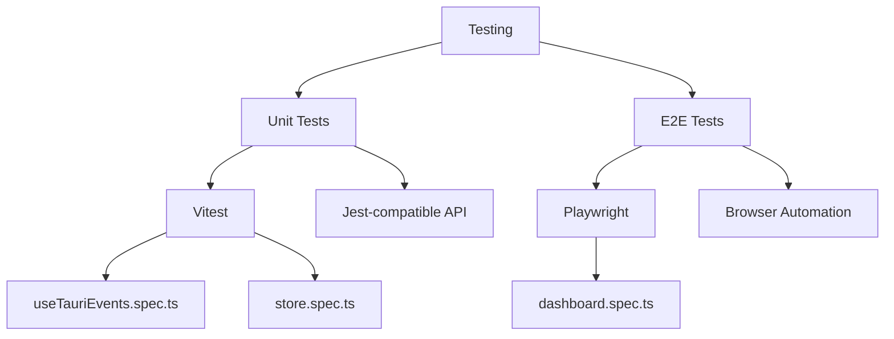

# Frontend Architecture

<cite>
**Referenced Files in This Document**  
- [main.ts](file://src/main.ts)
- [App.vue](file://src/App.vue)
- [MainLayout.vue](file://src/layouts/MainLayout.vue)
- [index.ts](file://src/router/index.ts)
- [config.ts](file://src/stores/config.ts)
- [market.ts](file://src/stores/market.ts)
- [strategy.ts](file://src/stores/strategy.ts)
- [trade.ts](file://src/stores/trade.ts)
- [user.ts](file://src/stores/user.ts)
- [useTauriEvents.ts](file://src/composables/useTauriEvents.ts)
- [useTheme.ts](file://src/composables/useTheme.ts)
- [package.json](file://package.json)
- [vite.config.ts](file://vite.config.ts)
- [vitest.config.ts](file://vitest.config.ts)
- [playwright.config.ts](file://playwright.config.ts)
</cite>

## Table of Contents
1. [Introduction](#introduction)
2. [Project Structure](#project-structure)
3. [Core Components](#core-components)
4. [Architecture Overview](#architecture-overview)
5. [Detailed Component Analysis](#detailed-component-analysis)
6. [State Management with Pinia](#state-management-with-pinia)
7. [Composable Patterns](#composable-patterns)
8. [Routing System](#routing-system)
9. [Tauri Integration](#tauri-integration)
10. [UI Library and Styling](#ui-library-and-styling)
11. [Testing Setup](#testing-setup)
12. [Conclusion](#conclusion)

## Introduction
This document provides a comprehensive overview of the frontend architecture for the EA OKX application. The application is built using Vue 3 with the Composition API and TypeScript, leveraging Tauri for desktop integration. The architecture emphasizes modularity, reusability, and maintainability through well-defined component structures, state management, and composable logic.

## Project Structure
The frontend application follows a standard Vue 3 project structure with clear separation of concerns. Key directories include:
- `src/composables`: Reusable logic encapsulated in composables
- `src/layouts`: Layout components like MainLayout.vue
- `src/router`: Vue Router configuration
- `src/stores`: Pinia stores for state management
- `src/styles`: SCSS styling and theming
- `src/views`: Page-level components for different application views
- `src-tauri`: Tauri backend configuration and commands



**Diagram sources**
- [main.ts](file://src/main.ts)
- [App.vue](file://src/App.vue)

**Section sources**
- [main.ts](file://src/main.ts)
- [App.vue](file://src/App.vue)
- [package.json](file://package.json)

## Core Components
The application's core components include the main application entry point, layout structure, and primary views. The component tree starts with App.vue, which renders the router view, and MainLayout.vue, which provides the consistent application shell with navigation.

**Section sources**
- [App.vue](file://src/App.vue)
- [MainLayout.vue](file://src/layouts/MainLayout.vue)

## Architecture Overview
The application follows a modern Vue 3 architecture with Composition API, utilizing Pinia for state management, Vue Router for navigation, and Element Plus for UI components. The architecture is designed to be modular and scalable, with clear separation between presentation, logic, and state.



**Diagram sources**
- [App.vue](file://src/App.vue)
- [MainLayout.vue](file://src/layouts/MainLayout.vue)
- [index.ts](file://src/router/index.ts)

## Detailed Component Analysis

### MainLayout Analysis
The MainLayout.vue component provides the application shell with a sidebar navigation menu and header with theme switching functionality. It uses Element Plus components for layout and UI elements.



**Diagram sources**
- [MainLayout.vue](file://src/layouts/MainLayout.vue)
- [useTheme.ts](file://src/composables/useTheme.ts)

**Section sources**
- [MainLayout.vue](file://src/layouts/MainLayout.vue)

### View Components
The application includes several view components that represent the main pages:
- Dashboard.vue: Main dashboard with overview metrics
- Strategies.vue: Strategy management interface
- StrategyDetail.vue: Detailed view of individual strategies
- Backtest.vue: Backtesting analysis interface
- Trading.vue: Trading monitor and execution interface
- Risk.vue: Risk management center
- Settings.vue: Application settings

**Section sources**
- [Dashboard.vue](file://src/views/Dashboard.vue)
- [Strategies.vue](file://src/views/Strategies.vue)
- [Backtest.vue](file://src/views/Backtest.vue)
- [Trading.vue](file://src/views/Trading.vue)
- [Risk.vue](file://src/views/Risk.vue)
- [Settings.vue](file://src/views/Settings.vue)

## State Management with Pinia
The application uses Pinia for state management with several specialized stores that manage different aspects of the application state.

### Store Architecture
The application implements a modular state management approach with the following stores:



**Diagram sources**
- [config.ts](file://src/stores/config.ts)
- [market.ts](file://src/stores/market.ts)
- [strategy.ts](file://src/stores/strategy.ts)
- [trade.ts](file://src/stores/trade.ts)
- [user.ts](file://src/stores/user.ts)

**Section sources**
- [config.ts](file://src/stores/config.ts)
- [market.ts](file://src/stores/market.ts)
- [strategy.ts](file://src/stores/strategy.ts)
- [trade.ts](file://src/stores/trade.ts)
- [user.ts](file://src/stores/user.ts)

### State Persistence
The application uses pinia-plugin-persistedstate to persist store data across sessions, ensuring that user preferences and application state are maintained between application restarts.

**Section sources**
- [main.ts](file://src/main.ts)
- [config.ts](file://src/stores/config.ts)

## Composable Patterns
The application leverages Vue 3's Composition API through custom composables that encapsulate reusable logic.

### useTauriEvents Composable
This composable manages communication between the frontend and Tauri backend through events and commands.



**Diagram sources**
- [useTauriEvents.ts](file://src/composables/useTauriEvents.ts)

**Section sources**
- [useTauriEvents.ts](file://src/composables/useTauriEvents.ts)
- [App.vue](file://src/App.vue)

### useTheme Composable
This composable manages the application's theme state and provides functionality for switching between light and dark modes.



**Diagram sources**
- [useTheme.ts](file://src/composables/useTheme.ts)

**Section sources**
- [useTheme.ts](file://src/composables/useTheme.ts)
- [MainLayout.vue](file://src/layouts/MainLayout.vue)

## Routing System
The application uses Vue Router for client-side routing, with a nested route structure that supports the main layout and various views.

### Route Configuration
The routing system is configured with a parent layout route that contains children routes for each main view.

```mermaid
graph TD
A[/] --> B[/dashboard]
A --> C[/strategies]
A --> D[/backtest]
A --> E[/trading]
A --> F[/risk]
A --> G[/settings]
C --> H[/strategies/:id]
```

**Diagram sources**
- [index.ts](file://src/router/index.ts)

**Section sources**
- [index.ts](file://src/router/index.ts)

### Navigation Flow
The navigation flow is managed through the sidebar menu in MainLayout.vue, which uses Element Plus's el-menu component with router integration.

**Section sources**
- [MainLayout.vue](file://src/layouts/MainLayout.vue)
- [index.ts](file://src/router/index.ts)

## Tauri Integration
The frontend application integrates with the Tauri backend for desktop functionality and access to native system features.

### Command Architecture
The application uses Tauri commands to communicate with the Rust backend, enabling access to system-level functionality.



**Section sources**
- [useTauriEvents.ts](file://src/composables/useTauriEvents.ts)
- [src-tauri/src/commands](file://src-tauri/src/commands)

## UI Library and Styling
The application uses Element Plus as its UI component library and SCSS for styling with a custom theming system.

### Element Plus Integration
Element Plus is integrated globally in main.ts and provides a comprehensive set of UI components.

**Section sources**
- [main.ts](file://src/main.ts)

### Styling Approach
The application uses SCSS with a theming system that supports both light and dark modes.



**Diagram sources**
- [styles/index.scss](file://src/styles/index.scss)
- [styles/theme.scss](file://src/styles/theme.scss)

**Section sources**
- [styles/index.scss](file://src/styles/index.scss)
- [styles/theme.scss](file://src/styles/theme.scss)
- [MainLayout.vue](file://src/layouts/MainLayout.vue)

## Testing Setup
The application includes a comprehensive testing setup with unit tests and end-to-end tests.

### Testing Stack
The testing environment is configured with Vitest for unit testing and Playwright for end-to-end testing.



**Section sources**
- [vitest.config.ts](file://vitest.config.ts)
- [playwright.config.ts](file://playwright.config.ts)
- [useTauriEvents.spec.ts](file://src/composables/__tests__/useTauriEvents.spec.ts)
- [dashboard.spec.ts](file://src/e2e/dashboard.spec.ts)

## Conclusion
The EA OKX frontend application is built on a solid architecture using Vue 3 with Composition API and TypeScript. The application leverages Pinia for state management, Vue Router for navigation, and Element Plus for UI components. The integration with Tauri enables desktop functionality while maintaining a clean separation between frontend and backend concerns. The codebase is well-organized with reusable composables, modular stores, and a consistent styling approach that supports theming. The testing setup with Vitest and Playwright ensures code quality and reliability.