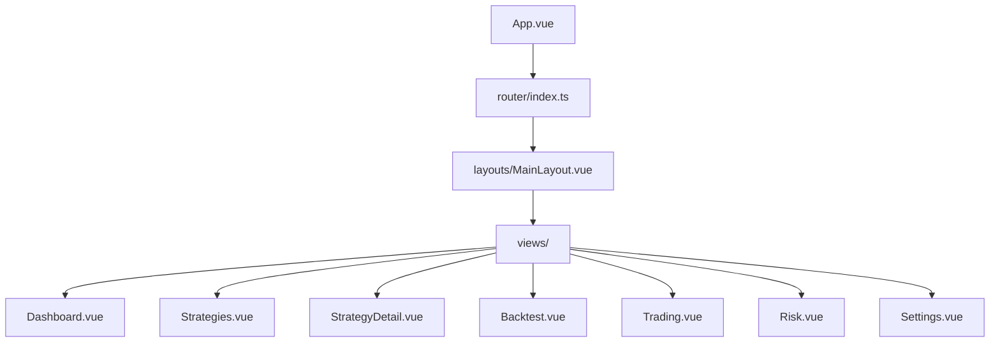
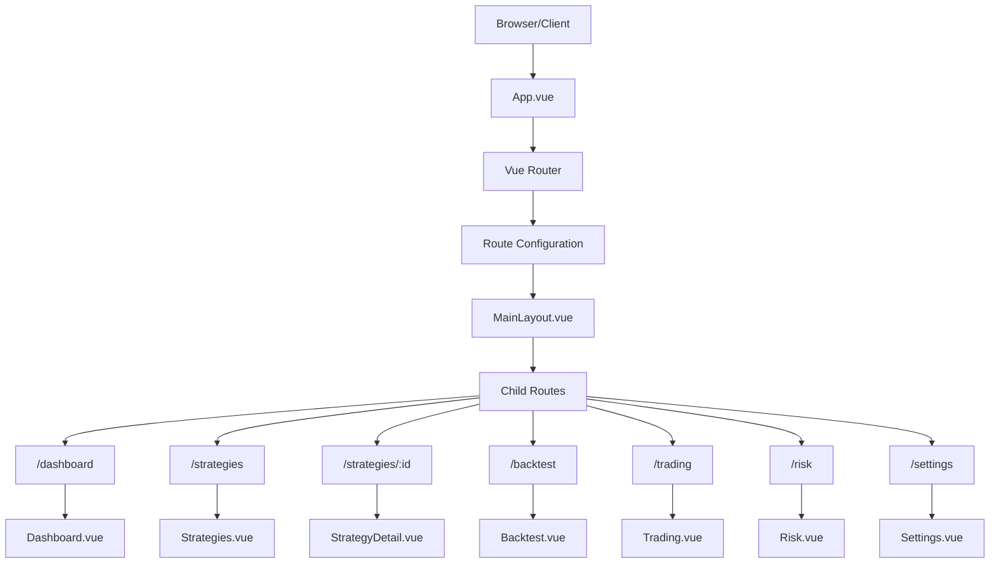
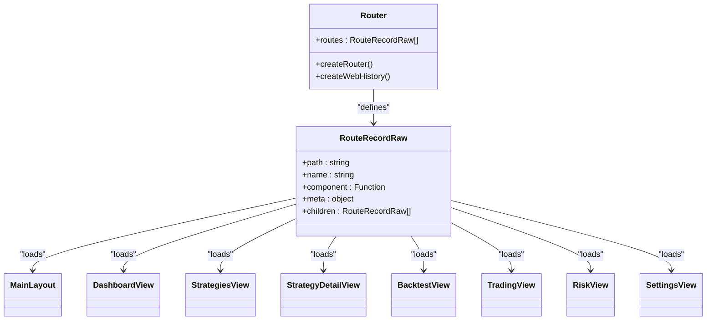
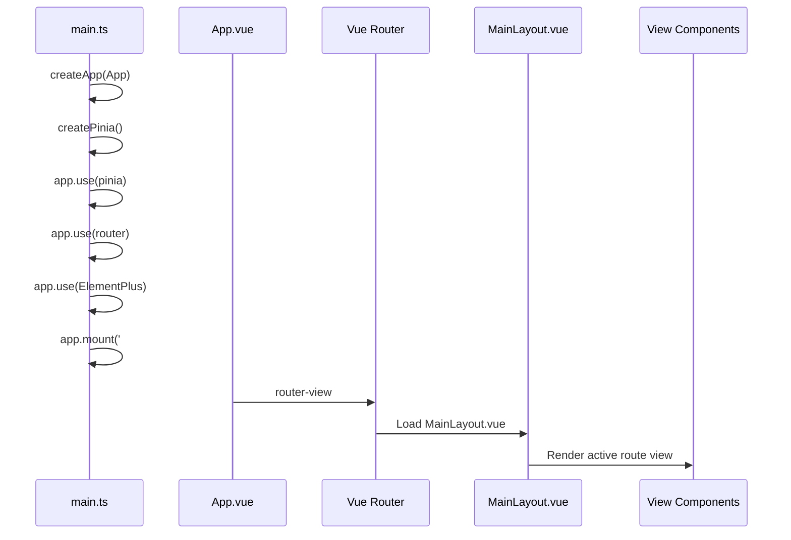
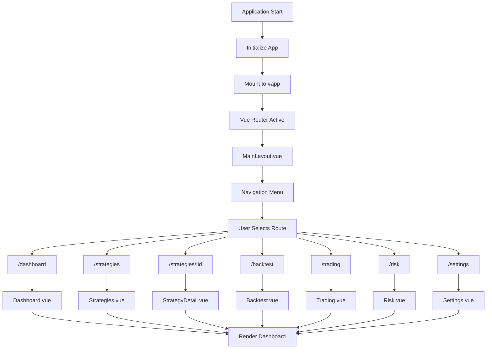
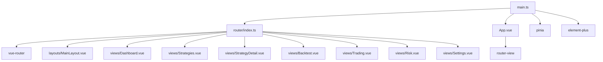

# Routing System

<cite>
**Referenced Files in This Document**   
- [router/index.ts](file://src/router/index.ts)
- [main.ts](file://src/main.ts)
- [App.vue](file://src/App.vue)
- [layouts/MainLayout.vue](file://src/layouts/MainLayout.vue)
- [views/Dashboard.vue](file://src/views/Dashboard.vue)
- [views/Strategies.vue](file://src/views/Strategies.vue)
- [views/StrategyDetail.vue](file://src/views/StrategyDetail.vue)
- [views/Backtest.vue](file://src/views/Backtest.vue)
- [views/Trading.vue](file://src/views/Trading.vue)
- [views/Risk.vue](file://src/views/Risk.vue)
- [views/Settings.vue](file://src/views/Settings.vue)
</cite>

## Table of Contents
1. [Introduction](#introduction)
2. [Project Structure](#project-structure)
3. [Core Components](#core-components)
4. [Architecture Overview](#architecture-overview)
5. [Detailed Component Analysis](#detailed-component-analysis)
6. [Dependency Analysis](#dependency-analysis)
7. [Performance Considerations](#performance-considerations)
8. [Troubleshooting Guide](#troubleshooting-guide)
9. [Conclusion](#conclusion)

## Introduction
This document provides comprehensive documentation for the Vue Router implementation in the EA OKX frontend application. It details the route configuration, navigation flow, integration with the main application, and key routing features such as lazy loading, route parameters, and navigation guards. The system enables seamless navigation between core application sections including Dashboard, Strategies, Trading, Risk, Backtest, and Settings.

## Project Structure

**Diagram sources**
- [App.vue](file://src/App.vue)
- [router/index.ts](file://src/router/index.ts)
- [layouts/MainLayout.vue](file://src/layouts/MainLayout.vue)
- [views/Dashboard.vue](file://src/views/Dashboard.vue)

**Section sources**
- [router/index.ts](file://src/router/index.ts)
- [main.ts](file://src/main.ts)
- [App.vue](file://src/App.vue)

## Core Components

The routing system is built around Vue Router with a hierarchical structure that organizes application views under a main layout component. The router configuration defines all application routes with metadata for navigation menus and implements lazy loading for optimal performance. Route parameters enable dynamic content loading, particularly for strategy details. The integration with Pinia provides state persistence across navigation, while Tauri integration enables desktop-specific functionality.

**Section sources**
- [router/index.ts](file://src/router/index.ts)
- [main.ts](file://src/main.ts)
- [App.vue](file://src/App.vue)

## Architecture Overview

**Diagram sources**
- [router/index.ts](file://src/router/index.ts)
- [App.vue](file://src/App.vue)
- [layouts/MainLayout.vue](file://src/layouts/MainLayout.vue)

## Detailed Component Analysis

### Route Configuration Analysis

**Diagram sources**
- [router/index.ts](file://src/router/index.ts)

**Section sources**
- [router/index.ts](file://src/router/index.ts)

### Main Application Integration

**Diagram sources**
- [main.ts](file://src/main.ts)
- [App.vue](file://src/App.vue)
- [router/index.ts](file://src/router/index.ts)

**Section sources**
- [main.ts](file://src/main.ts)
- [App.vue](file://src/App.vue)

### Navigation Flow Analysis

**Diagram sources**
- [router/index.ts](file://src/router/index.ts)
- [views/Dashboard.vue](file://src/views/Dashboard.vue)
- [views/Strategies.vue](file://src/views/Strategies.vue)
- [views/StrategyDetail.vue](file://src/views/StrategyDetail.vue)

**Section sources**
- [router/index.ts](file://src/router/index.ts)
- [views/Dashboard.vue](file://src/views/Dashboard.vue)
- [views/Strategies.vue](file://src/views/Strategies.vue)
- [views/StrategyDetail.vue](file://src/views/StrategyDetail.vue)

## Dependency Analysis

**Diagram sources**
- [main.ts](file://src/main.ts)
- [router/index.ts](file://src/router/index.ts)
- [App.vue](file://src/App.vue)

**Section sources**
- [main.ts](file://src/main.ts)
- [router/index.ts](file://src/router/index.ts)

## Performance Considerations
The routing system implements lazy loading through dynamic imports (import() syntax) which significantly improves initial load time by code splitting. Each view component is loaded only when its route is accessed. The use of createWebHistory provides clean URLs without hash fragments, improving user experience. The integration with Pinia's persisted state ensures that user preferences and application state are maintained across navigation without requiring re-fetching of data.

## Troubleshooting Guide
Common routing issues in this application typically involve incorrect route paths, missing component imports, or problems with dynamic parameter handling. Ensure that route paths in router/index.ts exactly match the intended URLs and that component paths in dynamic imports are correct. For strategy detail pages, verify that route parameters (:id) are properly handled in the StrategyDetail.vue component. If views fail to render, check that the main.ts file correctly imports and uses the router instance. Theme-related issues after navigation can be addressed by ensuring the theme-changed event listener is properly implemented in view components.

## Conclusion
The Vue Router implementation in the EA OKX application provides a robust navigation framework that effectively organizes the application's core functionality into distinct sections. The configuration leverages modern Vue 3 features including lazy loading, TypeScript typing, and seamless integration with Pinia for state management. The routing structure supports both static routes for main application sections and dynamic routes for detailed views, enabling a rich user experience in the desktop trading application. The integration with Tauri allows for native desktop functionality while maintaining a web-like navigation paradigm.