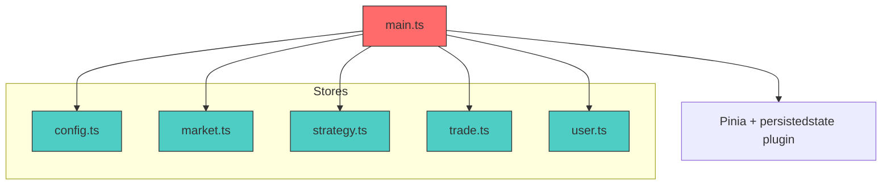
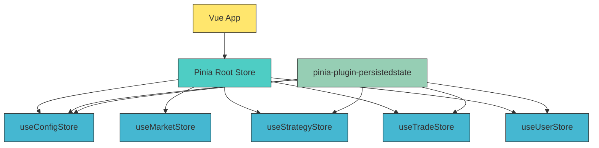
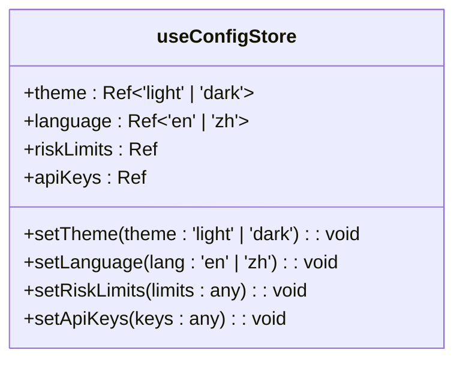
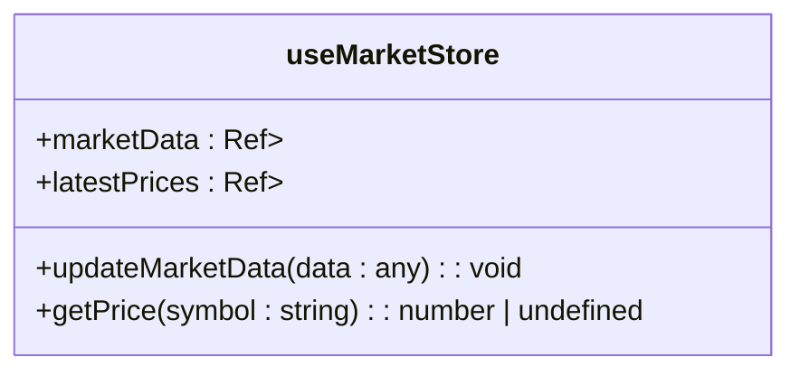
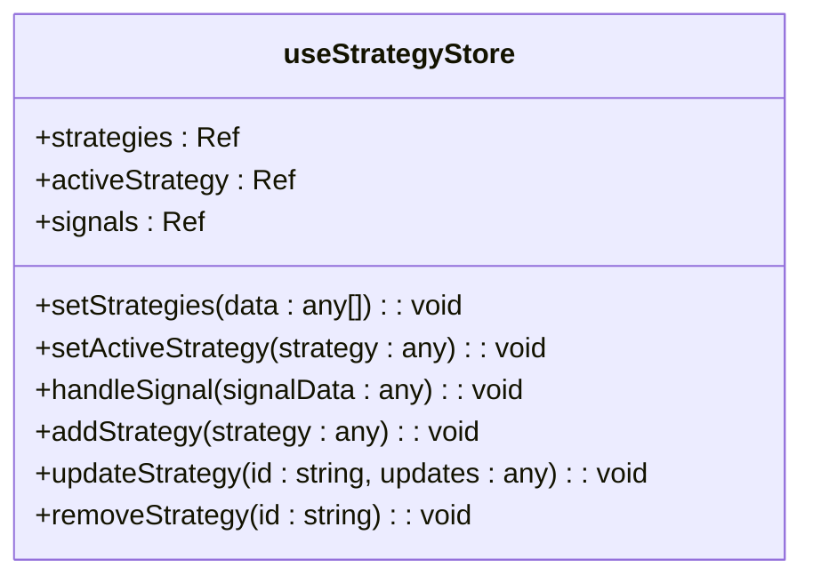
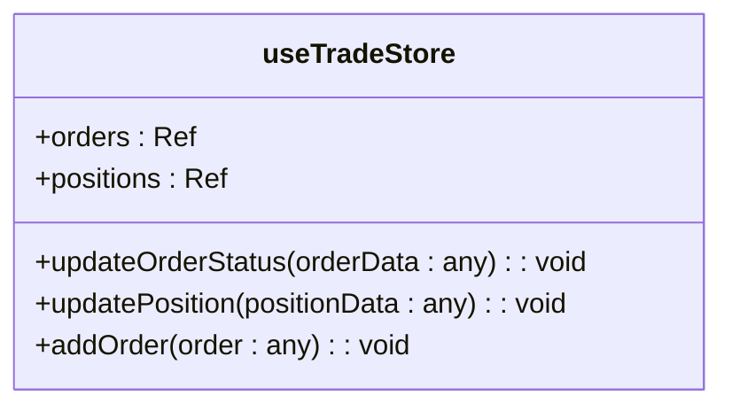
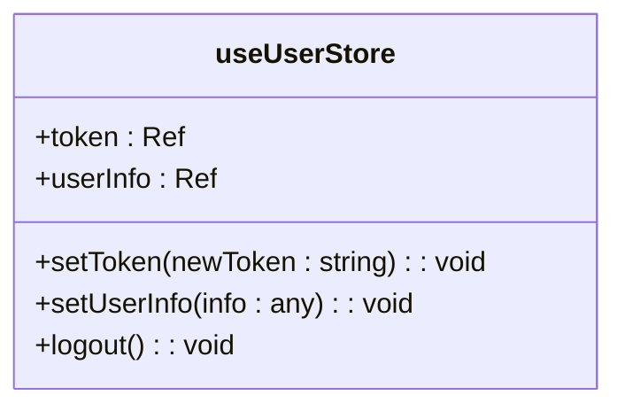
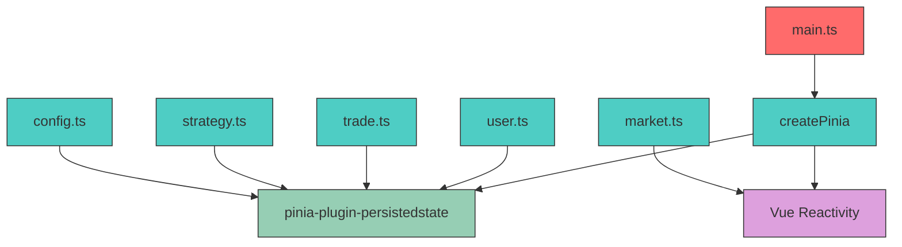

# State Management

<cite>
**Referenced Files in This Document**   
- [config.ts](file://src/stores/config.ts)
- [market.ts](file://src/stores/market.ts)
- [strategy.ts](file://src/stores/strategy.ts)
- [trade.ts](file://src/stores/trade.ts)
- [user.ts](file://src/stores/user.ts)
- [main.ts](file://src/main.ts)
</cite>

## Table of Contents
1. [Introduction](#introduction)
2. [Project Structure](#project-structure)
3. [Core Components](#core-components)
4. [Architecture Overview](#architecture-overview)
5. [Detailed Component Analysis](#detailed-component-analysis)
6. [Dependency Analysis](#dependency-analysis)
7. [Performance Considerations](#performance-considerations)
8. [Troubleshooting Guide](#troubleshooting-guide)
9. [Conclusion](#conclusion)

## Introduction
This document provides a comprehensive analysis of the Pinia state management system used in the EA OKX trading application. It details the architecture, responsibilities, and implementation patterns of each store—config, market, strategy, trade, and user—including their state properties, actions, getters, reactivity mechanisms, and persistence strategies. The document also covers store usage patterns across components, error handling, initialization, modularization, and testing approaches.

## Project Structure
The frontend state management system is organized under the `src/stores/` directory, with each store encapsulated in its own TypeScript file. Stores are implemented using Pinia, integrated at the application level via `main.ts`, and leverage the `pinia-plugin-persistedstate` for persistent state management.

**Diagram sources**
- [config.ts](file://src/stores/config.ts)
- [market.ts](file://src/stores/market.ts)
- [strategy.ts](file://src/stores/strategy.ts)
- [trade.ts](file://src/stores/trade.ts)
- [user.ts](file://src/stores/user.ts)
- [main.ts](file://src/main.ts)

**Section sources**
- [src/stores](file://src/stores)
- [main.ts](file://src/main.ts)

## Core Components
The core components of the state management system are five Pinia stores: `config`, `market`, `strategy`, `trade`, and `user`. Each store manages a specific domain of application state, exposing reactive properties, actions for state mutation, and optional persistence configurations.

**Section sources**
- [config.ts](file://src/stores/config.ts)
- [market.ts](file://src/stores/market.ts)
- [strategy.ts](file://src/stores/strategy.ts)
- [trade.ts](file://src/stores/trade.ts)
- [user.ts](file://src/stores/user.ts)

## Architecture Overview
The state management architecture follows a modular, domain-driven design where each store encapsulates a logical slice of application state. Stores are defined using `defineStore` from Pinia, initialized in `main.ts`, and enhanced with the `pinia-plugin-persistedstate` plugin to enable local storage persistence.

**Diagram sources**
- [main.ts](file://src/main.ts)
- [config.ts](file://src/stores/config.ts)
- [strategy.ts](file://src/stores/strategy.ts)
- [trade.ts](file://src/stores/trade.ts)
- [user.ts](file://src/stores/user.ts)

## Detailed Component Analysis

### Config Store Analysis
The `useConfigStore` manages user preferences such as theme, language, risk limits, and API keys. It uses reactive `ref` values to maintain reactivity and exposes setter actions to update state. The entire store state is persisted using `pinia-plugin-persistedstate`.

**Diagram sources**
- [config.ts](file://src/stores/config.ts#L4-L38)

**Section sources**
- [config.ts](file://src/stores/config.ts#L1-L39)

### Market Store Analysis
The `useMarketStore` handles real-time market data including price updates and symbol-specific information. It maintains a dictionary of market data and latest prices, with actions to update and retrieve price information efficiently.

**Diagram sources**
- [market.ts](file://src/stores/market.ts#L4-L25)

**Section sources**
- [market.ts](file://src/stores/market.ts#L1-L27)

### Strategy Store Analysis
The `useStrategyStore` manages trading strategies, including active strategy selection, signal handling, and CRUD operations for strategies. It persists the `strategies` array to ensure user-defined strategies survive page reloads.

**Diagram sources**
- [strategy.ts](file://src/stores/strategy.ts#L4-L53)

**Section sources**
- [strategy.ts](file://src/stores/strategy.ts#L1-L55)

### Trade Store Analysis
The `useTradeStore` tracks orders and positions, providing methods to update order status and position data. Both `orders` and `positions` arrays are persisted to maintain trading context across sessions.

**Diagram sources**
- [trade.ts](file://src/stores/trade.ts#L4-L37)

**Section sources**
- [trade.ts](file://src/stores/trade.ts#L1-L39)

### User Store Analysis
The `useUserStore` manages authentication state including token and user information. It supports login, logout, and profile updates, with full state persistence enabled.

**Diagram sources**
- [user.ts](file://src/stores/user.ts#L4-L28)

**Section sources**
- [user.ts](file://src/stores/user.ts#L1-L31)

## Dependency Analysis
Pinia stores are decoupled but can interact through shared state or event-driven updates. The `pinia-plugin-persistedstate` introduces a dependency on browser storage APIs, while all stores depend on Vue's reactivity system via `ref`.

**Diagram sources**
- [main.ts](file://src/main.ts)
- [package-lock.json](file://package-lock.json#L3153-L3194)

**Section sources**
- [main.ts](file://src/main.ts)
- [package-lock.json](file://package-lock.json)

## Performance Considerations
Stores maintain reactivity through Vue's `ref` system, ensuring efficient updates. State persistence is selectively applied to critical data (e.g., strategies, orders) to balance usability and performance. The market store limits signal history to 100 entries to prevent memory bloat.

## Troubleshooting Guide
Common issues include persistence failures due to storage limits or schema changes, and reactivity loss when directly mutating state outside actions. Ensure all state modifications occur through defined actions, and test persistence behavior during store refactors.

**Section sources**
- [config.ts](file://src/stores/config.ts)
- [strategy.ts](file://src/stores/strategy.ts)
- [trade.ts](file://src/stores/trade.ts)

## Conclusion
The Pinia-based state management system in the EA OKX application provides a clean, modular architecture for managing complex trading application state. With proper separation of concerns, selective persistence, and consistent reactivity patterns, the stores enable robust and maintainable state management across the application lifecycle.