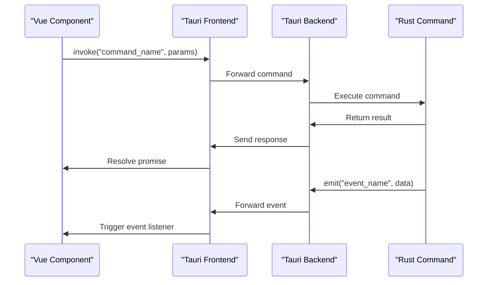
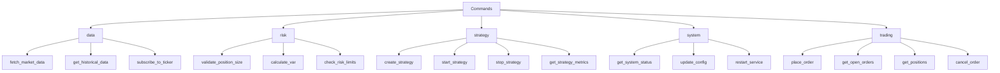
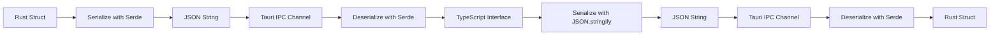
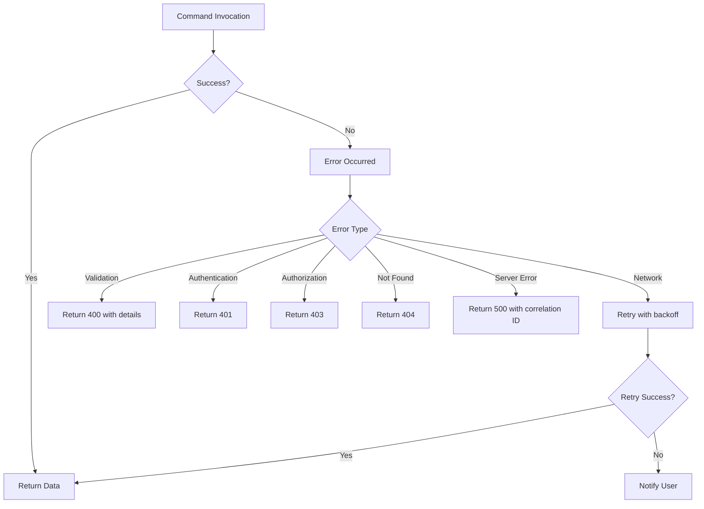
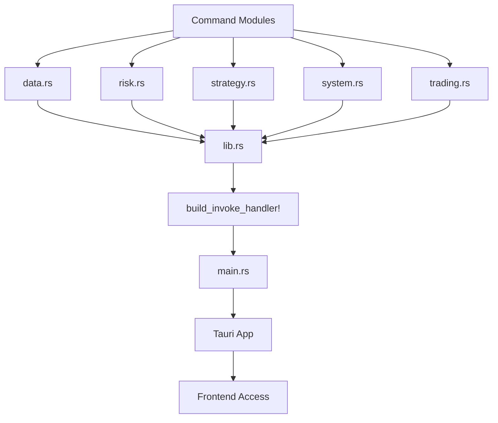
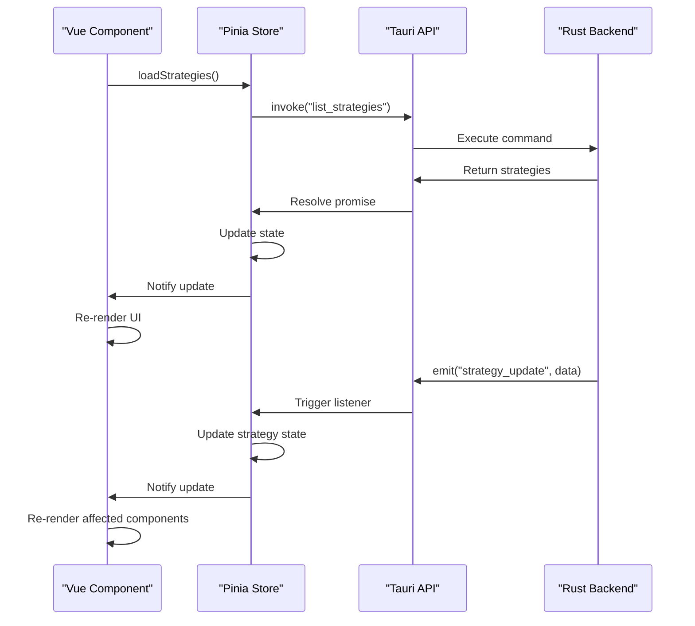

# Tauri Integration

<cite>
**Referenced Files in This Document**   
- [src-tauri/src/commands/data.rs](file://src-tauri/src/commands/data.rs)
- [src-tauri/src/commands/risk.rs](file://src-tauri/src/commands/risk.rs)
- [src-tauri/src/commands/strategy.rs](file://src-tauri/src/commands/strategy.rs)
- [src-tauri/src/commands/system.rs](file://src-tauri/src/commands/system.rs)
- [src-tauri/src/commands/trading.rs](file://src-tauri/src/commands/trading.rs)
- [src-tauri/src/commands/mod.rs](file://src-tauri/src/commands/mod.rs)
- [src-tauri/src/lib.rs](file://src-tauri/src/lib.rs)
- [src-tauri/src/main.rs](file://src-tauri/src/main.rs)
- [src-tauri/tauri.conf.json](file://src-tauri/tauri.conf.json)
- [frontend/src/composables/useTauriEvents.ts](file://frontend/src/composables/useTauriEvents.ts)
- [frontend/src/stores/strategy.ts](file://frontend/src/stores/strategy.ts)
- [frontend/src/stores/trade.ts](file://frontend/src/stores/trade.ts)
- [frontend/src/views/Strategies.vue](file://frontend/src/views/Strategies.vue)
- [frontend/src/views/Trading.vue](file://frontend/src/views/Trading.vue)
</cite>

## Table of Contents
1. [Introduction](#introduction)
2. [IPC Communication Pattern](#ipc-communication-pattern)
3. [Command Structure Overview](#command-structure-overview)
4. [Serialization and Deserialization with Serde](#serialization-and-deserialization-with-serde)
5. [Error Handling Strategy](#error-handling-strategy)
6. [Command Registration Process](#command-registration-process)
7. [Frontend Command Invocation Examples](#frontend-command-invocation-examples)
8. [Configuration in tauri.conf.json](#configuration-in-tauriconfjson)
9. [Conclusion](#conclusion)

## Introduction
This document provides comprehensive documentation for the Tauri command integration between frontend and backend in the ea_okx application. It details the IPC communication pattern, command structure, serialization process, error handling, and configuration aspects of the Tauri integration. The documentation covers both backend command implementation in Rust and frontend usage in Vue components, providing a complete reference for developers working with the Tauri integration layer.

## IPC Communication Pattern
The application utilizes Tauri's invoke and listen methods for inter-process communication between the frontend and backend. The invoke method enables the frontend to call backend commands synchronously, while the listen method allows the frontend to subscribe to events emitted by the backend. This bidirectional communication pattern facilitates real-time updates and command execution across the application.

The invoke pattern follows a request-response model where frontend components call registered backend commands with parameters and receive structured responses. The listen pattern implements an event-driven architecture where the backend emits events that frontend components can subscribe to for real-time updates on system state changes, trading activities, and strategy execution.

**Diagram sources**
- [src-tauri/src/lib.rs](file://src-tauri/src/lib.rs)
- [frontend/src/composables/useTauriEvents.ts](file://frontend/src/composables/useTauriEvents.ts)

**Section sources**
- [src-tauri/src/lib.rs](file://src-tauri/src/lib.rs)
- [frontend/src/composables/useTauriEvents.ts](file://frontend/src/composables/useTauriEvents.ts)

## Command Structure Overview
The Tauri commands are organized into a modular structure within the src-tauri/src/commands directory, with dedicated modules for different functional domains: data, risk, strategy, system, and trading. Each command module encapsulates related functionality and provides a clean API surface for frontend integration.

The data module handles market data collection, storage, and retrieval operations. The risk module implements risk assessment, validation, and management functions. The strategy module contains commands for strategy creation, configuration, lifecycle management, and execution monitoring. The system module provides system-level operations including configuration management and health checks. The trading module handles order execution, position management, and trade reporting.

**Diagram sources**
- [src-tauri/src/commands/data.rs](file://src-tauri/src/commands/data.rs)
- [src-tauri/src/commands/risk.rs](file://src-tauri/src/commands/risk.rs)
- [src-tauri/src/commands/strategy.rs](file://src-tauri/src/commands/strategy.rs)
- [src-tauri/src/commands/system.rs](file://src-tauri/src/commands/system.rs)
- [src-tauri/src/commands/trading.rs](file://src-tauri/src/commands/trading.rs)

**Section sources**
- [src-tauri/src/commands/mod.rs](file://src-tauri/src/commands/mod.rs)
- [src-tauri/src/commands/data.rs](file://src-tauri/src/commands/data.rs)
- [src-tauri/src/commands/risk.rs](file://src-tauri/src/commands/risk.rs)
- [src-tauri/src/commands/strategy.rs](file://src-tauri/src/commands/strategy.rs)
- [src-tauri/src/commands/system.rs](file://src-tauri/src/commands/system.rs)
- [src-tauri/src/commands/trading.rs](file://src-tauri/src/commands/trading.rs)

## Serialization and Deserialization with Serde
The application uses Serde for serialization and deserialization of complex types between the frontend and backend. This enables type-safe data exchange with automatic JSON conversion. Complex data structures from the core domain models are serialized to JSON format when crossing the IPC boundary and deserialized back to their native types on the receiving end.

The serialization process handles nested objects, enums, and collections, preserving type information and structure. Custom serialization logic is implemented for types that require special handling, such as timestamps, decimal values, and binary data. The serde derive macros are used extensively to minimize boilerplate code while ensuring type safety and performance.

**Diagram sources**
- [src-tauri/src/commands/strategy.rs](file://src-tauri/src/commands/strategy.rs)
- [crates/core/src/models/strategy.rs](file://crates/core/src/models/strategy.rs)
- [frontend/src/stores/strategy.ts](file://frontend/src/stores/strategy.ts)

**Section sources**
- [src-tauri/src/commands/strategy.rs](file://src-tauri/src/commands/strategy.rs)
- [crates/core/src/models/strategy.rs](file://crates/core/src/models/strategy.rs)

## Error Handling Strategy
The application implements a comprehensive error handling strategy for command failures and network issues. Errors are structured with consistent formatting that includes error codes, messages, and optional context data. The backend commands return Result types that are automatically converted to standardized error responses when invoked from the frontend.

Network-related errors are handled through retry mechanisms and connection state monitoring. Transient failures trigger automatic retries with exponential backoff, while persistent failures trigger user notifications and graceful degradation of functionality. The error handling system distinguishes between client errors (invalid input, unauthorized access) and server errors (internal failures, service unavailability) to provide appropriate feedback and recovery options.

**Diagram sources**
- [src-tauri/src/commands/mod.rs](file://src-tauri/src/commands/mod.rs)
- [src-tauri/src/lib.rs](file://src-tauri/src/lib.rs)
- [frontend/src/composables/useTauriEvents.ts](file://frontend/src/composables/useTauriEvents.ts)

**Section sources**
- [src-tauri/src/commands/mod.rs](file://src-tauri/src/commands/mod.rs)
- [frontend/src/composables/useTauriEvents.ts](file://frontend/src/composables/useTauriEvents.ts)

## Command Registration Process
Tauri commands are registered in the lib.rs and main.rs files through the Tauri plugin system. The registration process involves importing command modules and exposing them through the Tauri configuration. Commands are annotated with the #[tauri::command] macro to make them available for IPC invocation.

The lib.rs file serves as the primary entry point for command registration, where all command modules are imported and made available to the Tauri application. The main.rs file configures the Tauri application and includes the registered commands in the invocation handler. This two-level registration process provides modularity and separation of concerns between command implementation and application configuration.

**Diagram sources**
- [src-tauri/src/lib.rs](file://src-tauri/src/lib.rs)
- [src-tauri/src/main.rs](file://src-tauri/src/main.rs)
- [src-tauri/src/commands/mod.rs](file://src-tauri/src/commands/mod.rs)

**Section sources**
- [src-tauri/src/lib.rs](file://src-tauri/src/lib.rs)
- [src-tauri/src/main.rs](file://src-tauri/src/main.rs)

## Frontend Command Invocation Examples
Frontend components invoke Tauri commands using the invoke method provided by the Tauri JavaScript API. Commands are called with their registered names and parameters, returning promises that resolve with the command results. The useTauriEvents composable provides a convenient wrapper for common command patterns and event handling.

Vue components typically invoke commands in response to user interactions or during component lifecycle hooks. Response handling includes both success cases and error conditions, with appropriate user feedback and state updates. The store pattern is used to manage command results and maintain application state consistency across components.

**Diagram sources**
- [frontend/src/stores/strategy.ts](file://frontend/src/stores/strategy.ts)
- [frontend/src/views/Strategies.vue](file://frontend/src/views/Strategies.vue)
- [src-tauri/src/commands/strategy.rs](file://src-tauri/src/commands/strategy.rs)

**Section sources**
- [frontend/src/stores/strategy.ts](file://frontend/src/stores/strategy.ts)
- [frontend/src/views/Strategies.vue](file://frontend/src/views/Strategies.vue)
- [frontend/src/views/Trading.vue](file://frontend/src/views/Trading.vue)

## Configuration in tauri.conf.json
The tauri.conf.json file contains essential configuration for the Tauri application, including security settings, window configuration, and plugin options. The configuration defines the application metadata, window properties, and security policies that govern the behavior of the desktop application.

Security settings include CSP (Content Security Policy) rules, URL whitelisting, and permission configuration. Window configuration specifies the initial window size, resizable property, and title. The configuration also includes build settings and plugin-specific options that affect the application's behavior and capabilities.

**Section sources**
- [src-tauri/tauri.conf.json](file://src-tauri/tauri.conf.json)

## Conclusion
The Tauri integration in the ea_okx application provides a robust foundation for desktop application development with secure IPC communication between the frontend and backend. The modular command structure, standardized serialization, and comprehensive error handling create a maintainable and extensible architecture. The integration pattern demonstrated in this documentation enables efficient development of feature-rich desktop applications with access to system-level capabilities while maintaining a responsive user interface.