# Testing Strategy

<cite>
**Referenced Files in This Document**   
- [vitest.config.ts](file://vitest.config.ts)
- [playwright.config.ts](file://playwright.config.ts)
- [Dashboard.spec.ts](file://src/views/__tests__/Dashboard.spec.ts)
- [useTauriEvents.spec.ts](file://src/composables/__tests__/useTauriEvents.spec.ts)
- [config.spec.ts](file://src/stores/__tests__/config.spec.ts)
- [dashboard.spec.ts](file://src/e2e/dashboard.spec.ts)
- [Dashboard.vue](file://src/views/Dashboard.vue)
- [useTauriEvents.ts](file://src/composables/useTauriEvents.ts)
- [config.ts](file://src/stores/config.ts)
</cite>

## Table of Contents
1. [Introduction](#introduction)
2. [Unit Testing Strategy](#unit-testing-strategy)
3. [End-to-End Testing Strategy](#end-to-end-testing-strategy)
4. [Test Configuration](#test-configuration)
5. [Mocking Strategies](#mocking-strategies)
6. [Test Coverage Requirements](#test-coverage-requirements)
7. [CI/CD Integration](#cicd-integration)
8. [Debugging Techniques](#debugging-techniques)
9. [Conclusion](#conclusion)

## Introduction
This document outlines the comprehensive testing strategy for the frontend application, focusing on unit testing with Vitest and end-to-end testing with Playwright. The strategy ensures robust validation of components, composables, stores, and user flows while maintaining high code quality through coverage requirements and CI/CD integration.

## Unit Testing Strategy

The unit testing approach utilizes Vitest as the primary testing framework, providing a fast and reliable environment for testing Vue components, composables, and Pinia stores. The strategy emphasizes isolated testing of individual units with proper mocking of external dependencies.

### Component Testing with Dashboard.spec.ts

The Dashboard component testing demonstrates the standard approach for Vue component unit testing. Tests verify component rendering, UI element presence, and helper method functionality in isolation.


**Diagram sources**
- [Dashboard.spec.ts](file://src/views/__tests__/Dashboard.spec.ts#L29-L96)

**Section sources**
- [Dashboard.spec.ts](file://src/views/__tests__/Dashboard.spec.ts#L1-L97)
- [Dashboard.vue](file://src/views/Dashboard.vue)

### Composable Testing with useTauriEvents.spec.ts

Composables are tested to ensure proper initialization and interaction with external APIs. The useTauriEvents composable testing focuses on event listener registration and proper integration with the Tauri event system.


**Diagram sources**
- [useTauriEvents.spec.ts](file://src/composables/__tests__/useTauriEvents.spec.ts#L17-L30)

**Section sources**
- [useTauriEvents.spec.ts](file://src/composables/__tests__/useTauriEvents.spec.ts#L1-L38)
- [useTauriEvents.ts](file://src/composables/useTauriEvents.ts)

### Store Testing with config.spec.ts

Pinia stores are tested to validate state management, mutations, and initial state configuration. The config store testing ensures proper initialization and mutation behavior for application configuration settings.


**Diagram sources**
- [config.spec.ts](file://src/stores/__tests__/config.spec.ts)

**Section sources**
- [config.spec.ts](file://src/stores/__tests__/config.spec.ts#L1-L62)
- [config.ts](file://src/stores/config.ts)

## End-to-End Testing Strategy

The end-to-end testing strategy uses Playwright to validate complete user flows and navigation patterns within the application. These tests run in a real browser environment and verify the integration of multiple components.

### Dashboard User Flow Validation

The dashboard.spec.ts end-to-end test validates the primary navigation flows from the dashboard to other application sections. This ensures that routing and page transitions work as expected.


**Diagram sources**
- [dashboard.spec.ts](file://src/e2e/dashboard.spec.ts)

**Section sources**
- [dashboard.spec.ts](file://src/e2e/dashboard.spec.ts#L1-L37)

## Test Configuration

The testing environment is configured through dedicated configuration files for both Vitest and Playwright, ensuring consistent test execution across different environments.

### Vitest Configuration

The vitest.config.ts file configures the unit testing environment with specific settings for coverage reporting, test environment, and module resolution.

```mermaid
flowchart TD
A[vitest.config.ts] --> B[Environment: jsdom]
A --> C[Coverage Provider: v8]
A --> D[Coverage Reporters: text, json, html]
A --> E[Coverage Thresholds: 80%]
A --> F[Exclude: node_modules, src-tauri]
A --> G[Alias: @ → src]
```



**Diagram sources**
- [vitest.config.ts](file://vitest.config.ts)

**Section sources**
- [vitest.config.ts](file://vitest.config.ts#L1-L35)

### Playwright Configuration

The playwright.config.ts file configures the end-to-end testing environment with settings for test directory, parallel execution, retry policies, and web server integration.


**Diagram sources**
- [playwright.config.ts](file://playwright.config.ts)

**Section sources**
- [playwright.config.ts](file://playwright.config.ts#L1-L28)

## Mocking Strategies

The testing strategy employs comprehensive mocking to isolate units from external dependencies, particularly Tauri commands and third-party libraries.

### Tauri Command Mocking

Tauri API commands are mocked using Vitest's mocking utilities to simulate native functionality without requiring the actual Tauri runtime.


**Diagram sources**
- [Dashboard.spec.ts](file://src/views/__tests__/Dashboard.spec.ts#L8-L15)

**Section sources**
- [Dashboard.spec.ts](file://src/views/__tests__/Dashboard.spec.ts#L8-L16)
- [useTauriEvents.spec.ts](file://src/composables/__tests__/useTauriEvents.spec.ts#L7-L9)

### Third-Party Library Mocking

External libraries like ECharts are mocked to prevent actual rendering and focus testing on component logic rather than library integration.

```mermaid
flowchart TD
A[Component] --> B[Import echarts]
B --> C[Mock echarts.init()]
C --> D[Return mock chart instance]
D --> E[Mock setOption(), resize(), dispose()]
E --> F[Component uses mock instance]
F --> G[Test verifies method calls]
```

**Diagram sources**
- [Dashboard.spec.ts](file://src/views/__tests__/Dashboard.spec.ts#L19-L27)

**Section sources**
- [Dashboard.spec.ts](file://src/views/__tests__/Dashboard.spec.ts#L19-L27)

## Test Coverage Requirements

The project enforces strict test coverage requirements to ensure code quality and reliability across all components.

### Coverage Configuration

The vitest.config.ts file defines minimum coverage thresholds that must be met for the codebase.


**Diagram sources**
- [vitest.config.ts](file://vitest.config.ts#L21-L26)

**Section sources**
- [vitest.config.ts](file://vitest.config.ts#L10-L27)

## CI/CD Integration

The testing strategy is integrated into the CI/CD pipeline to ensure automated test execution on every code change.

### Pipeline Configuration

The configuration includes environment-specific settings for CI execution, including retry policies and worker allocation.


**Diagram sources**
- [playwright.config.ts](file://playwright.config.ts#L6-L8)
- [vitest.config.ts](file://vitest.config.ts)

**Section sources**
- [playwright.config.ts](file://playwright.config.ts#L6-L8)

## Debugging Techniques

The testing framework provides several techniques for debugging failing tests and understanding test execution flow.

### Debugging Configuration

The configuration supports various debugging approaches, including trace recording and HTML reporting.


**Diagram sources**
- [playwright.config.ts](file://playwright.config.ts#L12)

**Section sources**
- [playwright.config.ts](file://playwright.config.ts#L12)

## Conclusion

The testing strategy provides a comprehensive approach to ensuring frontend quality through unit and end-to-end testing. By leveraging Vitest for component and composable testing and Playwright for user flow validation, the project maintains high reliability. The mocking strategy effectively isolates units from external dependencies, while strict coverage requirements and CI/CD integration ensure consistent quality across the codebase.