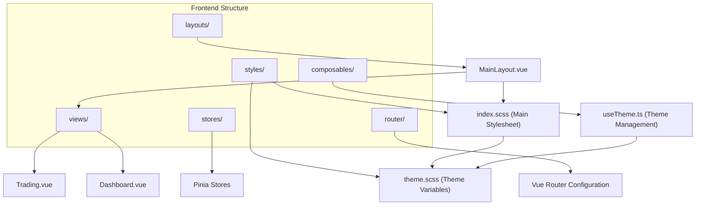
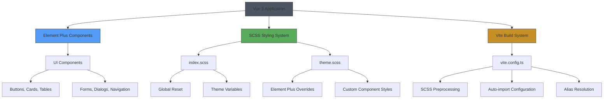
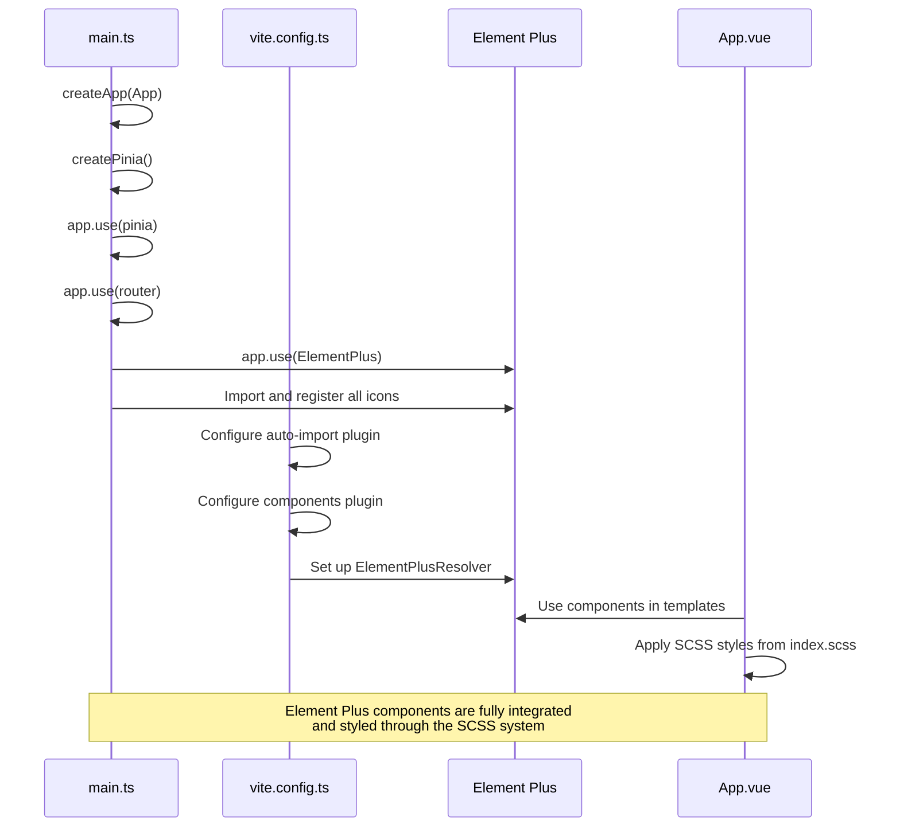
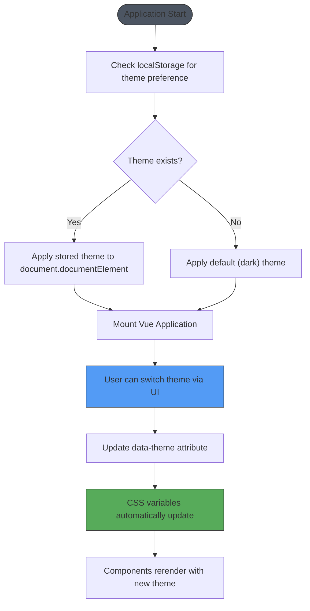

# UI Components and Styling

<cite>
**Referenced Files in This Document**   
- [main.ts](file://src/main.ts)
- [index.scss](file://src/styles/index.scss)
- [theme.scss](file://src/styles/theme.scss)
- [vite.config.ts](file://vite.config.ts)
- [package.json](file://package.json)
- [useTheme.ts](file://src/composables/useTheme.ts)
</cite>

## Table of Contents
1. [Introduction](#introduction)
2. [Project Structure](#project-structure)
3. [Core Components](#core-components)
4. [Architecture Overview](#architecture-overview)
5. [Detailed Component Analysis](#detailed-component-analysis)
6. [Dependency Analysis](#dependency-analysis)
7. [Performance Considerations](#performance-considerations)
8. [Troubleshooting Guide](#troubleshooting-guide)
9. [Conclusion](#conclusion)

## Introduction
This document provides comprehensive documentation for the UI component library and styling system used in the EA OKX quantitative trading platform. The frontend is built with Vue 3 and leverages Element Plus as the primary component library, providing a rich set of UI components for building modern web applications. The styling system is based on SCSS with a well-structured theming approach that supports both dark and light themes. The documentation covers component integration, CSS architecture, theme customization, build configuration, accessibility, and cross-browser compatibility.

## Project Structure
The frontend codebase is organized under the `src/` directory with a clear separation of concerns. The styling system is centralized in the `styles/` subdirectory, which contains `index.scss` as the main stylesheet and `theme.scss` for theme-specific variables and overrides. Component composition is handled through Vue 3's Composition API in the `composables/` directory, while UI components are implemented in `.vue` files within the `views/` and `layouts/` directories. State management is implemented using Pinia, and routing is handled by Vue Router.



**Diagram sources**
- [index.scss](file://src/styles/index.scss#L1-L78)
- [theme.scss](file://src/styles/theme.scss#L1-L208)
- [useTheme.ts](file://src/composables/useTheme.ts)

**Section sources**
- [src/](file://src/)
- [src/styles/](file://src/styles/)

## Core Components
The UI component library is built around Element Plus, a comprehensive Vue 3 component library that provides a wide range of components including buttons, cards, tables, forms, dialogs, and navigation elements. These components are integrated into the application through proper initialization in `main.ts` and are styled consistently using the SCSS-based theming system. The core components are designed to be reusable across different views such as Dashboard, Trading, Risk, and Settings, ensuring a consistent user experience throughout the application.

**Section sources**
- [main.ts](file://src/main.ts#L1-L31)
- [package.json](file://package.json#L16-L28)

## Architecture Overview
The UI architecture follows a modern Vue 3 application structure with a clear separation between components, styles, and business logic. The styling system is built on SCSS with a two-layer approach: global styles in `index.scss` and component-specific theme overrides in `theme.scss`. Theme switching is implemented using CSS custom properties (variables) scoped to `:root` with a `data-theme` attribute that can be dynamically changed. The build process is configured through Vite, which handles SCSS preprocessing and provides development server functionality.



**Diagram sources**
- [main.ts](file://src/main.ts#L1-L31)
- [index.scss](file://src/styles/index.scss#L1-L78)
- [theme.scss](file://src/styles/theme.scss#L1-L208)
- [vite.config.ts](file://vite.config.ts#L1-L50)

## Detailed Component Analysis

### Element Plus Integration
The application integrates Element Plus components through proper initialization in the main application file. All components are automatically imported and registered using the `unplugin-vue-components` and `unplugin-auto-import` Vite plugins, which streamline the development process by eliminating the need for manual imports. The icons from `@element-plus/icons-vue` are registered globally, making them available throughout the application without additional import statements.



**Diagram sources**
- [main.ts](file://src/main.ts#L1-L31)
- [vite.config.ts](file://vite.config.ts#L1-L50)

**Section sources**
- [main.ts](file://src/main.ts#L1-L31)
- [vite.config.ts](file://vite.config.ts#L1-L50)

### SCSS-Based Styling Approach
The styling system is built on SCSS with a well-organized structure that separates global styles from theme-specific variables. The `index.scss` file serves as the entry point for all styles, importing `theme.scss` and defining global reset rules, font families, and layout properties. The theme system uses CSS custom properties within `:root` selectors that are scoped to `data-theme` attributes, allowing for dynamic theme switching without requiring page reloads.

```mermaid
classDiagram
class IndexSCSS {
+* {margin : 0; padding : 0}
+body {font-family : 'Roboto'}
+#app {width : 100%; height : 100vh}
+ : root[data-theme='dark'] {--bg-primary : #0f1419}
+ : root[data-theme='light'] {--bg-primary : #ffffff}
+body {background-color : var(--bg-primary)}
}
class ThemeSCSS {
+ : root[data-theme='dark'] {--el-bg-color : #1c2128}
+ : root[data-theme='light'] {--el-bg-color : #ffffff}
+.el-card : hover {box-shadow : 0 2px 12px 0 rgba(0,0,0,0.1)}
+.el-table {--el-table-border : 1px solid var(--border-color)}
+ : : -webkit-scrollbar {width : 8px; height : 8px}
+.chart-container {background-color : transparent}
}
IndexSCSS --> ThemeSCSS : "imports"
style IndexSCSS fill : #57ab5a,stroke : #333
style ThemeSCSS fill : #57ab5a,stroke : #333
```

**Diagram sources**
- [index.scss](file://src/styles/index.scss#L1-L78)
- [theme.scss](file://src/styles/theme.scss#L1-L208)

**Section sources**
- [index.scss](file://src/styles/index.scss#L1-L78)
- [theme.scss](file://src/styles/theme.scss#L1-L208)

### Theme Customization System
The theme customization system is implemented using CSS custom properties that are defined within `:root` selectors scoped to the `data-theme` attribute. This approach allows for seamless theme switching by simply changing the attribute value on the root element. The system supports both dark and light themes with comprehensive color palettes for backgrounds, text, borders, and interactive elements. Element Plus components are customized by overriding their CSS variables to match the application's design language.



**Diagram sources**
- [index.scss](file://src/styles/index.scss#L21-L54)
- [theme.scss](file://src/styles/theme.scss#L4-L167)
- [useTheme.ts](file://src/composables/useTheme.ts)

**Section sources**
- [index.scss](file://src/styles/index.scss#L21-L54)
- [theme.scss](file://src/styles/theme.scss#L4-L167)
- [useTheme.ts](file://src/composables/useTheme.ts)

## Dependency Analysis
The frontend dependencies are managed through `package.json` with a clear separation between production dependencies and development dependencies. The core UI dependencies include Vue 3, Element Plus, and related packages, while the build system relies on Vite and associated plugins. The dependency management system ensures that all required packages are properly versioned and that the application can be reliably reproduced across different environments.

```mermaid
graph TD
A[package.json] --> B[Dependencies]
A --> C[DevDependencies]
B --> D[vue^3.4.0]
B --> E[vue-router^4.2.0]
B --> F[pinia^2.1.0]
B --> G[element-plus^2.5.0]
B --> H[@element-plus/icons-vue^2.3.0]
B --> I[echarts^5.4.0]
B --> J[ve-echarts^6.6.0]
C --> K[@tauri-apps/cli^2.0.0]
C --> L[@vitejs/plugin-vue^5.0.0]
C --> M[vite^5.0.0]
C --> N[sass^1.69.0]
C --> O[unplugin-auto-import^0.17.0]
C --> P[unplugin-vue-components^0.26.0]
style A fill:#4c5562,stroke:#333
style B fill:#539bf5,stroke:#333
style C fill:#c69026,stroke:#333
```

**Diagram sources**
- [package.json](file://package.json#L1-L45)

**Section sources**
- [package.json](file://package.json#L1-L45)

## Performance Considerations
The styling system is optimized for performance through several mechanisms. The SCSS preprocessing is handled efficiently by Vite's build system, which uses the modern Sass compiler API to minimize processing time. CSS variables are used extensively for theming, which allows for theme switching without requiring additional CSS bundle size. The auto-import system for Element Plus components reduces bundle size by only including components that are actually used in the application. The scrollbar customization is implemented with minimal CSS rules to avoid performance overhead.

**Section sources**
- [vite.config.ts](file://vite.config.ts#L39-L48)
- [theme.scss](file://src/styles/theme.scss#L184-L201)

## Troubleshooting Guide
Common issues with the UI component library and styling system typically relate to theme switching, component rendering, and build configuration. When theme changes are not reflected in the UI, verify that the `data-theme` attribute is properly set on the root element and that the corresponding CSS variables are defined in `theme.scss`. For Element Plus component styling issues, ensure that the component-specific CSS variables are properly overridden in the theme file. Build errors related to SCSS can often be resolved by verifying the Vite configuration for the Sass preprocessor options.

**Section sources**
- [index.scss](file://src/styles/index.scss)
- [theme.scss](file://src/styles/theme.scss)
- [vite.config.ts](file://vite.config.ts)

## Conclusion
The UI component library and styling system in the EA OKX application provides a robust foundation for building a modern, responsive, and accessible trading interface. By leveraging Vue 3 and Element Plus, the application benefits from a rich set of pre-built components that can be easily customized through the SCSS-based theming system. The architecture supports both dark and light themes with seamless switching capabilities, and the build process is optimized for performance through Vite's efficient preprocessing and bundling. The system is designed to be maintainable and extensible, allowing for future enhancements and component additions while maintaining visual consistency across the application.