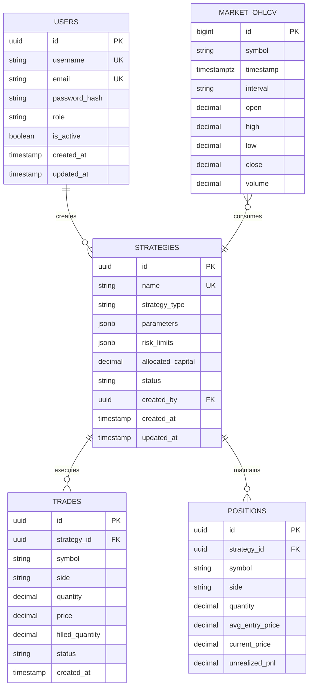

# Getting Started

<cite>
**Referenced Files in This Document**   
- [README.md](file://README.md)
- [Cargo.toml](file://Cargo.toml)
- [package.json](file://package.json)
- [config/README.md](file://config/README.md)
- [examples/README.md](file://examples/README.md)
- [migrations/001_initial_schema.sql](file://migrations/001_initial_schema.sql)
- [migrations/002_continuous_aggregates.sql](file://migrations/002_continuous_aggregates.sql)
</cite>

## Table of Contents
1. [System Requirements](#system-requirements)
2. [Installing Dependencies](#installing-dependencies)
3. [Setting Up the Database](#setting-up-the-database)
4. [API Credentials and Configuration](#api-credentials-and-configuration)
5. [Building and Running the Application](#building-and-running-the-application)
6. [Basic Usage Examples](#basic-usage-examples)
7. [Development Environment Setup](#development-environment-setup)
8. [Troubleshooting Common Issues](#troubleshooting-common-issues)
9. [Verifying Installation and Health Checks](#verifying-installation-and-health-checks)

## System Requirements

Before beginning the installation process, ensure your system meets the following requirements:

- **Operating System**: Windows 10/11, macOS 10.15+, or Linux (Ubuntu 20.04+ recommended)
- **Processor**: 64-bit dual-core processor or better
- **Memory**: 8GB RAM minimum (16GB recommended)
- **Storage**: 20GB free disk space
- **Internet Connection**: Required for dependency installation and API access

This application is a desktop trading platform built with a Rust backend and Vue 3 frontend using the Tauri framework. The system integrates with the OKX exchange API and uses PostgreSQL with TimescaleDB for time-series data storage.

**Section sources**
- [README.md](file://README.md#L1-L36)
- [Cargo.toml](file://Cargo.toml#L1-L95)

## Installing Dependencies

### Rust Installation

The backend is written in Rust and requires the Rust toolchain:

```bash
# Install Rust using rustup
curl --proto '=https' --tlsv1.2 -sSf https://sh.rust-lang.org/rustup.sh | sh

# Or download from https://www.rust-lang.org/tools/install

# Verify installation
rustc --version
cargo --version
```

Ensure you have the latest stable version of Rust. The project uses Rust 2021 edition.

### Node.js and pnpm Installation

The frontend is built with Vue 3 and requires Node.js and pnpm:

```bash
# Install Node.js 18+ (recommended LTS version)
# Download from https://nodejs.org or use a version manager

# Verify Node.js installation
node --version
npm --version

# Install pnpm globally
npm install -g pnpm

# Verify pnpm installation
pnpm --version
```

### PostgreSQL with TimescaleDB

The application requires PostgreSQL with the TimescaleDB extension for time-series data:

#### Option 1: Docker (Recommended for Development)

```bash
# Create .env file with database password
echo "DB_PASSWORD=your-secure-password" > .env

# Start services using Docker Compose
docker-compose up -d

# Verify services are running
docker-compose ps
```

#### Option 2: Native Installation

**On Ubuntu:**
```bash
# Add TimescaleDB repository
sudo add-apt-repository -y ppa:timescale/timescaledb-ppa
sudo apt update

# Install PostgreSQL and TimescaleDB
sudo apt install -y timescaledb-2-postgresql-15

# Initialize and start the service
sudo systemctl start postgresql
```

**On macOS:**
```bash
# Install using Homebrew
brew install postgresql timescaledb

# Initialize database
initdb /usr/local/var/postgres

# Start PostgreSQL
brew services start postgresql
```

**Section sources**
- [config/README.md](file://config/README.md#L163-L192)
- [Cargo.toml](file://Cargo.toml#L31-L39)

## Setting Up the Database

### Database Initialization

The application includes SQL migration files to set up the database schema:

```bash
# Connect to PostgreSQL (adjust host/port if using Docker)
psql -h localhost -p 5432 -U postgres

# Create databases for different environments
CREATE DATABASE ea_okx_dev;
CREATE DATABASE ea_okx_prod;

# Enable required extensions
CREATE EXTENSION IF NOT EXISTS "uuid-ossp";
CREATE EXTENSION IF NOT EXISTS "timescaledb";

# Apply migrations
psql -h localhost -p 5432 -U postgres -d ea_okx_dev -f migrations/001_initial_schema.sql
psql -h localhost -p 5432 -U postgres -d ea_okx_dev -f migrations/002_continuous_aggregates.sql
```

### Schema Overview

The database schema includes the following key components:

- **Users**: System users with role-based access control
- **Strategies**: Trading strategies with parameters and risk limits
- **Market Data**: Time-series tables for OHLCV, ticks, and order book snapshots using TimescaleDB hypertables
- **Trades and Positions**: Execution records and current positions
- **Performance and Risk**: Strategy performance metrics and risk events

The schema is optimized with continuous aggregates for efficient querying of time-series data at different granularities.



**Diagram sources**
- [migrations/001_initial_schema.sql](file://migrations/001_initial_schema.sql#L8-L273)
- [migrations/002_continuous_aggregates.sql](file://migrations/002_continuous_aggregates.sql#L1-L105)

**Section sources**
- [migrations/001_initial_schema.sql](file://migrations/001_initial_schema.sql#L1-L273)
- [migrations/002_continuous_aggregates.sql](file://migrations/002_continuous_aggregates.sql#L1-L105)

## API Credentials and Configuration

### Obtaining OKX API Credentials

To connect to the OKX exchange, you'll need to create API credentials:

1. Log in to your OKX account
2. Navigate to "API Management" in the user settings
3. Create a new API key with the following permissions:
   - **Read**: Account, Positions, Orders
   - **Trade**: Place and cancel orders
   - **Withdrawal**: Disable (for security)
4. Set IP restrictions to your development machine's IP address
5. Save the API Key, Secret Key, and Passphrase securely

**Important**: Never share your API credentials or commit them to version control.

### Configuration Files

The application uses TOML configuration files and environment variables:

#### 1. Create Environment Variables File

```bash
# Create .env file in project root
touch .env

# Add your credentials (never commit this file)
echo "OKX_API_KEY=your-api-key-here" >> .env
echo "OKX_SECRET_KEY=your-secret-key-here" >> .env
echo "OKX_PASSPHRASE=your-passphrase-here" >> .env
echo "DB_PASSWORD=your-database-password" >> .env
echo "ENVIRONMENT=development" >> .env
```

#### 2. Configuration Structure

The application loads configuration from multiple sources in this order:
1. Default values in code
2. Configuration files (`config/development.toml`, `config/production.toml`)
3. Environment variables (prefixed with `OKX_`, `DB_`, etc.)

Example development configuration is available in `config/README.md`.

**Section sources**
- [config/README.md](file://config/README.md#L134-L161)

## Building and Running the Application

### Installing Frontend Dependencies

```bash
# Navigate to project root
cd 

# Install frontend dependencies using pnpm
pnpm install

# Verify installation
pnpm list
```

### Building the Application

```bash
# Build the Rust backend and Vue frontend
pnpm tauri build

# For development, run in dev mode
pnpm tauri dev
```

### Running in Development Mode

```bash
# Start the development server
pnpm dev

# This starts:
# - Vue development server on http://localhost:1420
# - Tauri application with integrated backend
```

The application will launch as a desktop window with developer tools available.

**Section sources**
- [README.md](file://README.md#L5-L17)
- [package.json](file://package.json#L1-L45)

## Basic Usage Examples

### Connecting to the Exchange

The application automatically connects to OKX using your API credentials when started. You can verify the connection in the UI or through logs.

### Viewing Market Data

Once connected, you can view real-time market data:

1. Open the "Dashboard" tab
2. Select a trading pair (e.g., BTC-USDT)
3. View price charts, order book, and recent trades
4. The data is streamed via OKX WebSocket API and stored in TimescaleDB

### Running a Simple Strategy

The repository includes example strategies that you can run:

```bash
# Run the Simple Moving Average Crossover strategy
cargo run --example simple_ma_crossover

# Run the RSI Mean Reversion strategy
cargo run --example rsi_strategy

# Run the Grid Trading strategy
cargo run --example grid_trading
```

These examples demonstrate core functionality and can be used as templates for developing your own strategies.

**Section sources**
- [examples/README.md](file://examples/README.md#L1-L236)

## Development Environment Setup

### Recommended Tools

- **IDE**: Visual Studio Code with the following extensions:
  - Rust Analyzer
  - Volar (for Vue 3)
  - Tauri
  - PostgreSQL
  - GitLens

- **Additional Tools**:
  - Git for version control
  - Docker for database and service management
  - Postman or Insomnia for API testing
  - pgAdmin for database management

### IDE Configuration

For optimal development experience:

1. Install the Rust Analyzer extension for proper Rust language support
2. Configure Prettier for code formatting (settings in project root)
3. Set up ESLint with TypeScript support
4. Enable Tauri debugging capabilities

### Debugging Setup

The application uses structured logging with tracing:

```bash
# Set log level for detailed output
export RUST_LOG=debug

# Or for specific components
export RUST_LOG=ea_okx_core=debug,ea_okx_client=trace

# Run with verbose logging
pnpm tauri dev
```

Logs are available in the developer console and can be persisted to files in production.

**Section sources**
- [package.json](file://package.json#L29-L43)
- [Cargo.toml](file://Cargo.toml#L56-L58)

## Troubleshooting Common Issues

### Database Connection Issues

**Symptom**: Application fails to start with database connection errors

**Solutions**:
1. Verify PostgreSQL is running:
   ```bash
   # Check Docker containers
   docker-compose ps
   
   # Or check native service
   sudo systemctl status postgresql
   ```
2. Verify credentials in `.env` file match database configuration
3. Check that TimescaleDB extension is enabled:
   ```sql
   SELECT * FROM pg_extension WHERE extname = 'timescaledb';
   ```

### API Authentication Failures

**Symptom**: "Invalid signature" or "Unauthorized" errors

**Solutions**:
1. Double-check API Key, Secret Key, and Passphrase
2. Verify the API key has the required permissions
3. Check for IP restrictions on the API key
4. Ensure system time is synchronized (required for signature verification)

### Frontend Build Errors

**Symptom**: Vite build fails with module import errors

**Solutions**:
1. Clear pnpm cache:
   ```bash
   pnpm clean
   pnpm install
   ```
2. Verify Node.js version compatibility
3. Check for missing environment variables

### WebSocket Connection Problems

**Symptom**: Unable to receive real-time market data

**Solutions**:
1. Check internet connection
2. Verify OKX WebSocket URLs in configuration
3. Test firewall settings (ports 8443 for WSS)
4. Monitor application logs for connection status

**Section sources**
- [config/README.md](file://config/README.md#L13-L19)
- [examples/README.md](file://examples/README.md#L20-L30)

## Verifying Installation and Health Checks

### Successful Installation Indicators

After completing the setup, verify the following:

1. **Application Launch**: The desktop application starts without errors
2. **Database Connection**: No database connection errors in logs
3. **API Authentication**: Successful connection to OKX exchange
4. **Market Data**: Real-time price updates visible in the UI
5. **Service Status**: All backend services are operational

### System Health Checks

Run these commands to verify system health:

```bash
# Check running processes
docker-compose ps  # If using Docker

# Verify database connectivity
psql -h localhost -p 5432 -U postgres -d ea_okx_dev -c "SELECT NOW();"

# Check Redis connection
redis-cli ping

# Test Rust build
cargo build --workspace

# Test frontend build
pnpm build
```

### Monitoring Endpoints

The application provides monitoring endpoints:

- **Metrics**: Available at `http://localhost:9090/metrics` (Prometheus format)
- **Health Check**: `GET /api/health` returns system status
- **Version Info**: `GET /api/version` returns application version

These endpoints can be used to verify the system is functioning correctly and to monitor performance.

**Section sources**
- [config/README.md](file://config/README.md#L45-L48)
- [Cargo.toml](file://Cargo.toml#L83-L85)