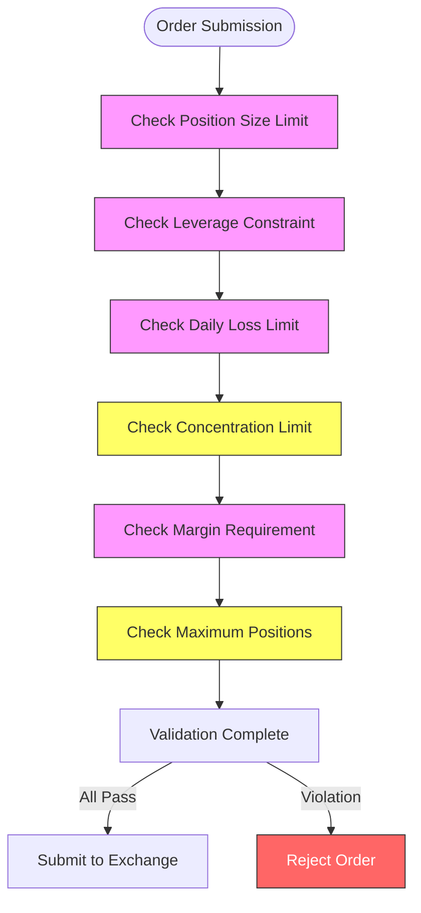
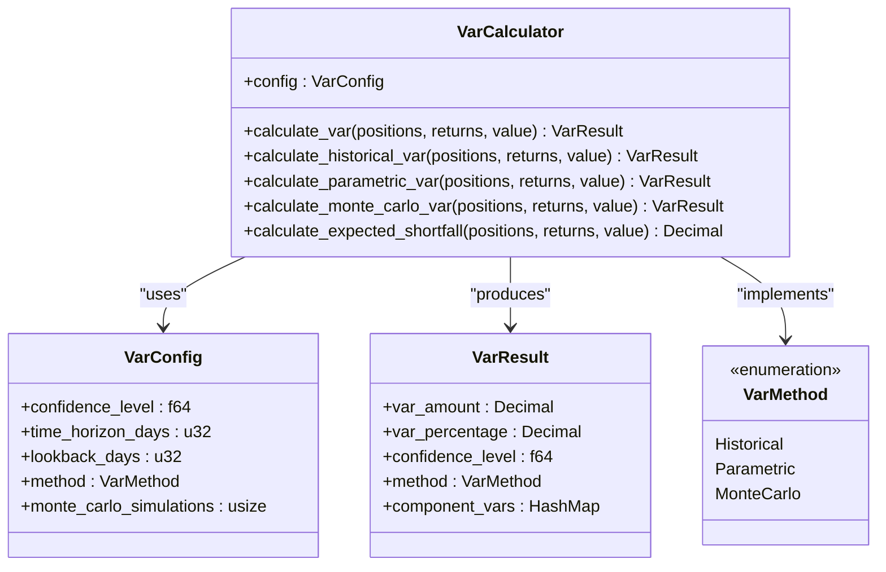
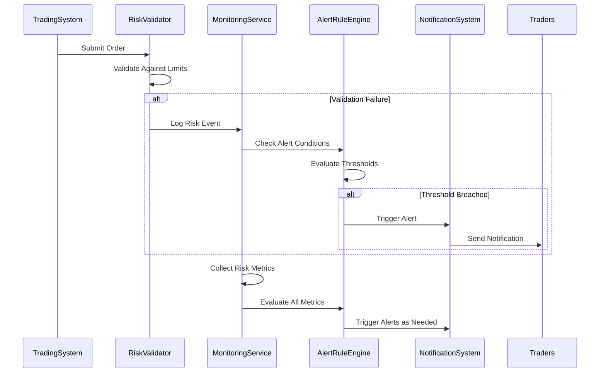
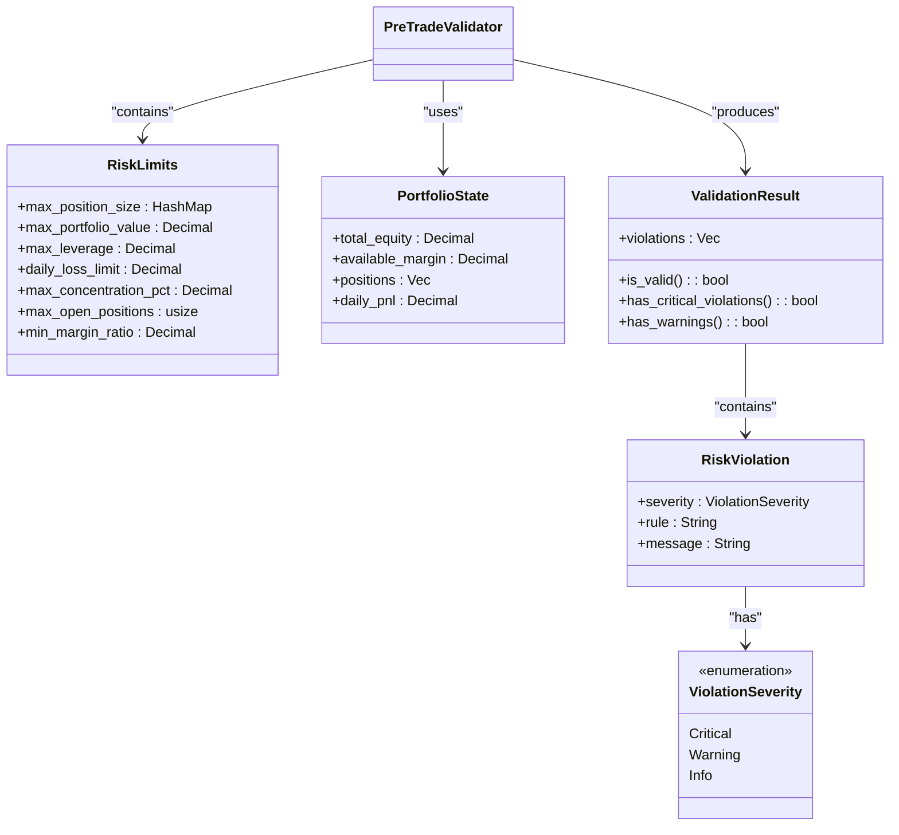
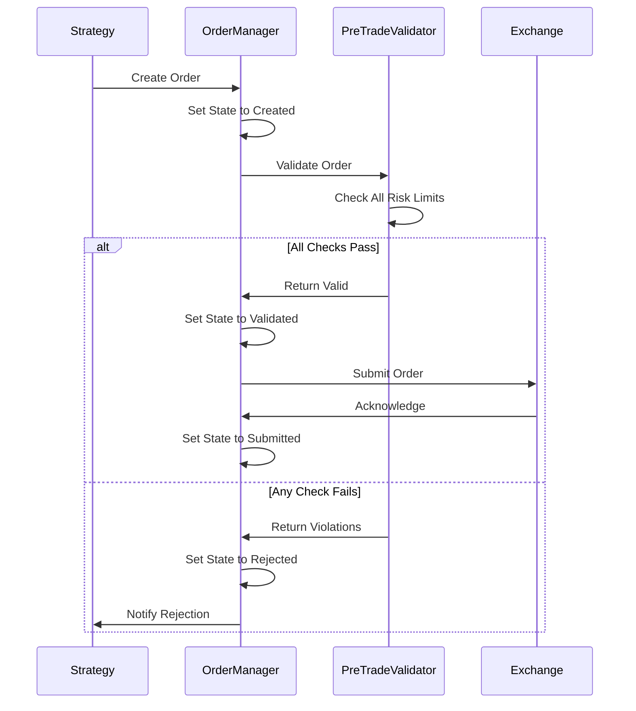

# Risk Management Framework

<cite>
**Referenced Files in This Document**   
- [validators.rs](file://crates/risk/src/validators.rs)
- [var.rs](file://crates/risk/src/var.rs)
- [alerts.rs](file://crates/monitoring/src/alerts.rs)
- [metrics.rs](file://crates/monitoring/src/metrics.rs)
- [service.rs](file://crates/monitoring/src/service.rs)
- [order_manager.rs](file://crates/trading/src/order_manager.rs)
- [order.rs](file://crates/core/src/models/order.rs)
- [position.rs](file://crates/core/src/models/position.rs)
- [001_initial_schema.sql](file://migrations/001_initial_schema.sql)
- [FINAL_IMPLEMENTATION_REPORT.md](file://FINAL_IMPLEMENTATION_REPORT.md)
</cite>

## Table of Contents
1. [Introduction](#introduction)
2. [Pre-Trade Validation Framework](#pre-trade-validation-framework)
3. [Value at Risk (VaR) Calculation](#value-at-risk-var-calculation)
4. [Risk Event Logging and Alerting System](#risk-event-logging-and-alerting-system)
5. [Risk Limits and Threshold Configuration](#risk-limits-and-threshold-configuration)
6. [Integration with Trading Execution System](#integration-with-trading-execution-system)
7. [Stress Testing and Scenario Analysis](#stress-testing-and-scenario-analysis)
8. [Regulatory Compliance and Audit Requirements](#regulatory-compliance-and-audit-requirements)
9. [Risk Management Policies and Implementation](#risk-management-policies-and-implementation)
10. [Risk Metrics Monitoring and Reporting](#risk-metrics-monitoring-and-reporting)

## Introduction
The risk management framework in the EA OKX quantitative trading system provides comprehensive protection against financial, operational, and systemic risks. This framework operates across multiple dimensions including pre-trade validation, portfolio risk assessment, real-time monitoring, and regulatory compliance. The system is designed to prevent unauthorized or excessive risk exposure while maintaining trading efficiency. The risk management components are implemented as a dedicated Rust crate with clear interfaces to trading, monitoring, and data systems, ensuring low-latency risk checks without compromising system performance.

## Pre-Trade Validation Framework
The pre-trade validation framework provides a comprehensive set of checks that are executed before any order is submitted to the exchange. This multi-layered validation process ensures that all trades comply with predefined risk limits and organizational policies.

**Diagram sources**
- [validators.rs](file://crates/risk/src/validators.rs#L76-L130)

**Section sources**
- [validators.rs](file://crates/risk/src/validators.rs#L58-L131)

### Position Size Validator
The position size validator ensures that no single position exceeds predefined limits for each trading symbol. The validator calculates the potential new position size after the proposed trade and compares it against configured maximums. This check prevents overexposure to any individual asset and is particularly important for managing idiosyncratic risk.

### Leverage Validator
The leverage validator enforces maximum leverage constraints across the entire portfolio. It calculates the total exposure (sum of all open positions plus the proposed trade) relative to the total equity. The default limit is set at 3x leverage, but this can be configured based on risk tolerance. This validator helps maintain capital efficiency while preventing excessive borrowing.

### Daily Loss Validator
The daily loss validator monitors cumulative losses within a trading day and prevents further trading when predefined thresholds are breached. This circuit breaker mechanism protects against runaway losses during periods of high volatility or system malfunction. The default daily loss limit is $10,000, but this can be adjusted based on portfolio size and risk parameters.

### Concentration Validator
The concentration validator ensures that no single position becomes too large relative to the overall portfolio value. The default limit is 25% of portfolio value per symbol, which helps maintain diversification benefits. Unlike other validators, concentration breaches generate warnings rather than critical violations, allowing traders to override with appropriate justification while maintaining an audit trail.

### Margin Validator
The margin validator ensures that sufficient margin is available to support the proposed trade. It calculates the required margin as a percentage of the order value. The default minimum margin ratio is 15%, ensuring adequate buffer against price movements. This validator prevents margin calls and potential liquidations.

### Maximum Positions Validator
The maximum positions validator limits the total number of concurrent open positions across all symbols. The default limit is 10 positions, which helps prevent portfolio complexity from becoming unmanageable. Like concentration limits, exceeding the maximum positions generates a warning rather than a critical violation, allowing experienced traders to override when justified.

## Value at Risk (VaR) Calculation Methods

The risk framework implements multiple Value at Risk (VaR) calculation methods to provide comprehensive risk assessment across different market conditions and assumptions. VaR represents the maximum potential loss over a specified time horizon at a given confidence level.

**Diagram sources**
- [var.rs](file://crates/risk/src/var.rs#L70-L85)

**Section sources**
- [var.rs](file://crates/risk/src/var.rs#L8-L85)

### Historical Simulation Method
The historical simulation method calculates VaR by applying historical price movements to the current portfolio composition. It uses a 252-day lookback period (approximately one year of trading days) to capture a wide range of market conditions. The method sorts historical portfolio returns and identifies the loss level that is exceeded only a certain percentage of the time (determined by the confidence level). This non-parametric approach makes no assumptions about return distributions and captures actual historical correlations between assets.

### Parametric (Variance-Covariance) Method
The parametric method assumes that portfolio returns follow a normal distribution and calculates VaR using the portfolio's volatility and a Z-score corresponding to the confidence level. For a 95% confidence level, a Z-score of 1.65 is used, while a 99% confidence level uses a Z-score of 2.33. This method is computationally efficient and provides stable results, but relies on the assumption of normally distributed returns, which may underestimate tail risk during periods of market stress.

### Monte Carlo Simulation Method
The Monte Carlo simulation method generates thousands of potential future scenarios based on statistical models of asset returns and correlations. While the current implementation uses historical simulation as an approximation, the framework is designed to support full Monte Carlo simulations with sophisticated return models. This method can capture complex, non-linear relationships and is particularly useful for portfolios with options or other derivatives.

### Component VaR and Expected Shortfall
In addition to portfolio-level VaR, the system calculates Component VaR for each position, showing the contribution of individual positions to overall portfolio risk. This helps identify risk concentration and informs position sizing decisions. The framework also calculates Expected Shortfall (also known as Conditional VaR), which measures the average loss beyond the VaR threshold, providing insight into tail risk characteristics.

## Risk Event Logging and Alerting System

The risk event logging and alerting system provides real-time monitoring of risk metrics and automated notifications when thresholds are breached. This system serves as an early warning mechanism and creates an audit trail for regulatory compliance.

**Diagram sources**
- [validators.rs](file://crates/risk/src/validators.rs#L74-L130)
- [service.rs](file://crates/monitoring/src/service.rs#L62-L87)
- [alerts.rs](file://crates/monitoring/src/alerts.rs#L78-L94)

**Section sources**
- [validators.rs](file://crates/risk/src/validators.rs#L74-L130)
- [service.rs](file://crates/monitoring/src/service.rs#L62-L87)
- [alerts.rs](file://crates/monitoring/src/alerts.rs#L78-L94)

The system implements a comprehensive alerting framework with multiple severity levels (Info, Warning, Critical, Emergency) and configurable cooldown periods to prevent alert fatigue. Alert rules can be defined for various risk metrics including position concentration, leverage levels, VaR breaches, and P&L thresholds. Each alert contains detailed context including the triggering condition, current metric value, threshold, and recommended actions.

## Configuring Risk Limits and Thresholds

Risk limits and thresholds are configured through the RiskLimits structure, which provides a comprehensive set of parameters for controlling portfolio risk exposure. These limits can be set at the system level, strategy level, or individual position level, allowing for granular risk management.

**Diagram sources**
- [validators.rs](file://crates/risk/src/validators.rs#L12-L45)
- [validators.rs](file://crates/risk/src/validators.rs#L49-L56)
- [validators.rs](file://crates/risk/src/validators.rs#L274-L298)

**Section sources**
- [validators.rs](file://crates/risk/src/validators.rs#L12-L45)
- [validators.rs](file://crates/risk/src/validators.rs#L49-L56)
- [validators.rs](file://crates/risk/src/validators.rs#L274-L298)

Default risk limits are set conservatively to prevent excessive risk-taking, but can be adjusted based on strategy requirements, portfolio size, and risk tolerance. The system supports dynamic limit adjustments through API calls, allowing risk managers to respond to changing market conditions. All limit changes are logged in the audit trail for compliance purposes.

## Integration with Trading Execution Systems

The risk management framework is tightly integrated with the trading execution system through a well-defined interface that ensures all orders pass through pre-trade validation before submission to the exchange. This integration is implemented through the order management system's state machine, which includes a validation state between order creation and submission.

**Diagram sources**
- [order_manager.rs](file://crates/trading/src/order_manager.rs#L127-L139)
- [validators.rs](file://crates/risk/src/validators.rs#L69-L73)

**Section sources**
- [order_manager.rs](file://crates/trading/src/order_manager.rs#L127-L139)
- [validators.rs](file://crates/risk/src/validators.rs#L69-L73)

The integration follows a fail-safe principle: if the risk validation service is unavailable, orders are rejected by default to prevent uncontrolled risk exposure. This ensures system integrity even during partial failures. The validation process is designed to be low-latency, typically completing in under 1 millisecond, to minimize impact on trading performance.

## Stress Testing and Scenario Analysis Capabilities

The risk framework includes comprehensive stress testing and scenario analysis capabilities that allow risk managers to evaluate portfolio performance under adverse market conditions. These tools help identify potential vulnerabilities and inform risk limit setting.

The system supports both historical scenario testing (using actual market crises such as the 2008 financial crisis or 2020 COVID crash) and hypothetical scenario testing (such as sudden volatility spikes, liquidity crises, or correlated asset movements). Stress tests can be run at the portfolio level or for individual strategies, and results are compared against normal market conditions to quantify potential impact.

Scenario analysis includes sensitivity testing for key risk factors such as volatility, correlation, and interest rates. The framework can simulate the impact of specific events like central bank announcements, earnings surprises, or geopolitical developments on portfolio value. Results are presented with confidence intervals and probability distributions to help assess the likelihood of different outcomes.

## Regulatory Compliance Considerations and Audit Requirements

The risk management system is designed with regulatory compliance as a core requirement, implementing features that support adherence to financial regulations and audit requirements. The system maintains a comprehensive audit trail of all risk-related activities, including order rejections, limit changes, and manual overrides.

All risk events are logged in the database with immutable timestamps and user identification, creating a verifiable record for regulatory examinations. The system supports role-based access control with different permission levels for traders, risk managers, and auditors. Sensitive operations such as limit changes or manual order approvals require dual authorization from separate individuals.

The framework implements data retention policies that comply with regulatory requirements, storing risk logs and audit trails for the required period (typically 5-7 years). Regular automated compliance checks verify that risk limits are within regulatory bounds and that trading activity adheres to approved strategies. The system can generate compliance reports in standard formats for submission to regulatory authorities.

## Risk Management Policies and Their Implementation

The risk management framework implements several key policies that govern trading activities and protect capital:

1. **Pre-Trade Validation Policy**: All orders must pass risk validation before submission to the exchange. This policy prevents unauthorized or excessive risk-taking and ensures compliance with organizational risk limits.

2. **Position Sizing Policy**: Position sizes are limited both at the individual symbol level and as a percentage of total portfolio value. This policy prevents overconcentration and ensures diversification benefits.

3. **Leverage Policy**: Portfolio leverage is capped at predefined levels to prevent excessive borrowing and maintain capital efficiency. The default limit of 3x leverage can be adjusted based on strategy requirements.

4. **Daily Loss Limit Policy**: A circuit breaker mechanism prevents further trading when daily losses exceed predefined thresholds. This policy protects against runaway losses during periods of high volatility.

5. **Margin Policy**: Sufficient margin must be available to support all open positions and proposed trades. The minimum margin ratio of 15% ensures adequate buffer against price movements.

6. **Maximum Positions Policy**: The total number of concurrent open positions is limited to prevent portfolio complexity from becoming unmanageable.

These policies are implemented through the PreTradeValidator class, which systematically checks each order against all applicable rules before allowing submission to the exchange. The implementation allows for both hard limits (which prevent trading when breached) and soft limits (which generate warnings but allow trading with appropriate justification).

## Monitoring and Reporting of Risk Metrics

The risk management system provides comprehensive monitoring and reporting capabilities that give risk managers real-time visibility into portfolio risk exposure. Key risk metrics are collected, aggregated, and displayed through both programmatic interfaces and user-friendly dashboards.

Real-time monitoring includes position concentration, leverage levels, VaR, expected shortfall, and P&L attribution. These metrics are updated continuously and can trigger automated alerts when thresholds are breached. Historical trend analysis helps identify developing risk patterns and informs strategic decisions.

Reporting capabilities include daily risk summaries, exception reports for limit breaches, and comprehensive risk dashboards that visualize portfolio risk across multiple dimensions. The system can generate regulatory reports in standard formats and supports ad-hoc reporting for specific analytical needs. All reports include timestamps and user identification to maintain audit integrity.

The monitoring service integrates with the broader system health monitoring, providing a unified view of both operational and risk metrics. This holistic approach enables risk managers to correlate risk events with system performance and identify potential issues before they impact trading activities.