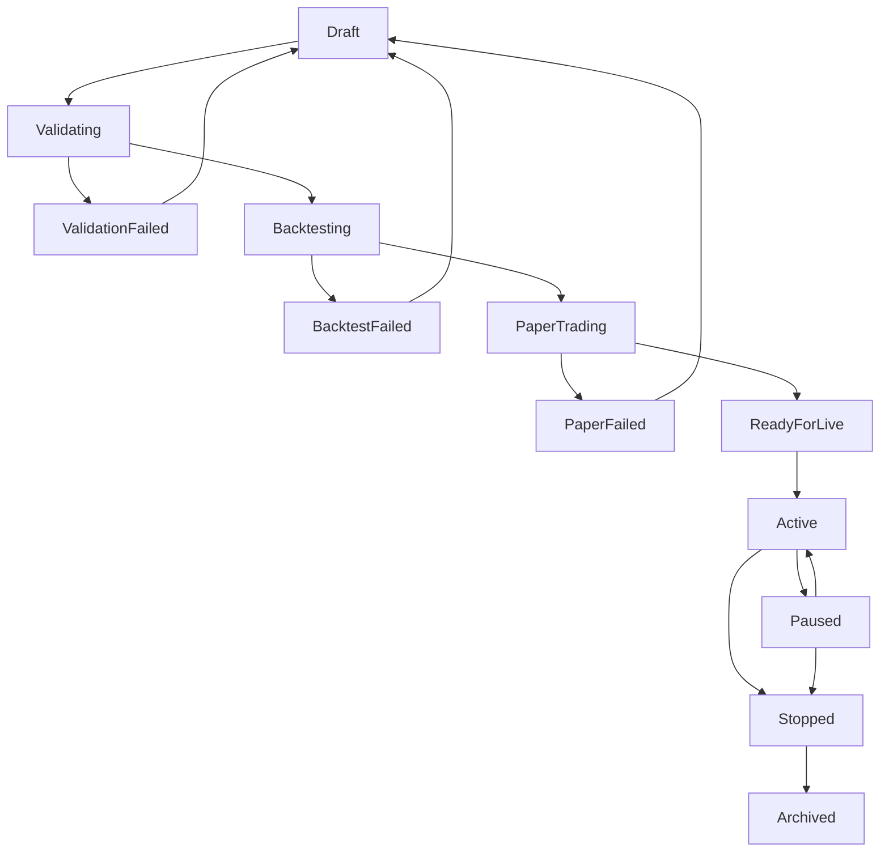

# Strategy Development Guide

<cite>
**Referenced Files in This Document**   
- [strategy.rs](file://crates/core/src/models/strategy.rs)
- [traits.rs](file://crates/strategy/src/traits.rs)
- [lifecycle.rs](file://crates/strategy/src/lifecycle.rs)
- [signal.rs](file://crates/strategy/src/signal.rs)
- [rsi_strategy.rs](file://examples/rsi_strategy.rs)
- [simple_ma_crossover.rs](file://examples/simple_ma_crossover.rs)
- [grid_trading.rs](file://examples/grid_trading.rs)
- [engine.rs](file://crates/backtest/src/engine.rs)
- [portfolio.rs](file://crates/backtest/src/portfolio.rs)
- [results.rs](file://crates/backtest/src/results.rs)
</cite>

## Table of Contents
1. [Introduction](#introduction)
2. [Strategy Trait Interface](#strategy-trait-interface)
3. [Lifecycle Management](#lifecycle-management)
4. [Signal Generation System](#signal-generation-system)
5. [Implementation Patterns](#implementation-patterns)
6. [Hot-Reload and State Serialization](#hot-reload-and-state-serialization)
7. [Testing Strategies](#testing-strategies)
8. [Performance Optimization](#performance-optimization)
9. [Common Pitfalls and Best Practices](#common-pitfalls-and-best-practices)
10. [Troubleshooting Guide](#troubleshooting-guide)

## Introduction
This guide provides comprehensive documentation for developing trading strategies within the ea_okx framework. It covers the core strategy interface, lifecycle management, signal generation system, implementation patterns, testing methodologies, and performance considerations. The framework is designed to support robust, testable, and maintainable trading strategies with features like hot-reload capability and comprehensive state management.

## Strategy Trait Interface
The core of the strategy framework is defined by the `Strategy` trait in the `ea_okx_strategy::traits` module. This trait establishes the contract that all trading strategies must implement, ensuring consistency across different strategy types.

The trait defines several key methods that govern strategy behavior:

- `initialize`: Sets up the strategy with configuration parameters
- `on_market_data`: Processes incoming market data events
- `generate_signal`: Produces trading signals based on market conditions
- `on_order_fill`: Handles notifications when orders are filled
- `on_order_reject`: Responds to order rejection events
- `get_metrics`: Retrieves performance metrics
- `serialize_state` and `deserialize_state`: Support state persistence
- `shutdown`: Performs cleanup operations

Strategies receive market data through the `MarketDataEvent` enum, which supports different types of market information including tickers, candles, and trades. This flexible event system allows strategies to be implemented using various data sources and timeframes.

**Section sources**
- [traits.rs](file://crates/strategy/src/traits.rs#L60-L89)

## Lifecycle Management
The strategy framework implements a comprehensive 12-state lifecycle management system that governs the progression of strategies from creation to retirement. This state machine ensures proper validation, testing, and deployment procedures are followed.

### Lifecycle States
The `StrategyState` enum defines the following states:
- Draft
- Validating
- ValidationFailed
- Backtesting
- BacktestFailed
- PaperTrading
- PaperFailed
- ReadyForLive
- Active
- Paused
- Stopped
- Archived

### Valid State Transitions
The state machine enforces valid transitions between states to maintain system integrity:

Each transition is logged with a timestamp and reason, creating an audit trail of the strategy's progression. The lifecycle manager prevents invalid transitions, such as moving directly from Draft to Active without proper validation and testing.

The state machine ensures that strategies progress through appropriate stages: validation checks configuration correctness, backtesting evaluates performance on historical data, paper trading tests in live market conditions without real capital, and only after successful paper trading can a strategy be deployed for live trading.

**Diagram sources**
- [lifecycle.rs](file://crates/strategy/src/lifecycle.rs#L9-L22)

**Section sources**
- [lifecycle.rs](file://crates/strategy/src/lifecycle.rs#L7-L93)

## Signal Generation System
The signal generation system provides a standardized way for strategies to communicate trading intentions to the execution engine. The system is built around the `Signal` struct and `SignalType` enum.

### Signal Types
The framework supports five signal types:
- **Buy**: Initiate a long position
- **Sell**: Initiate a short position or exit a long position
- **Hold**: Maintain current position, no action
- **CloseLong**: Specifically close a long position
- **CloseShort**: Specifically close a short position

### Signal Structure
Signals contain rich metadata beyond just the action type:
- Confidence level (0.0 to 1.0)
- Target price for entry
- Stop loss price
- Take profit price
- Suggested quantity
- Additional metadata as JSON

This comprehensive signal structure allows for sophisticated risk management and position sizing strategies. The confidence level can be used by risk management components to filter or modify signals based on their reliability.

The signal system decouples strategy logic from execution logic, allowing different strategies to generate signals that are then processed consistently by the trading engine.

**Section sources**
- [signal.rs](file://crates/strategy/src/signal.rs#L7-L26)

## Implementation Patterns
The framework provides several example implementations that demonstrate different trading strategy patterns.

### RSI Mean Reversion Strategy
The RSI strategy (in `rsi_strategy.rs`) implements a classic mean reversion approach using the Relative Strength Index indicator. It buys when the RSI falls below 30 (oversold condition) and sells when it rises above 70 (overbought condition). This strategy demonstrates stateful indicator calculation with price history management using a `VecDeque`.

### Moving Average Crossover Strategy
The MA crossover strategy (in `simple_ma_crossover.rs`) implements a trend-following approach using two moving averages of different periods. It generates buy signals when the fast MA crosses above the slow MA (golden cross) and sell signals when the fast MA crosses below the slow MA (death cross). This implementation shows proper position tracking with entry price, stop loss, and take profit levels.

### Grid Trading Strategy
The grid trading strategy (in `grid_trading.rs`) implements a market-making approach by placing buy and sell orders at regular price intervals. It profits from market volatility by buying low and selling high within a defined price range. This pattern demonstrates order management with multiple simultaneous orders at different price levels.

These examples illustrate different approaches to strategy implementation while adhering to the core strategy interface. They show how to manage state, process market data, and generate appropriate signals based on market conditions.

**Section sources**
- [rsi_strategy.rs](file://examples/rsi_strategy.rs#L23-L117)
- [simple_ma_crossover.rs](file://examples/simple_ma_crossover.rs#L64-L279)
- [grid_trading.rs](file://examples/grid_trading.rs#L33-L77)

## Hot-Reload and State Serialization
The framework supports hot-reload capability, allowing strategy updates without requiring a system restart. This is achieved through the `serialize_state` and `deserialize_state` methods in the `Strategy` trait.

### State Serialization
Strategies can persist their internal state to JSON format, capturing all necessary information to restore operation after an update. This includes:
- Indicator values and price history
- Position tracking information
- Configuration parameters
- Performance metrics
- Any other strategy-specific state

The serialization system uses Serde for efficient JSON conversion, allowing complex data structures to be preserved. When a strategy is updated, its state can be serialized, the new version loaded, and the state deserialized into the new instance.

This capability enables continuous improvement of trading strategies without interrupting live trading operations. Traders can update strategy logic, fix bugs, or improve performance while maintaining their current market positions and accumulated state.

The hot-reload system is particularly valuable for strategies that maintain state over time, such as those using moving averages, momentum indicators, or machine learning models that require training data.

**Section sources**
- [traits.rs](file://crates/strategy/src/traits.rs#L81-L85)

## Testing Strategies
The framework provides comprehensive testing capabilities for both unit testing and integration testing of trading strategies.

### Unit Testing
Unit tests focus on isolated components of the strategy logic. The example strategies include unit tests that verify:
- Correct calculation of technical indicators
- Proper signal generation under various market conditions
- Accurate position tracking and management
- Appropriate risk management rule enforcement

For example, the MA crossover strategy includes tests that verify the moving average calculations are correct and that crossover signals are generated at the appropriate times.

### Integration Testing
The backtesting engine (in `engine.rs`) provides a comprehensive integration testing environment. It allows strategies to be tested against historical market data with realistic market conditions, including:
- Price slippage
- Transaction costs
- Order execution delays
- Market impact

The backtesting framework processes historical candle data chronologically, feeding it to the strategy and recording all trading activity. It then generates detailed performance reports with metrics such as:
- Total return and annualized return
- Win rate and profit factor
- Maximum drawdown and risk-adjusted returns
- Trade duration statistics
- Cost analysis

The backtesting results include an equity curve and drawdown analysis, providing a comprehensive view of strategy performance over time. This allows developers to identify periods of poor performance and optimize their strategies accordingly.

**Section sources**
- [engine.rs](file://crates/backtest/src/engine.rs#L139-L584)
- [portfolio.rs](file://crates/backtest/src/portfolio.rs#L36-L195)
- [results.rs](file://crates/backtest/src/results.rs#L61-L187)

## Performance Optimization
Developing high-performance trading strategies requires attention to several key optimization areas.

### Latency Considerations
For strategies that require low latency, consider the following optimizations:
- Minimize memory allocations in hot code paths
- Use efficient data structures for price history (e.g., circular buffers)
- Pre-allocate collections to avoid resizing
- Cache frequently accessed calculations
- Minimize string operations and formatting

### Computational Efficiency
The framework provides several opportunities for computational optimization:
- Use incremental calculations for indicators when possible (e.g., updating moving averages with new prices rather than recalculating from scratch)
- Batch process market data when appropriate
- Implement efficient filtering of market events
- Use appropriate data types for calculations (e.g., fixed-point arithmetic for financial calculations)

### Resource Management
Strategies should be designed with resource constraints in mind:
- Limit memory usage for price history to reasonable bounds
- Implement proper cleanup in the shutdown method
- Use asynchronous methods appropriately to avoid blocking
- Consider the impact of logging on performance

The backtesting framework itself is optimized for performance, using efficient data structures and algorithms to process large volumes of historical data quickly.

**Section sources**
- [engine.rs](file://crates/backtest/src/engine.rs#L146-L163)

## Common Pitfalls and Best Practices
Developing effective trading strategies requires awareness of common pitfalls and adherence to best practices.

### Common Pitfalls
- **Overfitting**: Creating strategies that perform well on historical data but fail in live trading
- **Look-ahead bias**: Using future information in signal generation
- **Ignoring transaction costs**: Failing to account for commissions, slippage, and fees
- **Poor risk management**: Not implementing proper position sizing and stop loss rules
- **State corruption**: Failing to properly handle state during serialization/deserialization

### Best Practices
- **Start simple**: Begin with basic strategies and gradually add complexity
- **Test thoroughly**: Use both unit tests and comprehensive backtesting
- **Validate assumptions**: Verify that market conditions match your strategy assumptions
- **Implement robust error handling**: Gracefully handle unexpected market conditions
- **Monitor performance**: Continuously track strategy performance and adapt as needed
- **Document thoroughly**: Maintain clear documentation of strategy logic and parameters

The framework's lifecycle management system helps prevent some common pitfalls by requiring strategies to progress through validation and testing stages before live deployment.

**Section sources**
- [lifecycle.rs](file://crates/strategy/src/lifecycle.rs#L40-L69)

## Troubleshooting Guide
When debugging strategy logic and execution issues, consider the following approaches:

### Logic Verification
- Verify that market data is being received and processed correctly
- Check that indicators are calculating expected values
- Confirm that signals are being generated at appropriate times
- Validate that position tracking is accurate

### State Management
- Ensure that state serialization and deserialization are working correctly
- Verify that all necessary state is being persisted
- Check for any data loss during hot-reload operations

### Performance Issues
- Monitor for memory leaks or excessive memory usage
- Check for CPU bottlenecks in signal generation
- Verify that the strategy can keep up with market data flow
- Test under high-load conditions

### Integration Problems
- Confirm that the strategy is properly integrated with the execution system
- Verify that orders are being submitted and filled as expected
- Check that risk management rules are being enforced
- Validate that performance metrics are being calculated correctly

The framework's comprehensive logging and monitoring capabilities can assist in identifying and resolving these issues.

**Section sources**
- [traits.rs](file://crates/strategy/src/traits.rs#L60-L89)
- [lifecycle.rs](file://crates/strategy/src/lifecycle.rs#L40-L69)