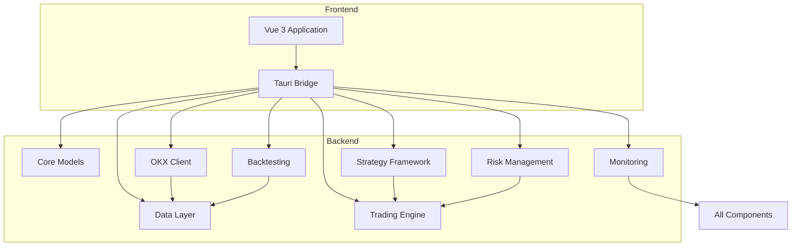
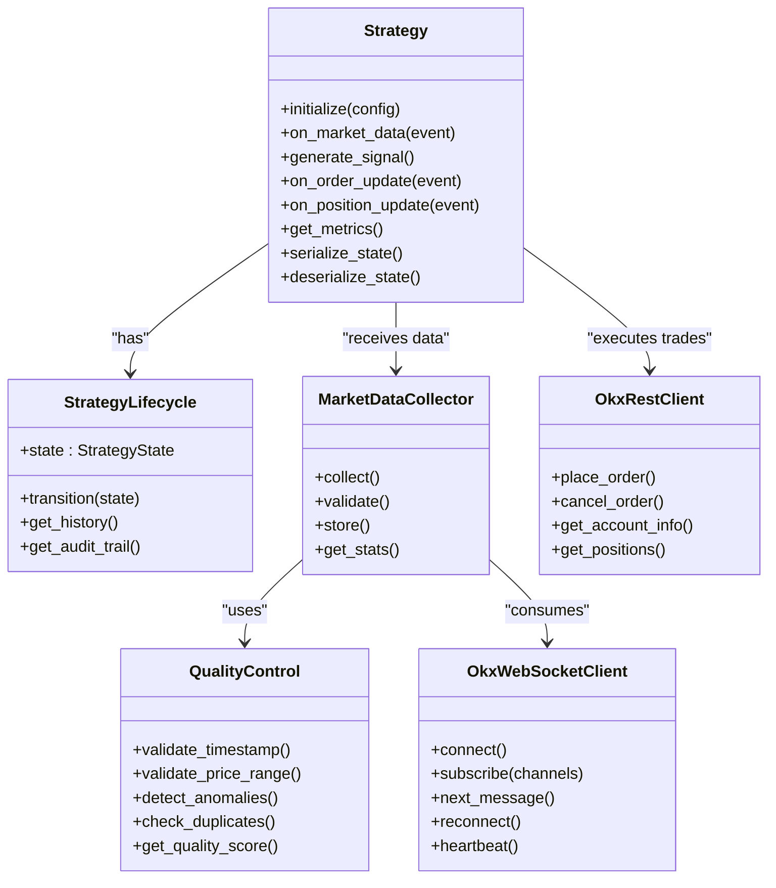
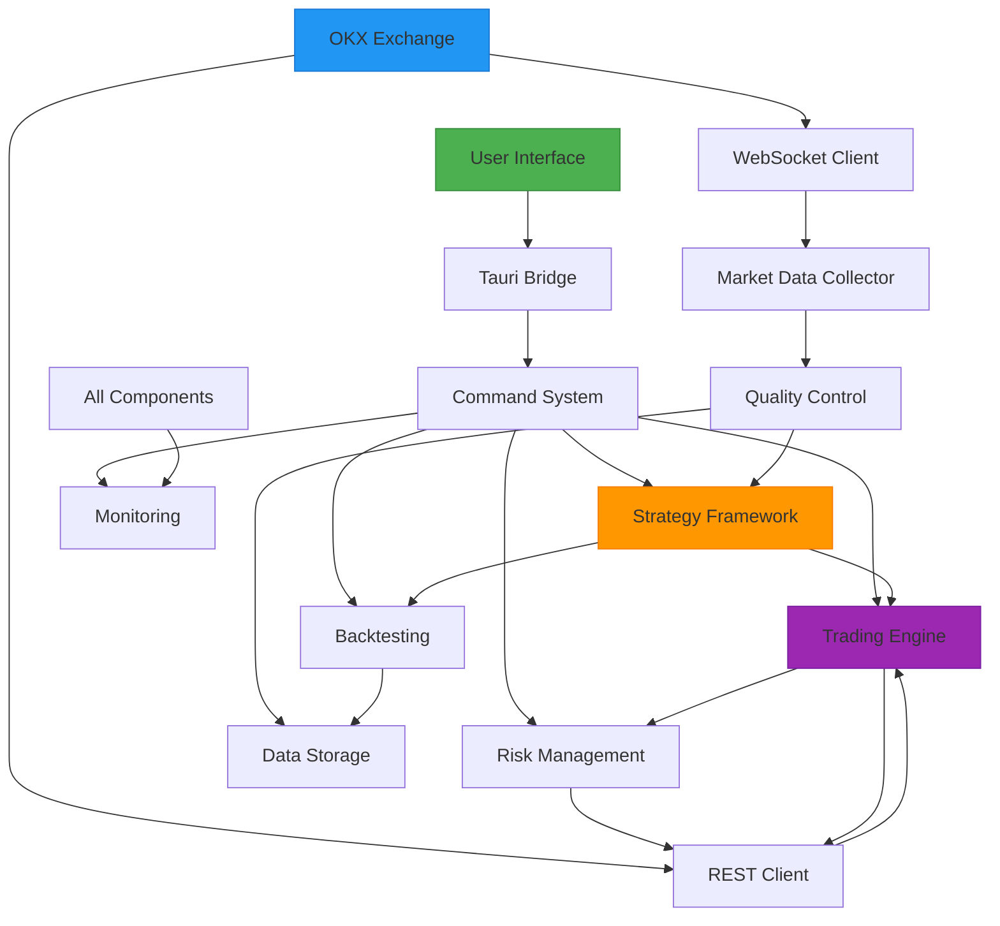
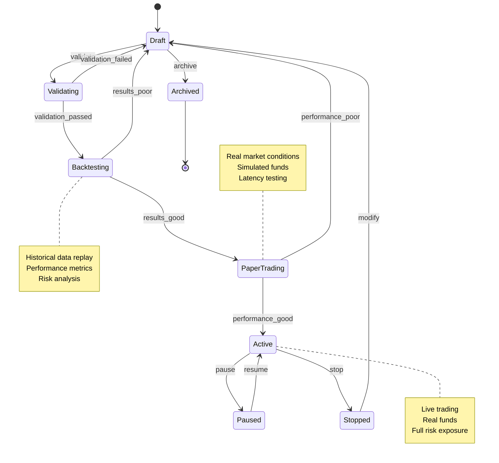
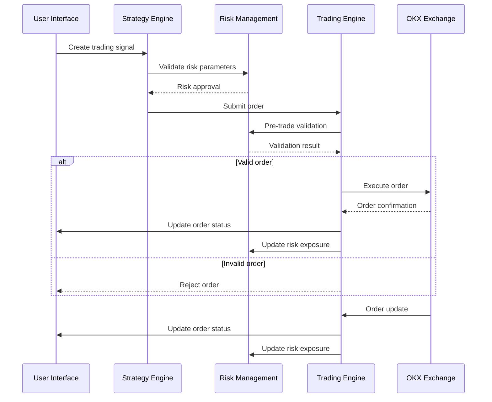
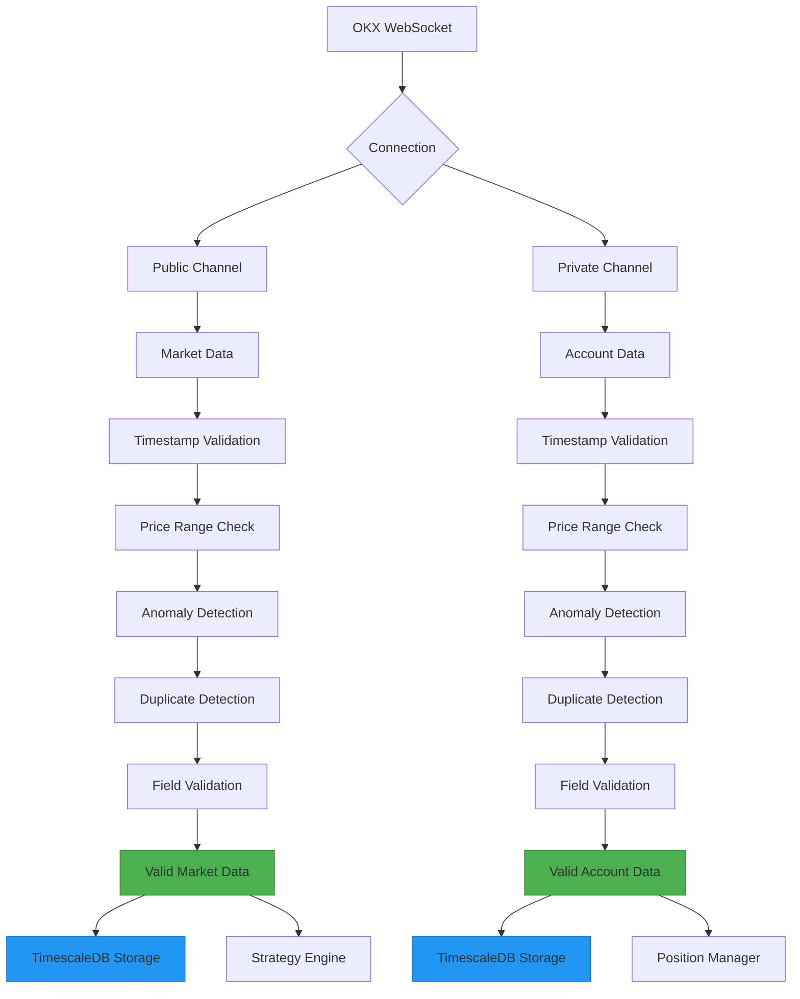
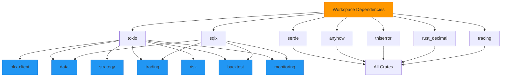

# System Overview

<cite>
**Referenced Files in This Document**   
- [README.md](file://README.md)
- [PROJECT_SUMMARY.md](file://PROJECT_SUMMARY.md)
- [Cargo.toml](file://Cargo.toml)
- [core/src/lib.rs](file://crates/core/src/lib.rs)
- [strategy/src/lib.rs](file://crates/strategy/src/lib.rs)
- [data/src/lib.rs](file://crates/data/src/lib.rs)
- [okx-client/src/lib.rs](file://crates/okx-client/src/lib.rs)
- [trading/src/lib.rs](file://crates/trading/src/lib.rs)
- [risk/src/lib.rs](file://crates/risk/src/lib.rs)
- [backtest/src/lib.rs](file://crates/backtest/src/lib.rs)
- [monitoring/src/lib.rs](file://crates/monitoring/src/lib.rs)
- [frontend/src/main.ts](file://frontend/src/main.ts)
- [frontend/src-tauri/Cargo.toml](file://frontend/src-tauri/Cargo.toml)
</cite>

## Table of Contents
1. [Introduction](#introduction)
2. [Project Structure](#project-structure)
3. [Core Components](#core-components)
4. [Architecture Overview](#architecture-overview)
5. [Detailed Component Analysis](#detailed-component-analysis)
6. [Dependency Analysis](#dependency-analysis)
7. [Performance Considerations](#performance-considerations)
8. [Troubleshooting Guide](#troubleshooting-guide)
9. [Conclusion](#conclusion)

## Introduction

The EA OKX Quantitative Trading System is a professional-grade cryptocurrency trading platform designed for algorithmic trading with integration to the OKX exchange. The system combines a high-performance Rust backend with a modern Vue 3 frontend, packaged as a desktop application using Tauri 2.0. This architecture enables low-latency trading operations while providing an intuitive user interface for strategy development and monitoring.

The platform supports a complete trading lifecycle from strategy creation through backtesting, paper trading, and live deployment. It emphasizes type safety, comprehensive testing, and data integrity to ensure reliable operation in the volatile cryptocurrency markets. With 65% completion, the system has established a solid foundation with working components for market data collection, strategy framework, and core domain models.

**Section sources**
- [README.md](file://README.md#L1-L36)
- [PROJECT_SUMMARY.md](file://PROJECT_SUMMARY.md#L1-L390)

## Project Structure

The EA OKX system follows a modular architecture with a Rust workspace containing multiple crates, each responsible for a specific domain. The project is organized into backend crates, frontend components, configuration files, database migrations, and example implementations.

The backend consists of a Rust workspace with eight specialized crates:
- **core**: Fundamental domain models and types
- **okx-client**: Integration with OKX exchange API
- **data**: Market data collection and quality control
- **strategy**: Strategy framework and lifecycle management
- **trading**: Order execution and algorithmic trading
- **risk**: Risk management and validation
- **backtest**: Backtesting engine and historical analysis
- **monitoring**: System monitoring and alerting

The frontend is implemented as a Vue 3 application with TypeScript, using Pinia for state management and Chart.js for data visualization. It is packaged as a desktop application using Tauri 2.0, which enables tight integration between the frontend UI and backend Rust logic through a command system.

**Diagram sources**
- [Cargo.toml](file://Cargo.toml#L1-L95)
- [frontend/src/main.ts](file://frontend/src/main.ts)
- [frontend/src-tauri/Cargo.toml](file://frontend/src-tauri/Cargo.toml)

**Section sources**
- [Cargo.toml](file://Cargo.toml#L1-L95)
- [PROJECT_SUMMARY.md](file://PROJECT_SUMMARY.md#L79-L92)

## Core Components

The EA OKX system comprises several core components that work together to provide a comprehensive trading platform. These components are designed with separation of concerns, type safety, and extensibility in mind.

The **Core** component provides fundamental domain models including Symbol, Price, Quantity, Order, Position, Strategy, and Trade. These models are implemented with type safety to prevent common errors in financial applications. The system uses rust_decimal for precise decimal arithmetic with 8 decimal places, ensuring accurate financial calculations.

The **OKX Client** component handles integration with the OKX exchange through both REST and WebSocket APIs. It supports dual connections for public market data and private account information, with automatic reconnection and heartbeat mechanisms to maintain reliable connectivity.

The **Data Layer** is responsible for market data collection and quality control. It implements a five-layer validation pipeline that checks for timestamp validity, price deviations, statistical anomalies, duplicates, and missing fields. This ensures that only high-quality data is used for trading decisions.

The **Strategy Framework** provides a trait-based interface for implementing trading strategies with support for hot-reloading and state preservation. Strategies follow a 12-state lifecycle from Draft to Active, with comprehensive audit trails and state history tracking.

**Diagram sources**
- [core/src/lib.rs](file://crates/core/src/lib.rs#L1-L26)
- [strategy/src/lib.rs](file://crates/strategy/src/lib.rs#L1-L25)
- [data/src/lib.rs](file://crates/data/src/lib.rs#L1-L22)
- [okx-client/src/lib.rs](file://crates/okx-client/src/lib.rs#L1-L39)

**Section sources**
- [core/src/lib.rs](file://crates/core/src/lib.rs#L1-L26)
- [strategy/src/lib.rs](file://crates/strategy/src/lib.rs#L1-L25)
- [data/src/lib.rs](file://crates/data/src/lib.rs#L1-L22)
- [okx-client/src/lib.rs](file://crates/okx-client/src/lib.rs#L1-L39)

## Architecture Overview

The EA OKX system follows a modular, layered architecture with clear separation between components. The system is designed as a full-stack application with a Rust backend providing high-performance trading capabilities and a Vue 3 frontend offering an intuitive user interface.

The backend architecture is organized as a Rust workspace with multiple crates, each representing a distinct domain. This crate-based organization enables independent development, testing, and maintenance of each component while maintaining type safety across the entire system. The use of Rust ensures memory safety, thread safety, and high performance without garbage collection pauses.

The frontend is implemented as a Vue 3 application using the Composition API and TypeScript, providing a modern, reactive user interface. It communicates with the backend through Tauri commands, which bridge the JavaScript and Rust code. This architecture allows the frontend to leverage the full power of the Rust backend while maintaining a responsive and user-friendly interface.

The system integrates with the OKX exchange through a dedicated client crate that handles both REST API calls and WebSocket streaming. Market data flows from the exchange through a quality control pipeline before being made available to trading strategies. Orders are executed through the REST API with proper authentication and error handling.

**Diagram sources**
- [Cargo.toml](file://Cargo.toml#L1-L95)
- [PROJECT_SUMMARY.md](file://PROJECT_SUMMARY.md#L79-L92)
- [frontend/src/main.ts](file://frontend/src/main.ts)

## Detailed Component Analysis

### Strategy Development Lifecycle

The EA OKX system implements a comprehensive strategy development lifecycle that guides users from initial concept to live trading. This lifecycle consists of 12 distinct states with 16 validated state transitions, ensuring proper progression and auditability.

The lifecycle begins in the **Draft** state, where users create and configure their strategies. From there, strategies move to **Validating** where they are checked for syntax and logical errors. The **Backtesting** state allows strategies to be tested against historical data to evaluate performance metrics such as Sharpe ratio, maximum drawdown, and win rate.

After successful backtesting, strategies enter **Paper Trading** where they operate with simulated funds in real market conditions. This phase helps identify issues that may not appear in backtesting due to market impact and slippage. Finally, approved strategies can be deployed to **Active** status for live trading.

Each state transition is logged with timestamps and user information, creating a complete audit trail. The system also tracks state history, allowing users to see the complete evolution of their strategies over time.

**Diagram sources**
- [strategy/src/lib.rs](file://crates/strategy/src/lib.rs#L1-L25)
- [PROJECT_SUMMARY.md](file://PROJECT_SUMMARY.md#L67-L71)

**Section sources**
- [strategy/src/lib.rs](file://crates/strategy/src/lib.rs#L1-L25)
- [PROJECT_SUMMARY.md](file://PROJECT_SUMMARY.md#L57-L77)

### Trading Operations

The trading component of the EA OKX system handles order execution with support for various algorithmic trading strategies. The OrderManager maintains the current state of all orders and positions, providing reconciliation between the system's view and the exchange's view.

The system implements sophisticated execution algorithms including TWAP (Time-Weighted Average Price) and VWAP (Volume-Weighted Average Price) to minimize market impact when executing large orders. These algorithms break large orders into smaller slices distributed over time according to configurable parameters.

Pre-trade risk validation ensures that orders comply with configured risk limits before submission to the exchange. This includes checks for position size limits, concentration risk, and value-at-risk (VaR) calculations. Post-trade monitoring continues to track risk exposure as market conditions change.

**Diagram sources**
- [trading/src/lib.rs](file://crates/trading/src/lib.rs#L1-L10)
- [risk/src/lib.rs](file://crates/risk/src/lib.rs#L1-L11)

**Section sources**
- [trading/src/lib.rs](file://crates/trading/src/lib.rs#L1-L10)
- [risk/src/lib.rs](file://crates/risk/src/lib.rs#L1-L11)

### Market Data Processing

The market data processing pipeline is designed for high reliability and data integrity. It collects real-time market data from OKX through WebSocket connections, processes it through a multi-layer quality control system, and makes it available to trading strategies.

The quality control pipeline implements five validation layers:
1. **Timestamp validation**: Rejects data that is too stale (configurable threshold)
2. **Price range validation**: Detects prices that deviate significantly from recent values
3. **Anomaly detection**: Uses statistical methods (Z-score) to identify outliers
4. **Duplicate detection**: Filters out duplicate messages
5. **Field validation**: Ensures all required fields are present

Validated data is stored in TimescaleDB, a PostgreSQL extension optimized for time-series data. The database schema includes hypertables for OHLCV (Open-High-Low-Close-Volume) data with automatic compression and retention policies. Continuous aggregates provide pre-computed data at various time intervals for efficient querying.

**Diagram sources**
- [data/src/lib.rs](file://crates/data/src/lib.rs#L1-L22)
- [okx-client/src/lib.rs](file://crates/okx-client/src/lib.rs#L1-L39)
- [migrations/001_initial_schema.sql](file://migrations/001_initial_schema.sql)

**Section sources**
- [data/src/lib.rs](file://crates/data/src/lib.rs#L1-L22)
- [okx-client/src/lib.rs](file://crates/okx-client/src/lib.rs#L1-L39)
- [PROJECT_SUMMARY.md](file://PROJECT_SUMMARY.md#L40-L48)

## Dependency Analysis

The EA OKX system has a well-defined dependency structure with clear boundaries between components. The Rust workspace manages dependencies at both the workspace level and individual crate level, ensuring consistency while allowing for specialized requirements.

Workspace-level dependencies include essential crates for asynchronous programming (tokio), web frameworks (axum), database access (sqlx), serialization (serde), and error handling (anyhow, thiserror). These dependencies are shared across multiple crates to reduce duplication and ensure compatibility.

Each crate declares its specific dependencies based on its responsibilities:
- **core**: Minimal dependencies focusing on data types and error handling
- **okx-client**: WebSocket and HTTP client libraries
- **data**: Database and caching libraries
- **strategy**: Async traits and state management
- **trading**: Algorithmic execution libraries
- **risk**: Statistical analysis libraries
- **backtest**: Historical data processing libraries
- **monitoring**: Metrics and alerting libraries

The system uses semantic versioning with caret requirements (^) to allow for patch and minor updates while preventing breaking changes. Critical dependencies like rust_decimal are pinned to specific versions to ensure financial calculation consistency.

**Diagram sources**
- [Cargo.toml](file://Cargo.toml#L1-L95)
- [crates/*/Cargo.toml](file://crates/core/Cargo.toml)

**Section sources**
- [Cargo.toml](file://Cargo.toml#L1-L95)

## Performance Considerations

The EA OKX system is designed with performance as a primary consideration, particularly in areas that impact trading latency and reliability. The system targets sub-100ms latency from signal generation to market execution, with specific performance goals for each component.

The Rust backend provides inherent performance advantages with zero-cost abstractions, fearless concurrency, and no garbage collector. The use of async/await patterns enables efficient handling of I/O operations without blocking threads. The system leverages Tokio as the async runtime, which provides a high-performance event-driven architecture.

Market data processing is optimized for low latency with a streamlined quality control pipeline that aims to validate data in under 1ms. The WebSocket client maintains persistent connections with the OKX exchange and implements efficient message parsing to minimize processing overhead.

For backtesting operations, the system is designed to efficiently process large volumes of historical data. The use of TimescaleDB with hypertables and continuous aggregates enables fast querying of time-series data at various granularities.

The frontend is optimized for responsiveness with Vue 3's reactivity system and efficient rendering. Tauri's lightweight architecture minimizes overhead compared to traditional Electron applications, resulting in faster startup times and lower memory usage.

| Component | Performance Target | Current Status |
|---------|-------------------|---------------|
| Signal-to-market latency | < 100ms (p95) | In development |
| Order submission latency | < 50ms | In development |
| WebSocket message processing | < 10ms | In development |
| Data quality validation | < 1ms | In development |
| System uptime | 99.9% | In development |
| Data quality rate | > 99.5% | In development |

**Section sources**
- [PROJECT_SUMMARY.md](file://PROJECT_SUMMARY.md#L284-L294)

## Troubleshooting Guide

The EA OKX system includes comprehensive monitoring and alerting capabilities to assist with troubleshooting and system maintenance. The monitoring component tracks key metrics across all system components and provides configurable alert rules.

Common issues and their solutions include:

**WebSocket Connection Problems**
- Symptom: Disconnected from OKX WebSocket
- Solution: The system automatically attempts reconnection with exponential backoff. Check network connectivity and API credentials.

**Data Quality Issues**
- Symptom: High rejection rate in quality control
- Solution: Review quality control configuration and market conditions. Temporary spikes may occur during high volatility events.

**Order Execution Failures**
- Symptom: Orders not being filled or rejected
- Solution: Check risk limits, account balance, and market conditions. Review pre-trade validation logs.

**Performance Degradation**
- Symptom: Increased latency in signal processing
- Solution: Monitor system resources and consider scaling. Review strategy complexity and data volume.

The system maintains detailed logs with structured logging using the tracing crate. Logs include timestamps, component identifiers, and structured fields for easy filtering and analysis. The monitoring service can generate health reports for all components, identifying potential issues before they impact trading operations.

**Section sources**
- [monitoring/src/lib.rs](file://crates/monitoring/src/lib.rs#L1-L56)
- [PROJECT_SUMMARY.md](file://PROJECT_SUMMARY.md#L296-L304)

## Conclusion

The EA OKX Quantitative Trading System represents a comprehensive platform for algorithmic cryptocurrency trading with professional-grade features and robust architecture. Built on Rust for performance and type safety, the system provides a solid foundation for developing, testing, and deploying trading strategies on the OKX exchange.

With 65% completion, the system has successfully implemented core components including a reliable OKX client, comprehensive data quality control, flexible strategy framework, and well-defined domain models. The remaining work focuses on completing the backtesting engine, trading execution algorithms, risk management features, and the frontend user interface.

The architecture balances performance, reliability, and usability with a modular design that enables independent development and testing of components. The integration of Rust backend with Vue 3 frontend via Tauri provides both high-performance trading capabilities and an intuitive user experience.

As development continues, the system will evolve to support more sophisticated trading strategies, enhanced risk management, and comprehensive user analytics. The foundation has been established for a powerful tool that can serve both retail and institutional cryptocurrency traders.